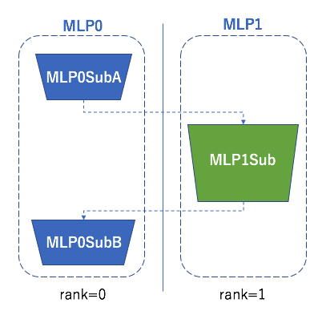

Example 1: Simple MLP
=====================

Here is the first example of model parallel, a simple MLP separated on two processes.

First, let's create a ChainerMN communicator::

    if args.gpu:
        comm = chainermn.create_communicator('hierarchical')
        device = comm.intra_rank
    else:
        comm = chainermn.create_communicator('naive')
        device = -1

As we see in :doc:`model_parallel_on_chainermn`, the naive implementation is to use the point-to-point communication such as ``send`` and ``recv``::

    class MLP0(chainer.Chain):
        def __init__(self, comm, n_out):
            super(MLP0SubA, self).__init__(
                l1=L.Linear(784, n_out))

        def __call__(self, x):
            h0 = F.relu(self.l1(x))
            phi = chainermn.functions.send(h0, self.comm, rank=1)
            # Note: do not forget to pass delegate variable
            y = chainermn.functions.recv(self.comm, rank=1, delegate_variable=phi)
            return y

    class MLP1(chainer.Chain):
        def __init__(self, n_units, n_out):
            super(MLP1Sub, self).__init__(
                l2=L.Linear(None, n_units),
                l3=L.Linear(None, n_out))

        def __call__(self, _):
            h0 = chainermn.functions.recv(self.comm, rank=0)
            h1 = F.relu(self.l2(h0))
            return chainermn.functions.send(self.l3(h1), self.comm, rank=0)

One should note that

+ ``MLP0``: delegate variable is indispensable which is passed from ``send`` to ``recv``.
+ ``MLP1``: the return value from ``send`` must be returned in ``__call__``, which is used to track back the computational graph.

On each process, different models are trained::

    if comm.rank == 0:
        model = L.Classifier(MLP0(comm, 100))
    elif comm.rank == 1:
        model = MLP1(comm, 100, 10)

Since ``MLP1`` receives its inputs from ``MLP0`` over the point-to-point communication, let's use ``empty_dataset`` instead of the usual dataset::

    # Iterate dataset only on worker 0.
    train, test = chainer.datasets.get_mnist()
    if comm.rank == 1:
        train = chainermn.datasets.create_empty_dataset(train)
        test = chainermn.datasets.create_empty_dataset(test)

Now we can run a model parallel architecture.

There is an alternative API to define the same model without explicitly defining communication paths::

	class MLP0SubA(chainer.Chain):
	    def __init__(self, comm, n_out):
	        super(MLP0SubA, self).__init__(
	            l1=L.Linear(784, n_out))
	
	    def __call__(self, x):
	        return F.relu(self.l1(x))

	class MLP0SubB(chainer.Chain):
	    def __init__(self, comm):
	        super(MLP0SubB, self).__init__()
	
	    def __call__(self, y):
	        return y

	class MLP0(chainermn.MultiNodeChainList):
	    # Model on worker 0.
	    def __init__(self, comm, n_out):
	        super(MLP0, self).__init__(comm=comm)
	        self.add_link(MLP0SubA(comm, n_out), rank_in=None, rank_out=1)
	        self.add_link(MLP0SubB(comm), rank_in=1, rank_out=None)

	class MLP1Sub(chainer.Chain):
	    def __init__(self, n_units, n_out):
	        super(MLP1Sub, self).__init__(
	            l2=L.Linear(None, n_units),
	            l3=L.Linear(None, n_out))
	
	    def __call__(self, h0):
	        h1 = F.relu(self.l2(h0))
	        return self.l3(h1)

	class MLP1(chainermn.MultiNodeChainList):
	    # Model on worker 1.
	    def __init__(self, comm, n_units, n_out):
	        super(MLP1, self).__init__(comm=comm)
	        self.add_link(MLP1Sub(n_units, n_out), rank_in=0, rank_out=0)

``MultiNodeChainList`` enables to define a multi model architecture, by adding non-connected component with ``add_link``.
Two arguments ``rank_in`` and ``rank_out`` specifies from which process the added link receives their inputs, and to which process it sends their outputs.

Although it may seems that there is no necessity to parallelize MLP with this size, it can be useful to train a MLP with many layers and parameters so that the entire model cannot be loaded on a single GPU.
The entire training code is available `here <https://github.com/chainer/chainer/blob/master/examples/chainermn/mnist/train_mnist_model_parallel.py>`__.
