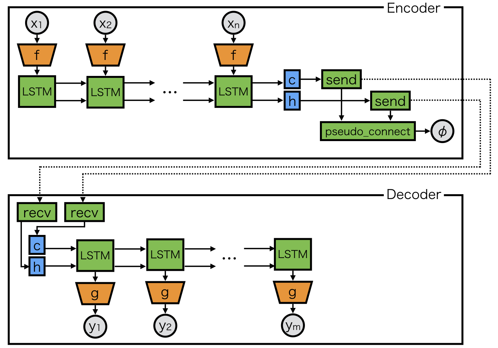
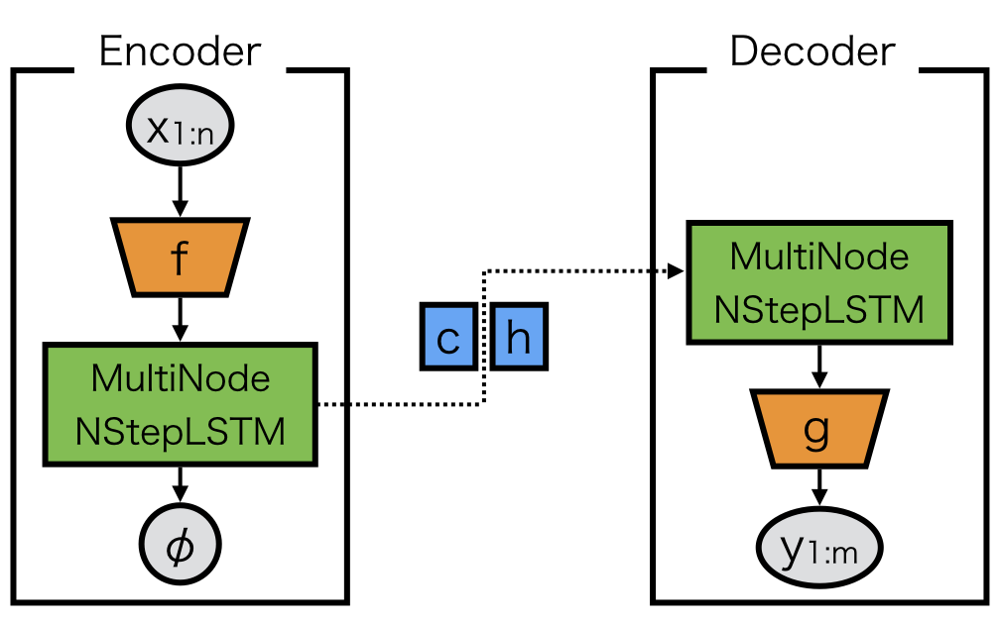

Example 2: seq2seq
==================

This example shows how to parallelize models that involves RNN.

The above model is a typical encoder-decoder model, and the encoder and decoder are splitted on two processes.
When ``f`` or ``g`` are large models such as deep CNN, this kind of model parallelism is needed.
However, ``send``, ``recv``, and ``pseudo_connect`` must be appropriately used, which is relatively hard.
To mitigate its difficulty, ``MultiNodeNStepRNN`` can be used.

``MultiNodeNStepRNN`` can be created by ``create_multi_node_n_step_rnn``::

    rnn = chainermn.links.create_multi_node_n_step_rnn(
        L.NStepLSTM(n_layers, n_units, n_units, 0.1),
        comm, rank_in=None, rank_out=1)

The model definition is as follows::

    class Encoder(chainer.Chain):

        def __init__(self, comm, n_layers, n_units):
            super(Encoder, self).__init__(
                # Corresponding decoder LSTM will be invoked on process 1.
                mn_encoder=chainermn.links.create_multi_node_n_step_rnn(
                    L.NStepLSTM(n_layers, n_units, n_units, 0.1),
                    comm, rank_in=None, rank_out=1
                ),
            )
            self.comm = comm
            self.n_layers = n_layers
            self.n_units = n_units

        def __call__(self, *xs):
            exs = f(xs)
            c, h, _, phi = self.mn_encoder(exs) 
            return phi

    class Decoder(chainer.Chain):

        def __init__(self, comm, n_layers, n_units):
            super(Decoder, self).__init__(
                # Corresponding encoder LSTM will be invoked on process 0.
                mn_decoder=chainermn.links.create_multi_node_n_step_rnn(
                    L.NStepLSTM(n_layers, n_units, n_units, 0.1),
                    comm, rank_in=0, rank_out=None),
            )
            self.comm = comm
            self.n_layers = n_layers
            self.n_units = n_units

        def __call__(self, *ys):
            c, h, os, _ = self.mn_decoder(ys)
            # compute loss (omitted)

An example code on seq2seq model is available `here <https://github.com/chainer/chainer/blob/master/examples/chainermn/seq2seq/seq2seq_mp1.py>`__.
