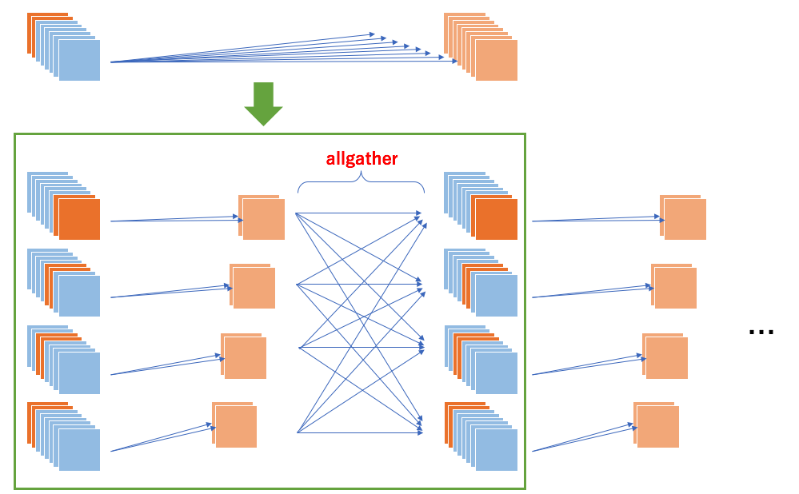

Example 3: Channel-wise Parallel Convolution
============================================

This is an example to parallelize CNN in channel-wise manner.
This parallelization is useful with a large batch size, or with high resolution images.

The basic strategy is

1. pick channels that each process is responsible for
2. apply convolution
3. use ``allgather`` to combine outputs in one tensor

on each process::

    class ParallelConvolution2D(chainer.links.Convolution2D):
        def __init__(self, comm, in_channels, out_channels, *args, **kwargs):
            self.comm = comm
            self.in_channels = in_channels
            self.out_channels = out_channels
            super(ParallelConvolution2D, self).__init__(
                self._in_channel_size, self._out_channel_size, *args, **kwargs)

        def __call__(self, x):
            x = x[:, self._channel_indices, :, :]
            y = super(ParallelConvolution2D, self).__call__(x)
            ys = chainermn.functions.allgather(self.comm, y)
            return F.concat(ys, axis=1)

        def _channel_size(self, n_channel):
            # Return the size of the corresponding channels.
            n_proc = self.comm.size
            i_proc = self.comm.rank
            return n_channel // n_proc + (1 if i_proc < n_channel % n_proc else 0)

        @property
        def _in_channel_size(self):
            return self._channel_size(self.in_channels)

        @property
        def _out_channel_size(self):
            return self._channel_size(self.out_channels)

        @property
        def _channel_indices(self):
            # Return the indices of the corresponding channel.
            indices = np.arange(self.in_channels)
            indices = indices[indices % self.comm.size == 0] + self.comm.rank
            return [i for i in indices if i < self.in_channels]

``ParallelConvolution2D`` can simply replace with the original ``Convolution2D``.
For the first convolution layer, input images for all processes must be shared.
``MultiNodeIterator`` distributes the same batches to all processes every iteration::

    if comm.rank != 0:
        train = chainermn.datasets.create_empty_dataset(train)
        test = chainermn.datasets.create_empty_dataset(test)

    train_iter = chainermn.iterators.create_multi_node_iterator(
        chainer.iterators.SerialIterator(train, args.batchsize), comm)
    test_iter = chainermn.iterators.create_multi_node_iterator(
        chainer.iterators.SerialIterator(test, args.batchsize,
                                         repeat=False, shuffle=False),
        comm)

An example code for VGG16 parallelization is available `here <https://github.com/chainer/chainer/blob/master/examples/chainermn/parallel_convolution/>`__.
