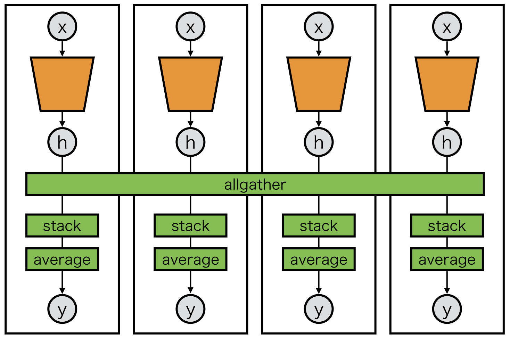

Example 4: Ensemble
===================

Averaging ensemble is one application which collective communications can effectively be applied to.

The following wrapper makes model parallel averaging ensemble easier::

    class Averaging(chainer.Chain):
        def __init__(self, comm, block):
            super(Averaging, self).__init__()
            self.comm = comm
            with self.init_scope():
                self.block = block

        def __call__(self, x):
            y = self.block(x)
    
            if not chainer.config.train:
                y = chainermn.functions.allgather(self.comm, y)
                y = F.stack(y, axis=0)
                y = F.average(y, axis=0)

            return y

Then, any links wrapped by ``Averaging`` are ready to be parallelized and averaged::

    class Model(chainer.Chain):
        def __init__(self, comm):
            super(Model, self).__init__()
            self.comm = comm
            with self.init_scope():
                self.l1 = L.Linear(d0, d1)
                self.l2 = L.Linear(d1, d2)
                self.l3 = Averaging(self.comm, L.Linear(d2, d3))

        def __call__(self, x):
            h = F.relu(self.l1(x))
            h = F.relu(self.l2(h))
            y = F.relu(self.l3(h))
            return y
