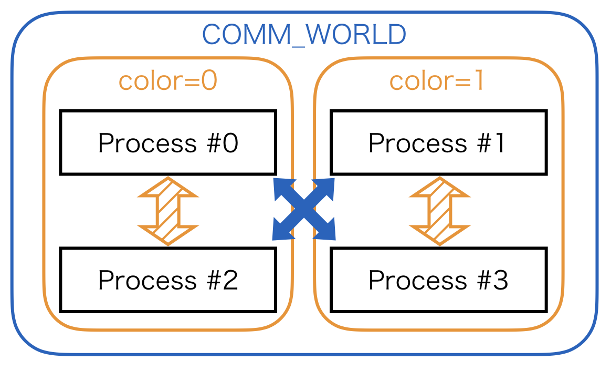
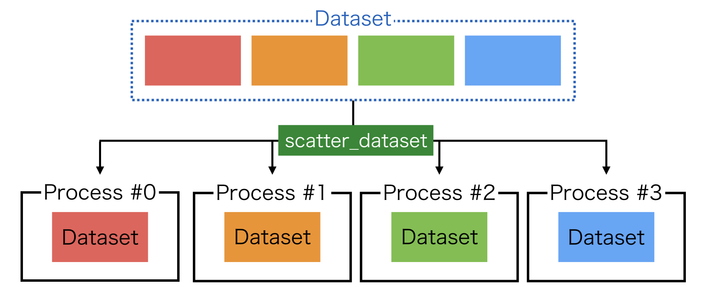
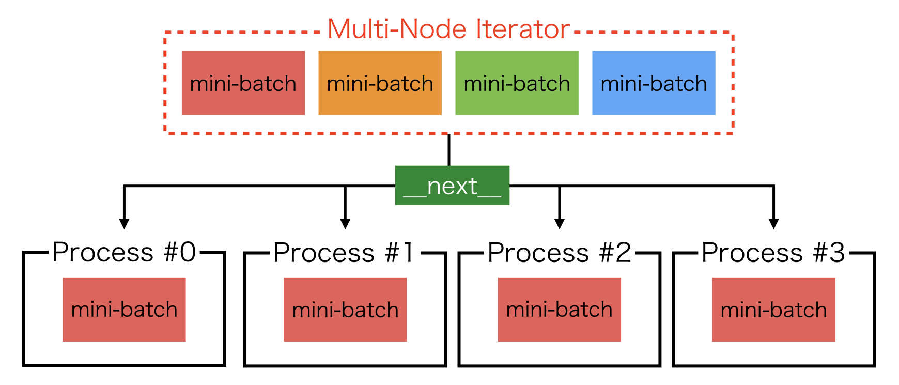
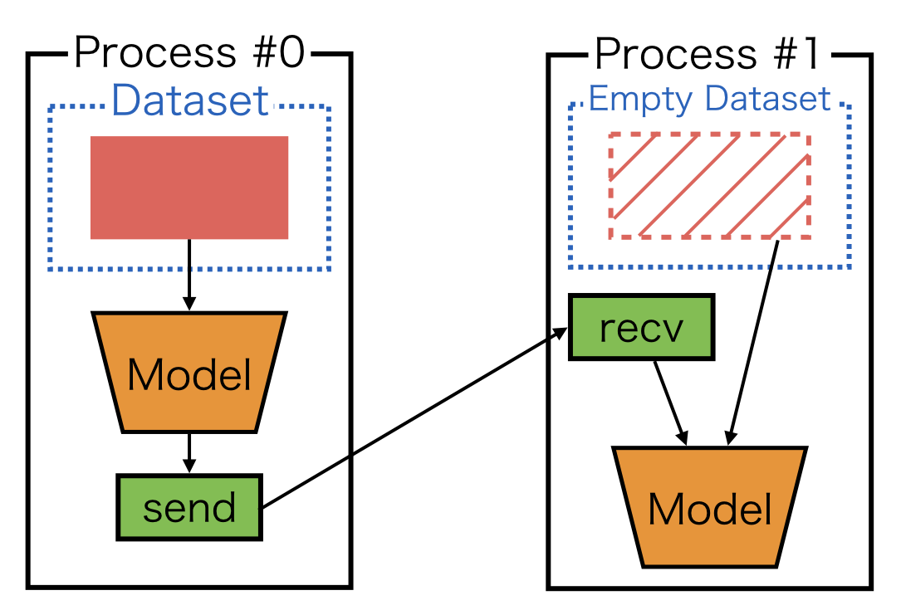
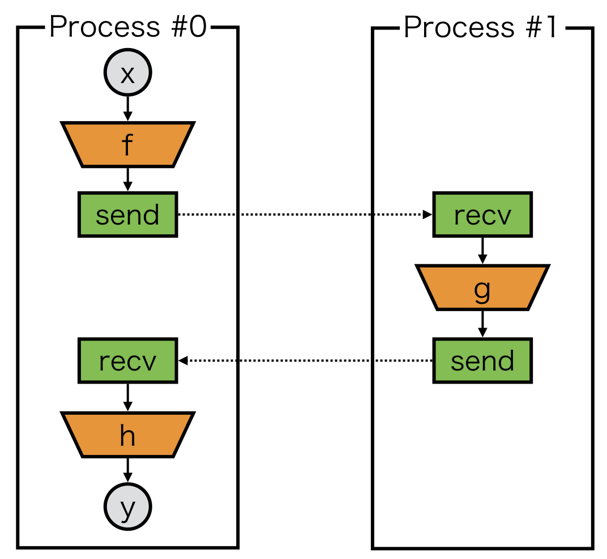
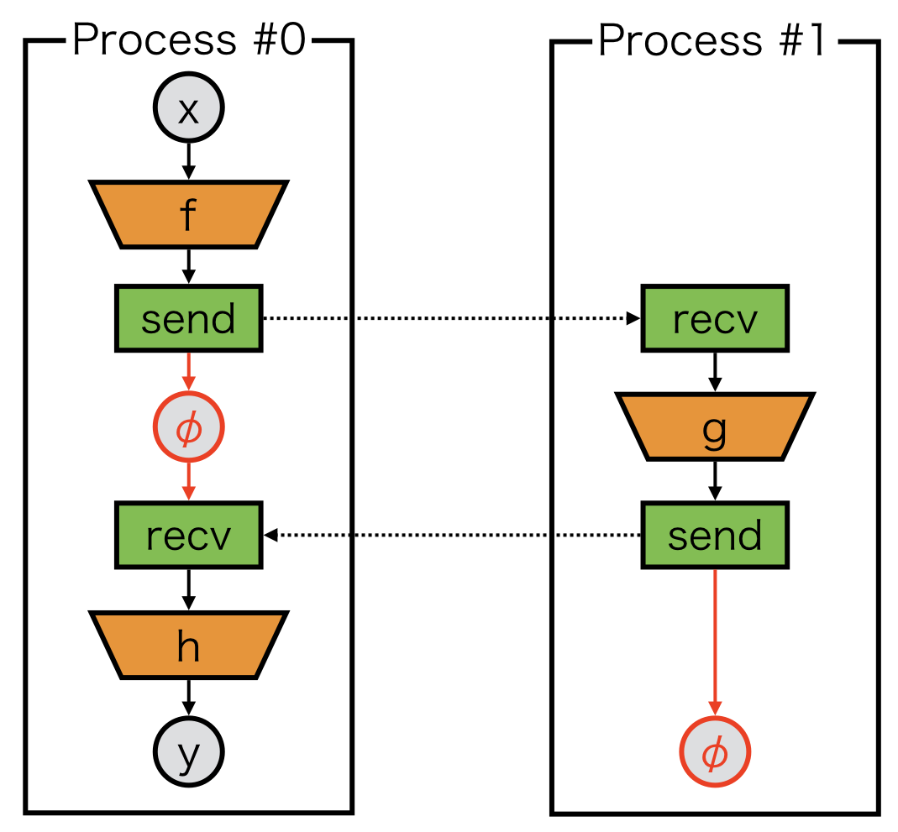
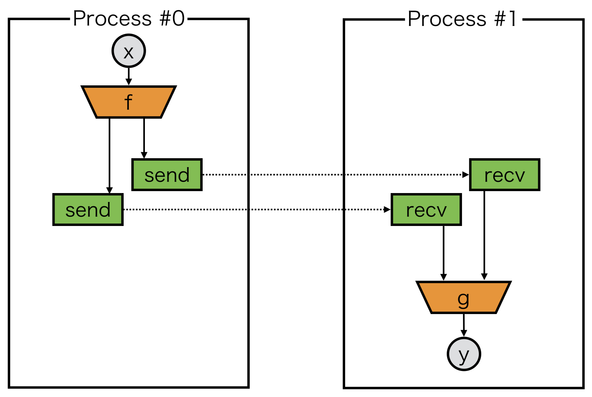
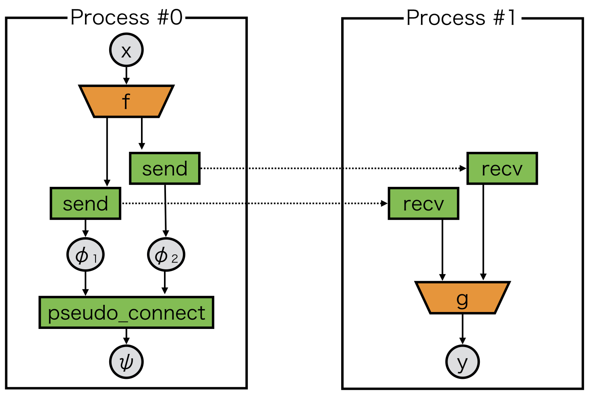

Model Parallel on ChainerMN
===========================

.. _chainermn-communicator:

Step 1: Communicators
~~~~~~~~~~~~~~~~~~~~~

To perform multi-node communications, a *communicator* is needed.
Basic usages are the same with the case of the data parallel, see :doc:`../tutorial/step1_communicators_optimizers`::

    comm = chainermn.create_communicator()

If you want to define collective communications among limited number of processes later, it is useful to split the communicator::

    subcomm = comm.split(comm.rank % 2, comm.rank)

For further detail about the communicator split, please refer to `MPI tutorial <http://mpitutorial.com/tutorials/introduction-to-groups-and-communicators/>`__.

Step 2: Datasets and Iterators
~~~~~~~~~~~~~~~~~~~~~~~~~~~~~~

In model parallel training, all processes belong to at least one of the following dataset input patterns.

1. model inputs come from datasets, and each process takes different mini-batches
2. model inputs come from datasets, and several processes share the same mini-batches
3. model inputs come from other processes

1. scatter_dataset
------------------

For the first case, you may use ``scatter_dataset`` as is introduced in :doc:`../tutorial/step2_datasets_evaluators`.

2. multi node iterator
----------------------

For the second case, iterator need to be modified, where ``create_multi_node_iterator`` is useful::

    train, test = chainer.datasets.get_mnist()
    train_iter = chainermn.iterators.create_multi_node_iterator(
        chainer.iterators.SerialIterator(train, batchsize), comm)
    test_iter = chainermn.iterators.create_multi_node_iterator(
        chainer.iterators.SerialIterator(test, batchsize), comm)

The resulting iterators return the same mini-batches among processes specified by the communicator.

3. empty dataset
----------------

For the last case, you may use ``create_empty_dataset``, which returns a dataset with the same number of empty tuples as the original dataset::

    train, test = chainer.datasets.get_mnist()
    train = chainermn.datasets.create_empty_dataset(train)
    test = chainermn.datasets.create_empty_dataset(test)

This input pattern appears in the subsequent examples such as :doc:`example1_simple_mlp`.
Note that datasets are required in Chainer's updater API. The empty dataset can be used as a dummy dataset.

Step 3: Define Communications 
~~~~~~~~~~~~~~~~~~~~~~~~~~~~~

ChainerMN supports most of the MPI communications *as Chainer functions*, including point-to-point and collective communications.
To know usages of each communication, please refer to :doc:`../reference/index`.

Example 1: Point-to-point Communication
---------------------------------------

This is an example to use point-to-point communications::

    def __call__(self, x):
        h = f(x)
        h = chainermn.functions.send(x, comm, rank=1)
        return h

The communication target is specified by ``rank`` parameter.
Note that the return value of ``send`` is often not negligible.
Please refer to :ref:`pseudo-connect`.

Example 2: Collective Communication
-----------------------------------

Here is another example to use collective communications::

    def __call__(self, x):
        h = f(x)
        h = chainermn.functions.allgather(comm, h)
        h = F.stack(h, axis=0)
        h = F.average(h, axis=0)
        return h

This pattern often appears in the averaging ensemble training.

.. _pseudo-connect:

Note: Define-by-Run and Model Parallelism
~~~~~~~~~~~~~~~~~~~~~~~~~~~~~~~~~~~~~~~~~

In model-parallel training, a model on each process may become *non-connected* computational graph.
Let's take a look at an example.

Naive implementation of a model on process #0 could be::

    class Model_0(chainer.Chain):
        def __call__(self, x):
            # first component
            z = f(x)
            chainermn.functions.send(z, comm, rank=1)

            # second component
            z = chainermn.functions.recv(comm, rank=1)
            y = h(z)

            return y

One may notice that there is no connection between the first and second components of computational graph.
As we rely on defined-by-run framework, we cannot build a backward path from the second component to the first component.
In order to build the backward path, a dummy variable, which we call ``delegate_variable``, is needed.

The variable :math:`\phi` in the above figure is ``delegate_variable``, which is a return value of ``send`` and passed to an argument of ``recv``::

    class Model_0(chainer.Chain):
        def __call__(self, x):
            # first component
            z = f(x)
            phi = chainermn.functions.send(z, comm, rank=1)

            # second component
            z = chainermn.functions.recv(comm, rank=1, delegate_variable=phi)
            y = h(z)

            return y

    class Model_1(chainer.Chain):
        def __call__(self, _):
            z = chainermn.functions.recv(comm, rank=0)
            z = g(z)
            phi = chainermn.functions.send(z, comm, rank=0)
            return phi

``Model_1`` also need to return a delegate variable :math:`\phi` to backtrack its computational graph to compute gradients.
Thus, the backward computation is guaranteed.
**Otherwise, backward computation will cause deadlock**.

Note: Delegate Variable and Pseudo Connect
~~~~~~~~~~~~~~~~~~~~~~~~~~~~~~~~~~~~~~~~~~

As we just see above, delegate variables must be appropriately handled to avoid potential deadlock.
However, there are still some pathological cases.
Let's consider to ``send`` variables twice.

Here, we must guarantee that backward tracking can find two ``send``, but we can only return one delegate variable from each model.
``pseudo_connect`` is a special function to combine one delegate variable to another variable.

In the above case, the returned variable :math:`\psi` from ``pseudo_connect`` behaves as if it is :math:`\phi_2`, while its ``backward`` backtracks both :math:`\phi_1` and :math:`\phi_2`::

    class Model_0(chainer.Chain):
        def __call__(self, x):
            z1, z2 = f(x)
            phi1 = chainermn.functions.send(z1, comm, rank=1)
            phi2 = chainermn.functions.send(z2, comm, rank=1)
            psi = chainermn.functions.pseudo_connect(phi1, phi2)
            return psi

    class Model_1(chainer.Chain):
        def __call__(self, _):
            z1 = chainermn.functions.recv(comm, rank=0)
            z2 = chainermn.functions.recv(comm, rank=0)
            y = g(z1, z2)
            return y
