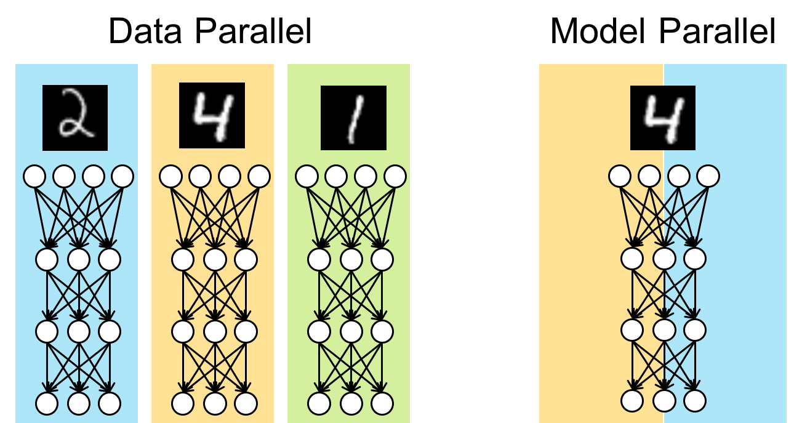
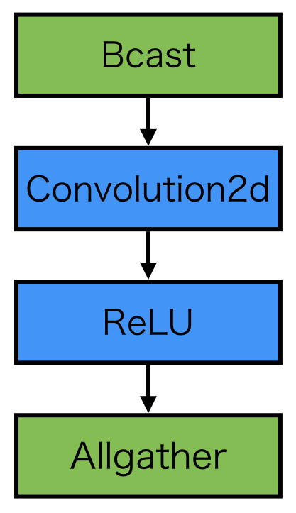
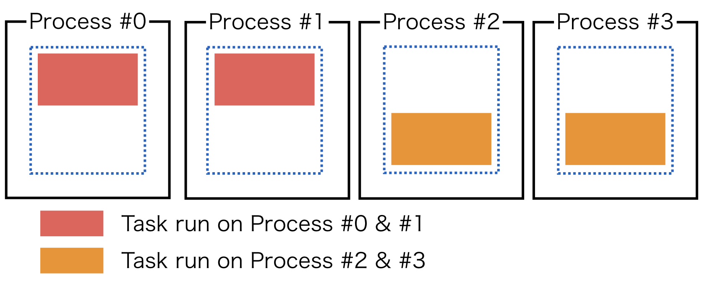

Overview
========

Model Parallelism
~~~~~~~~~~~~~~~~~

Even though ChainerMN mainly supports the data parallel approach for distributed training, it also has experimental APIs for the *model parallel* approach.
The model parallel approach splits a given model into subcomponents loaded on several processes.
This approach is useful in cases where

- large mini-batch or high-resolusion is needed.
- the model is too huge to run on a single process.
- the mixture of experts are trained.

Philosophy
~~~~~~~~~~

ChainerMN takes the following three approaches to realize the model parallelism.

1. Communication as Function
----------------------------

ChainerMN provides several special functions for communications such as ``chainermn.functions.bcast`` and ``chainermn.functions.alltoall``, which wraps raw MPI communications.
Users define communications between processes as Chainer function calls in the model definitions.
This enables highly flexible communication patterns.
Moreover, parameter updates in backward propagation are automatically invoked through ``backward`` defined in those functions for communications.

2. Synchronous Model Parallel
-----------------------------

ChainerMN restricts itself to the synchronous updates.
Though the asynchronous counterpart seems to be more computationally efficient, the asynchronous updates often suffer from the stale gradients problem and results in difficulty while debugging.
The synchronous communication makes them simpler.

3. Single-Program-Multiple-Data (SPMD)
--------------------------------------

In principle, ChainerMN supports single-program-multiple-data (SPMD), which means the same program is invoked and different data are used on each process.

References
~~~~~~~~~~

- `More Effective Distributed ML via a Stale Synchronous Parallel Parameter Server <https://papers.nips.cc/paper/4894-more-effective-distributed-ml-via-a-stale-synchronous-parallel-parameter-server.pdf>`__
- `Outrageously Large Neural Networks: The Sparsely-Gated Mixture-of-Experts Layer <https://arxiv.org/pdf/1701.06538.pdf>`__
- `AMPNet: Asynchronous Model-Parallel Training for Dynamic Neural Networks <https://arxiv.org/pdf/1705.09786.pdf>`__
- `Deep Mixture of Experts via Shallow Embedding <https://arxiv.org/pdf/1806.01531.pdf>`__
- `Mesh-TensorFlow: Deep Learning for Supercomputers <https://papers.nips.cc/paper/8242-mesh-tensorflow-deep-learning-for-supercomputers.pdf>`__
- `GPipe: Efficient Training of Giant Neural Networks using Pipeline Parallelism <https://arxiv.org/pdf/1811.06965.pdf>`__
