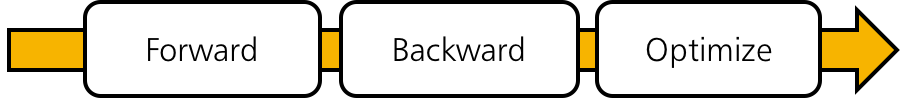
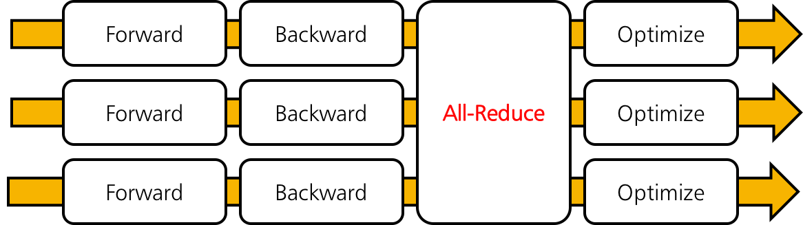

Overview
========

Data Parallelism
~~~~~~~~~~~~~~~~

ChainerMN employs the data parallel approach for distributed training.
In the data parallel approach, each worker has a model copy,
and computes a gradient against a batch.
Then, the workers collaborate to update the model using the gradients of all workers.

.. figure:: ../../../image/parallelism.png
    :align: center

Training Iterations
~~~~~~~~~~~~~~~~~~~

What ChainerMN does for distributed training is actually quite simple.
Let us look at what we do in each iteration.
The following figure illustrates an iteration of standard training using Chainer (without ChainerMN).
It consists of three steps: forward, backward and optimize.

When using ChainerMN, an additional step all-reduce is inserted after the backward step.
In this step, workers communicate to obtain the averaged gradient over gradients of all workers.
Then, the aggregated gradient is used to improve the model in the optimization step.

MPI
~~~

ChainerMN is built on MPI.
MPI invokes our training script in the SPMD (single program, multiple data) way.
ChainerMN is designed to create a process on each GPU.
For example, let us suppose you have two nodes with four GPUs each,
and want to run ``train_imagenet.py``.
Then, you will invoke eight Python processes running ``train_imagenet.py``
by using ``mpiexec`` or ``mpirun``.

