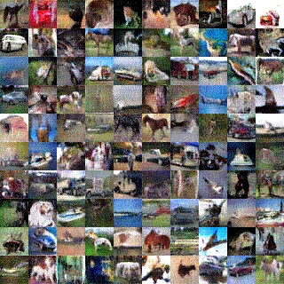
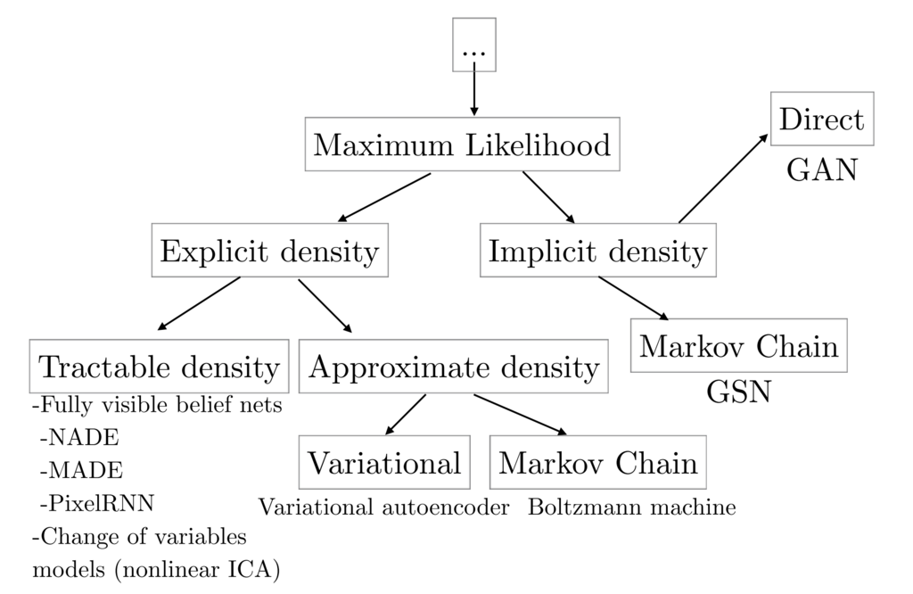
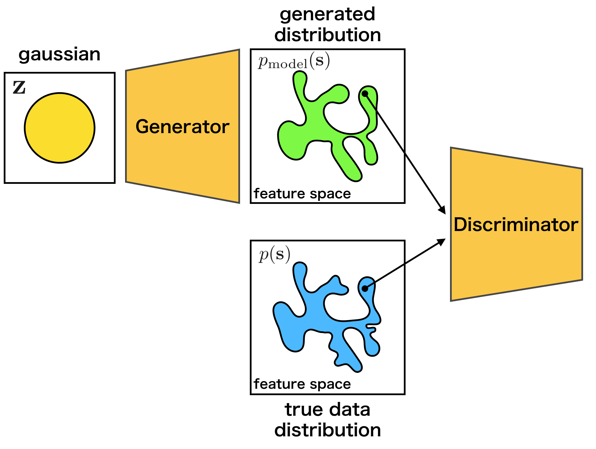
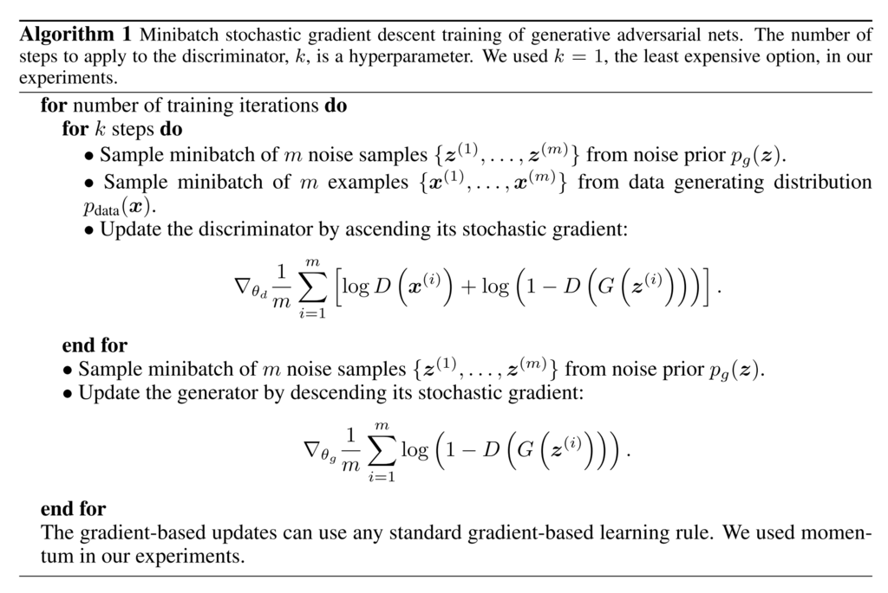
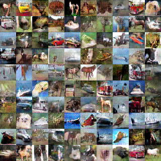

DCGAN: Generate images with Deep Convolutional GAN
****************************************************

.. currentmodule:: chainer

0. Introduction
================

In this tutorial, we generate images with **generative adversarial networks (GAN)**.
GAN are kinds of deep neural network for generative modeling that are often
applied to image generation. GAN-based models are also used in
`PaintsChainer <https://paintschainer.preferred.tech/index_en.html>`_,
an automatic colorization service.

In this tutorial, you will learn the following things:

1. Generative Adversarial Networks (GAN)
2. Implementation of DCGAN in Chainer

1. Generarive Adversarial Networks (GAN)
=========================================

1.1 What are GAN?
-----------------

As explained in GAN tutorial in NIPS 2016 [1], generative models can be classified into the categories as shown in the following figure:

   cited from [1]

Besides GAN, other famous generative models include Fully visible belief networks (FVBNs) and Variational autoencoder (VAE).
Unlike FVBNs and VAE, GAN do not explicitly model the probability distribution :math:`p({\bf s})`
that generates training data. Instead, we model a generator :math:`G: {\bf z} \mapsto {\bf s}`.
The generator :math:`G` samples :math:`{\bf s} \sim p({\bf s})` from the latent variable :math:`{\bf z}`.
Apart from the generator :math:`G`, we create a discriminator :math:`D({\bf x})`
which discriminates between samples from the generator `G` and examples from training data.
While training the discriminator :math:`D`, the generator :math:`G`
tries to maximize the probability of the discriminator :math:`D` making a mistake.
So, the generator :math:`G` tries to create samples
that seem to be drawn from the same distribution as the training data.

The advantages of GAN are low sampling cost and its state-of-the-art performance in image generation.
The disadvantage is that we cannot calculate the likelihood
:math:`p_{\mathrm {model}}({\bf s})` because we do not model any probability distribution,
and we cannot infer the latent variable :math:`{\bf z}` from a sample.

1.2 How GAN work?
-----------------------

As explained above, GAN use the two models, the generator and the discriminator.
When training the networks, we should match the data distribution
:math:`p({\bf s})` with the distribution of the samples
:math:`{\bf s} = G ({\bf z})` generated from the generator.

The generator :math:`G` learns the target distribution, and ideally eventually
reaches a **Nash equilibrium** [2] of game theory.
In detail, while training the discriminator :math:`D`,
the generator :math:`G` is also trained, so that
the discriminator :math:`D` makes a mistake.

As an intuitive example, the relationship between counterfeiters of
banknotes and the police is frequently used. The counterfeiters try to make counterfeit notes
that look like real banknotes. The police try to distinguish real bank notes from counterfeit notes.
It is supposed that the ability of the police gradually rises, so that real banknotes and counterfeit
notes can be recognized well. Then, the counterfeiters will not be able to use counterfeit banknotes,
so they will create counterfeit banknotes that appear more realistic.
As the police improve their skill further,
they can distinguish real and counterfeit notes... Eventually, the counterfeiter will
be able to produce counterfeit banknotes look as real as genuine ones.

The training process is explained by the following mathematical expressions.
First, since the discriminator :math:`D({\bf s})` is the probability 
that a sample :math:`{\bf s}` is generated from the data distribution at,
it can be expressed as follows:

.. math::
    D({\bf s}) = \frac{p({\bf s})}{p({\bf s}) + p_{\mathrm{model}}({\bf s})}

Then, when we match 
the data distribution :math:`{\bf s} \sim p({\bf s})` and
the distribution of generated samples by :math:`G`,
it means that we should minimize the dissimilarity between
the two distributions.
It is common to use **Jensen-Shannon Divergence** :math:`D_{\mathrm{JS}}`
to measure the dissimilarity between distributions[3].

The :math:`D_{\mathrm{JS}}` of :math:`p_{\mathrm{model}}({\bf s})` and
:math:`p({\bf s})` can be written as follows by using :math:`D({\bf s})`:

.. math::
     2 D_{\mathrm{JS}} &=& D_{\mathrm{KL}}(p({\bf s})||\bar{p}({\bf s})) + D_{\mathrm{KL}}(p_{\mathrm{model}}({\bf s})||\bar{p}({\bf s})) \\
     &=& \mathbb{E}_{p({\bf s})} \left[ \log \frac{2p({\bf s})}{p({\bf s}) + p_{\mathrm{model}}({\bf s})} \right] + \mathbb{E}_{p_{\mathrm{model}}} \left[ \log \frac{2p_{\mathrm{model}}({\bf s})}{p({\bf s}) + p_{\mathrm{model}}({\bf s})} \right] \\
     &=& \mathbb{E}_{p({\bf s})} \log D({\bf s}) + \mathbb{E}_{p_{\mathrm{model}}} \log (1-D({\bf s})) + \log 4 \\
     &=& \mathbb{E}_{p({\bf s})} \log D({\bf s}) + \mathbb{E}_{p_{\bf z}} \log (1-D(G({\bf z}))) + \log 4

where :math:`\bar{p}({\bf s}) = \frac{p({\bf s}) + p_{\rm model}({\bf s})}{2}`.
The :math:`D_{\mathrm{JS}}` will be ma{\bf s}imized by the discriminator :math:`D` and minimized by
the generator :math:`G`, namely, :math:`p_{\mathrm{model}}`.
And the distribution :math:`p_{\mathrm model}({\bf s})`
generated by :math:`G({\bf {\bf s}})` can match the data distribution :math:`p({\bf s})`.

.. math::
    \min_{G} \max_{D} \mathbb{E}_{p({\bf s})} \log D({\bf s}) + \mathbb{E}_{p_{\bf z}} \log (1-D(G({\bf z})))

When we actually train the model, the above min-max problem is solved by alternately updating the
discriminator :math:`D({\bf s})` and the generator :math:`G({\bf z})` [4]. The actual training procedures are described as follows:

   cited from [4]

1.3 What are DCGAN?
-------------------

In this section, we will introduce the model called DCGAN(Deep Convolutional GAN) proposed by Radford et al.[5].
As shown below, it is a model using CNN(Convolutional Neural Network) as its name suggests.

.. figure:: ../../image/dcgan/dcgan.png
   :scale: 100%

   cited from [5]

In addition, although GAN are known for its difficulty in training, this paper introduces various techniques
for successful training:

1. Convert max-pooling layers to convolution layers with larger or fractional strides
2. Convert fully connected layers to global average pooling layers in the discriminator
3. Use batch normalization layers in the generator and the discriminator
4. Use leaky ReLU activation functions in the discriminator

2. Implementation of DCGAN in Chainer
=======================================

There is an example of DCGAN in the official repository of Chainer,
so we will explain how to implement DCGAN based on this:
`chainer/examples/dcgan <https://github.com/chainer/chainer/tree/master/examples/dcgan>`_

2.1 Define the generator model
-------------------------------

First, let's define a network for the generator.

.. literalinclude:: ../../../examples/dcgan/net.py
   :language: python
   :pyobject: Generator
   :caption: train_dcgan.py

When we make a network in Chainer, there are some conventions:

1. Define a network class which inherits :class:`~chainer.Chain`.
2. Make :class:`chainer.links`\ 's instances in the ``init_scope():`` 
   of the initializer ``__init__``.
3. Define network connections in the ``__call__`` operator by using
   the :class:`chainer.links`\ 's instances and :class:`chainer.functions`.

If you are not familiar with constructing a new network, please refer to
:ref:`this tutorial<creating_models>`.

As we can see from the initializer ``__init__``, the ``Generator``
uses deconvolution layers :class:`~chainer.links.Deconvolution2D`
and batch normalization layers :class:`~chainer.links.BatchNormalization`.
In ``__call__``, each layer is called and followed by
:class:`~chainer.functions.relu` except the last layer.

Because the first argument of ``L.Deconvolution`` is the channel size of input and
the second is the channel size of output, we can find that each layer halves the
channel size. When we construct ``Generator`` with ``ch=1024``, the network
is same as the above image.

.. note::
    Be careful when passing the output of a fully connected layer to a convolution
    layer, because the convolutional layer needs additional dimensions for inputs.
    As we can see the 1st line of ``__call__``,
    the output of the fully connected layer is reshaped by :class:`~chainer.functions.reshape`
    to add the dimensions of the channel, the width and the height of images.

2.2 Define the discriminator model
-----------------------------------

In addtion, let's define the network for the discriminator.

.. literalinclude:: ../../../examples/dcgan/net.py
   :language: python
   :pyobject: Discriminator
   :caption: train_dcgan.py

The ``Discriminator`` network is almost mirrors of the ``Generator`` network.
However, there are minor different points:

1. Use :class:`~chainer.functions.leaky_relu` as activation functions
2. Deeper than ``Generator``
3. Add some noise to every intermediate outputs before giving them to the next layers

.. literalinclude:: ../../../examples/dcgan/net.py
   :language: python
   :pyobject: add_noise
   :caption: train_dcgan.py

2.3 Prepare dataset and iterator
---------------------------------

Let's retrieve the CIFAR-10 dataset by using Chainer's dataset utility function
:class:`~chainer.datasets.get_cifar10`. CIFAR-10 is a set of small natural images.
Each example is an RGB color image of size 32x32. In the original images,
each of R, G, B of pixels is represented by one-byte unsigned integer 
(i.e. from 0 to 255).
This function changes the scale of pixel values into ``[0, scale]`` float values.

.. literalinclude:: ../../../examples/dcgan/train_dcgan.py
   :language: python
   :start-after: Load the CIFAR10
   :end-before: else
   :dedent: 4

.. literalinclude:: ../../../examples/dcgan/train_dcgan.py
   :language: python
   :start-after: Setup an iterator
   :end-before: Setup an updater
   :caption: train_dcgan.py
   :dedent: 4

2.4 Prepare model and optimizer
--------------------------------

Let's make the instances of the generator and the discriminator.

.. literalinclude:: ../../../examples/dcgan/train_dcgan.py
   :language: python
   :start-after: Set up a neural network to train
   :end-before: if
   :caption: train_dcgan.py
   :dedent: 4

Next, let's make optimizers for the models created above.

.. literalinclude:: ../../../examples/dcgan/train_dcgan.py
   :language: python
   :start-after: Setup an optimizer
   :end-before: if
   :caption: train_dcgan.py
   :dedent: 4

2.5 Prepare updater
--------------------

GAN need the two models: the generator and the discriminator. Usually,
the default updaters pre-defined in Chainer take only one model.
So, we need to define a custom updater for GAN training.

The definition of ``DCGANUpdater`` is a little complicated. However, it just
minimizes the loss of the discriminator and that of the generator alternately.

As you can see in the class definiton, ``DCGANUpdater`` inherits 
:class:`~chainer.training.updaters.StandardUpdater`. In this case,
almost all necessary functions are defined in
:class:`~chainer.training.updaters.StandardUpdater`,
we just override the functions of ``__init__`` and ``update_core``.

.. note::
    We do not need to define ``loss_dis`` and ``loss_gen`` because the functions
    are called only in ``update_core``. It aims at improving readability.

.. literalinclude:: ../../../examples/dcgan/updater.py
   :language: python
   :pyobject: DCGANUpdater
   :caption: train_dcgan.py

In the intializer ``__init__``, an addtional keyword argument ``models`` is
required as you can see the code below. Also, we use keyword arguments
``iterator``, ``optimizer`` and ``device``. 
It should be noted that the ``optimizer`` augment takes a dictionary.
The two different models require two different optimizers.
To specify the different optimizers for the models, we give a dictionary,
``{'gen': opt_gen, 'dis': opt_dis}``, to the ``optimizer`` argument.
we should input
``optimizer`` as a dictionary ``{'gen': opt_gen, 'dis': opt_dis}``.
In the ``DCGANUpdater``, you can access the iterator with ``self.get_iterator('main')``.
Also, you can access the optimizers with
``self.get_optimizer('gen')`` and ``self.get_optimizer('dis')``.

In ``update_core``, the two loss functions ``loss_dis`` and ``loss_gen``
are minimized by the optimizers. At first two lines, we access
the optimizers. Then, we create next minibatch of training data by
``self.get_iterator('main').next()``, copy ``batch`` to the device
by ``self.converter``, and make it a ``Variable`` object.
After that, we minimize the loss functions with
the optimizers.

.. note::
    When defining ``update_core``, we may want to manipulate the
    underlying ``array`` of a ``Variable`` with ``numpy`` or ``cupy`` library.
    Note that the type of arrays on CPU  is ``numpy.ndarray``, while the type
    of arrays on GPU is ``cupy.ndarray``. However, users do not need to write
    ``if`` condition explicitly, because the appropriate array module can be
    obtained by ``xp = chainer.backends.cuda.get_array_module(variable.array)``.
    If ``variable`` is on GPU, ``cupy`` is assigned to ``xp``, otherwise
    ``numpy`` is assigned to ``xp``.

.. literalinclude:: ../../../examples/dcgan/train_dcgan.py
   :language: python
   :start-after: Setup an updater
   :end-before: Setup a trainer
   :caption: train_dcgan.py
   :dedent: 4

2.6 Prepare trainer and run
----------------------------

.. literalinclude:: ../../../examples/dcgan/train_dcgan.py
   :language: python
   :start-after: Setup a trainer
   :end-before: args.resume
   :caption: train_dcgan.py
   :dedent: 4

.. literalinclude:: ../../../examples/dcgan/train_dcgan.py
   :language: python
   :start-after: Run the training
   :end-before: __main__
   :caption: train_dcgan.py
   :dedent: 4

2.7 Start training
-------------------

We can run the example as follows.

.. code-block:: console

    $ pwd
    /root2chainer/chainer/examples/dcgan
    $ python train_dcgan.py --gpu 0 
    GPU: 0
    # Minibatch-size: 50
    # n_hidden: 100
    # epoch: 1000
    
    epoch       iteration   gen/loss    dis/loss  ................]  0.01%
    0           100         1.2292      1.76914     
         total [..................................................]  0.02%
    this epoch [#########.........................................] 19.00%
           190 iter, 0 epoch / 1000 epochs
        10.121 iters/sec. Estimated time to finish: 1 day, 3:26:26.372445.

The results will be saved in the directory ``/root2chainer/chainer/examples/dcgan/result/``.
The image is generated by the generator trained for 1000 epochs, and the GIF image
on the top of this page shows generated images after every 10 epochs.

3. Reference
=============
* [1] `NIPS 2016 Tutorial: Generative Adversarial Networks <http://arxiv.org/abs/1701.00160>`_
* [2] `Nash equilibrium <http://en.wikipedia.org/wiki/Nash_equilibrium>`_
* [3] `Jensen-Shannon Divergence <http://en.wikipedia.org/wiki/Jensen%E2%80%93Shannon_divergence>`_
* [4] `Generative Adversarial Networks <https://arxiv.org/abs/1406.2661>`_
* [5] `Unsupervised Representation Learning with Deep Convolutional Generative Adversarial Networks <https://arxiv.org/abs/1511.06434>`_
