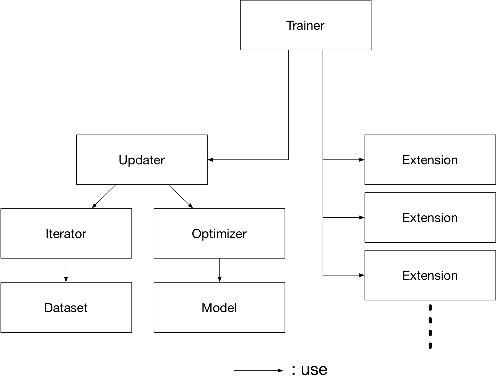
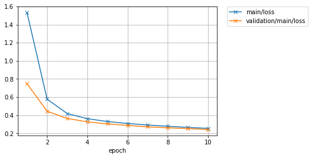
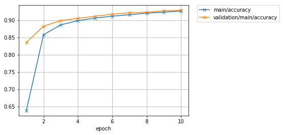
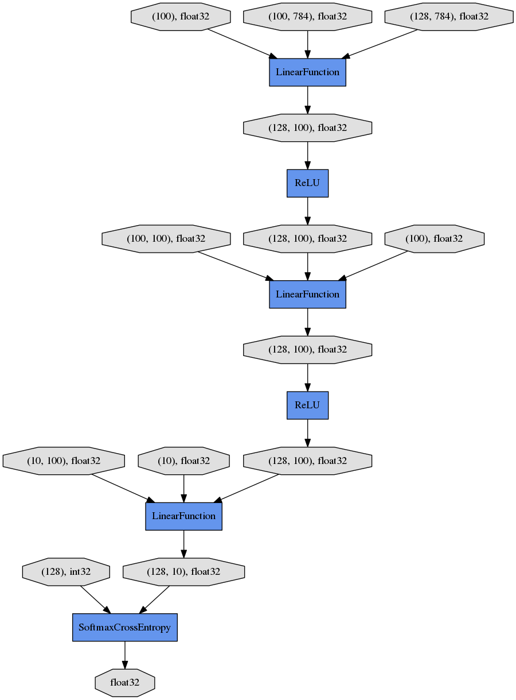

.. _mnist_mlp_example:

MNIST using Trainer
```````````````````

.. include:: ../imports.rst

By using :class:`~chainer.training.Trainer`, you don't need to write the training loop explicitly any more. Furthermore, Chainer provides many useful extensions that can be used with :class:`~chainer.training.Trainer` to visualize your results, evaluate your model, store and manage log files more easily.

This example will show how to use the :class:`~chainer.training.Trainer` to train a fully-connected feed-forward neural network on the MNIST dataset.

.. note::

    If you would like to know how to write a training loop without using the :class:`~chainer.training.Trainer`, please check :doc:`train_loop` instead of this tutorial.

1. Prepare the dataset
''''''''''''''''''''''

Load the MNIST dataset, which contains a training set of images and class labels as well as a corresponding test set.

.. testcode::

    from chainer.datasets import mnist

    train, test = mnist.get_mnist()

.. note::

    **You can use a Python list as a dataset.** That's because :class:`~chainer.dataset.Iterator` can take any object as a dataset whose elements can be accessed via ``[]`` accessor and whose length can be obtained with ``len()`` function. For example,

    .. code-block:: python

        train = [(x1, t1), (x2, t2), ...]

    a list of tuples like this can be used as a dataset.

    There are many utility dataset classes defined in :mod:`~chainer.datasets`. It's recommended to utilize them in the actual applications.

    For example, if your dataset consists of a number of image files, it would take a large amount of memory to load those data into a list like above. In that case, you can use :class:`~chainer.datasets.ImageDataset`, which just keeps the paths to image files. The actual image data will be loaded from the disk when the corresponding element is requested via ``[]`` accessor. Until then, no images are loaded to the memory to reduce memory use.

2. Prepare the dataset iterations
'''''''''''''''''''''''''''''''''

:class:`~chainer.dataset.Iterator` creates a mini-batch from the given dataset.

.. testcode::

    batchsize = 128

    train_iter = iterators.SerialIterator(train, batchsize)
    test_iter = iterators.SerialIterator(test, batchsize, False, False)

3. Prepare the model
''''''''''''''''''''

Here, we are going to use the same model as the one defined in :doc:`train_loop`.

.. testcode::

    class MLP(Chain):

        def __init__(self, n_mid_units=100, n_out=10):
            super(MLP, self).__init__()
            with self.init_scope():
                self.l1 = L.Linear(None, n_mid_units)
                self.l2 = L.Linear(None, n_mid_units)
                self.l3 = L.Linear(None, n_out)

        def forward(self, x):
            h1 = F.relu(self.l1(x))
            h2 = F.relu(self.l2(h1))
            return self.l3(h2)

    gpu_id = 0  # Set to -1 if you use CPU

    model = MLP()
    if gpu_id >= 0:
        model.to_gpu(gpu_id)

4. Prepare the Updater
''''''''''''''''''''''

:class:`~chainer.training.Trainer` is a class that holds all of the necessary components needed for training. The main components are shown below.



Basically, all you need to pass to :class:`~chainer.training.Trainer` is an :class:`~chainer.training.Updater`. However, :class:`~chainer.training.Updater` contains an :class:`~chainer.dataset.Iterator` and :class:`~chainer.Optimizer`. Since :class:`~chainer.dataset.Iterator` can access the dataset and :class:`~chainer.Optimizer` has references to the model, :class:`~chainer.training.Updater` can access to the model to update its parameters.

So, :class:`~chainer.training.Updater` can perform the training procedure as shown below:

1. Retrieve the data from dataset and construct a mini-batch (:class:`~chainer.dataset.Iterator`)
2. Pass the mini-batch to the model and calculate the loss
3. Update the parameters of the model (:class:`~chainer.Optimizer`)

Now let's create the :class:`~chainer.training.Updater` object !

.. testcode::

    max_epoch = 10

    # Wrap your model by Classifier and include the process of loss calculation within your model.
    # Since we do not specify a loss function here, the default 'softmax_cross_entropy' is used.
    model = L.Classifier(model)

    # selection of your optimizing method
    optimizer = optimizers.MomentumSGD()

    # Give the optimizer a reference to the model
    optimizer.setup(model)

    # Get an updater that uses the Iterator and Optimizer
    updater = training.updaters.StandardUpdater(train_iter, optimizer, device=gpu_id)

.. note::

    Here, the model defined above is passed to :class:`~chainer.links.Classifier` and changed to a new :class:`~chainer.Chain`. :class:`~chainer.links.Classifier`, which in fact inherits from the :class:`~chainer.Chain` class, keeps the given :class:`~chainer.Chain` model in its :attr:`~chainer.links.Classifier.predictor` attribute. Once you give the input data and the corresponding class labels to the model by the ``()`` operator,

    1. :meth:`~chainer.links.Classifier.forward` of the model is invoked. The data is then given to :attr:`~chainer.links.Classifier.predictor` to obtain the output ``y``.
    2. Next, together with the given labels, the output ``y`` is passed to the loss function which is determined by :attr:`~chainer.links.Classifier.lossfun` argument in the constructor of :class:`~chainer.links.Classifier`.
    3. The loss is returned as a :class:`~chainer.Variable`.

    In :class:`~chainer.links.Classifier`, the :attr:`~chainer.links.Classifier.lossfun` is set to
    :meth:`~chainer.functions.softmax_cross_entropy` as default.

    :class:`~chainer.training.updaters.StandardUpdater` is the simplest class among several updaters. There are also the :class:`~chainer.training.updaters.ParallelUpdater` and the :class:`~chainer.training.updaters.MultiprocessParallelUpdater` to utilize multiple GPUs. The :class:`~chainer.training.updaters.MultiprocessParallelUpdater` uses the NVIDIA NCCL library, so you need to install NCCL and re-install CuPy before using it.

5. Setup Trainer
''''''''''''''''

Lastly, we will setup :class:`~chainer.training.Trainer`. The only requirement for creating a :class:`~chainer.training.Trainer` is to pass the :class:`~chainer.training.Updater` object that we previously created above. You can also pass a :attr:`~chainer.training.Trainer.stop_trigger` to the second trainer argument as a tuple like ``(length, unit)`` to tell the trainer when to stop the training. The ``length`` is given as an integer and the ``unit`` is given as a string which should be either ``epoch`` or ``iteration``. Without setting :attr:`~chainer.training.Trainer.stop_trigger`, the training will never be stopped.

.. testcode::

    # Setup a Trainer
    trainer = training.Trainer(updater, (max_epoch, 'epoch'), out='mnist_result')

The :attr:`~chainer.training.Trainer.out` argument specifies an output directory used to save the
log files, the image files of plots to show the time progress of loss, accuracy, etc. when you use :class:`~chainer.training.extensions.PlotReport` extension. Next, we will explain how to display or save those information by using trainer :class:`~chainer.training.Extension`.

6. Add Extensions to the Trainer object
'''''''''''''''''''''''''''''''''''''''

The :class:`~chainer.training.Trainer` extensions provide the following capabilities:

* Save log files automatically (:class:`~chainer.training.extensions.LogReport`)
* Display the training information to the terminal periodically (:class:`~chainer.training.extensions.PrintReport`)
* Visualize the loss progress by plotting a graph periodically and save it as an image file (:class:`~chainer.training.extensions.PlotReport`)
* Automatically serialize the state periodically (:meth:`~chainer.training.extensions.snapshot` / :meth:`~chainer.training.extensions.snapshot_object`)
* Display a progress bar to the terminal to show the progress of training (:class:`~chainer.training.extensions.ProgressBar`)
* Save the model architecture as a Graphviz's dot file (:meth:`~chainer.training.extensions.DumpGraph`)

To use these wide variety of tools for your training task, pass :class:`~chainer.training.Extension` objects to the :meth:`~chainer.training.Trainer.extend` method of your :class:`~chainer.training.Trainer` object.

.. testcode::
    :hide:

    # Shortcut for doctests.
    max_epoch = 1
    trainer = training.Trainer(updater, (max_epoch, 'epoch'), out='mnist_result')
    trainer.extend(extensions.snapshot_object(model.predictor, filename='model_epoch-10'))

    # Allow doctest to run in headless environment.
    import matplotlib
    matplotlib.use('Agg')

.. testcode::

    from chainer.training import extensions

    trainer.extend(extensions.LogReport())
    trainer.extend(extensions.snapshot(filename='snapshot_epoch-{.updater.epoch}'))
    trainer.extend(extensions.snapshot_object(model.predictor, filename='model_epoch-{.updater.epoch}'))
    trainer.extend(extensions.Evaluator(test_iter, model, device=gpu_id))
    trainer.extend(extensions.PrintReport(['epoch', 'main/loss', 'main/accuracy', 'validation/main/loss', 'validation/main/accuracy', 'elapsed_time']))
    trainer.extend(extensions.PlotReport(['main/loss', 'validation/main/loss'], x_key='epoch', file_name='loss.png'))
    trainer.extend(extensions.PlotReport(['main/accuracy', 'validation/main/accuracy'], x_key='epoch', file_name='accuracy.png'))
    trainer.extend(extensions.DumpGraph('main/loss'))

:class:`~chainer.training.extensions.LogReport`
...............................................

Collect ``loss`` and ``accuracy`` automatically every ``epoch`` or ``iteration`` and store the information under the ``log`` file in the directory specified by the :attr:`~chainer.training.Trainer.out` argument when you create a :class:`~chainer.training.Trainer` object.

:meth:`~chainer.training.extensions.snapshot`
.............................................

The :meth:`~chainer.training.extensions.snapshot` method saves the :class:`~chainer.training.Trainer` object at the designated timing (default: every epoch) in the directory specified by :attr:`~chainer.training.Trainer.out`. The :class:`~chainer.training.Trainer` object, as mentioned before, has an :class:`~chainer.training.Updater` which contains an :class:`~chainer.Optimizer` and a model inside. Therefore, as long as you have the snapshot file, you can use it to come back to the training or make inferences using the previously trained model later.

:meth:`~chainer.training.extensions.snapshot_object`
....................................................

However, when you keep the whole :class:`~chainer.training.Trainer` object, in some cases, it is very tedious to retrieve only the inside of the model. By using :meth:`~chainer.training.extensions.snapshot_object`, you can save the particular object (in this case, the model wrapped by :class:`~chainer.links.Classifier`) as a separate snapshot. :class:`~chainer.links.Classifier` is a :class:`~chainer.Chain` object which keeps the model that is also a :class:`~chainer.Chain` object as its :attr:`~chainer.links.Classifier.predictor` property, and all the parameters are under the :attr:`~chainer.links.Classifier.predictor`, so taking the snapshot of :attr:`~chainer.links.Classifier.predictor` is enough to keep all the trained parameters.

This is a list of commonly used trainer extensions:

.. glossary::

  :class:`~chainer.training.extensions.LogReport`
     This extension collects the loss and accuracy values every epoch or iteration and stores in a log file.
     The log file will be located under the output directory (specified by ``out`` argument of the :class:`~chainer.training.Trainer` object).

  :meth:`~chainer.training.extensions.snapshot`
     This extension saves the :class:`~chainer.training.Trainer` object at the designated timing (defaut: every epoch) in the output directory.
     The :class:`~chainer.training.Trainer` object, as mentioned before, has an :class:`~chainer.training.Updater` which contains an :class:`~chainer.Optimizer` and a model inside. Therefore, as long as you have the snapshot file, you can use it to come back to the training or make inferences using the previously trained model later.

  :meth:`~chainer.training.extensions.snapshot_object`
     :meth:`~chainer.training.extensions.snapshot` extension above saves the whole :class:`~chainer.training.Trainer` object. However, in some cases, it is tedious to retrieve only the inside of the model.
     By using :meth:`~chainer.training.extensions.snapshot_object`, you can save the particular object (in the example above, the model wrapped by :class:`~chainer.links.Classifier`) as a separeted snapshot.
     Taking the snapshot of :attr:`~chainer.links.Classifier.predictor` is enough to keep all the trained parameters, because
     :class:`~chainer.links.Classifier` (which is a subclass of :class:`~chainer.Chain`) keeps the model as its :attr:`~chainer.links.Classifier.predictor` property, and all the parameters are under this property.

  :meth:`~chainer.training.extensions.DumpGraph`
     This extension saves the structure of the computational graph of the model.
     The graph is saved in `Graphviz <http://www.graphviz.org/>`_ dot format under the output directory of the :class:`~chainer.training.Trainer`.

  :class:`~chainer.training.extensions.Evaluator`
     :class:`~chainer.dataset.Iterator`\ s that use the evaluation dataset and the model object are required to use :class:`~chainer.training.extensions.Evaluator` extension.
     It evaluates the model using the given dataset (typically it's a validation dataset) at the specified timing interval.

  :class:`~chainer.training.extensions.PrintReport`
     This extension outputs the spcified values to the standard output.

  :class:`~chainer.training.extensions.PlotReport`
     This extension plots the values specified by its arguments and saves it as a image file.

This is not an exhaustive list of built-in extensions.
Please take a look at :ref:`extensions` for more of them.

7. Start Training
'''''''''''''''''

Just call :meth:`~chainer.training.Trainer.run` method from
:class:`~chainer.training.Trainer` object to start training.

.. testcode::

    trainer.run()

::

    epoch       main/loss   main/accuracy  validation/main/loss  validation/main/accuracy  elapsed_time
    1           1.53241     0.638409       0.74935               0.835839                  4.93409
    2           0.578334    0.858059       0.444722              0.882812                  7.72883
    3           0.418569    0.886844       0.364943              0.899229                  10.4229
    4           0.362342    0.899089       0.327569              0.905558                  13.148
    5           0.331067    0.906517       0.304399              0.911788                  15.846
    6           0.309019    0.911964       0.288295              0.917722                  18.5395
    7           0.292312    0.916128       0.272073              0.921776                  21.2173
    8           0.278291    0.92059        0.261351              0.923457                  23.9211
    9           0.266266    0.923541       0.253195              0.927314                  26.6612
    10          0.255489    0.926739       0.242415              0.929094                  29.466

Let's see the plot of loss progress saved in the ``mnist_result`` directory.



How about the accuracy?



Furthermore, let's visualize the computational graph saved with :meth:`~chainer.training.extensions.DumpGraph` using Graphviz.

::

    % dot -Tpng mnist_result/cg.dot -o mnist_result/cg.png



From the top to the bottom, you can see the data flow in the computational graph. It basically shows how data and parameters are passed to the :class:`~chainer.Function`\ s.

8. Evaluate a pre-trained model
'''''''''''''''''''''''''''''''

Evaluation using the snapshot of a model is as easy as what explained in the :doc:`train_loop`.

.. testcode::

    import matplotlib.pyplot as plt

    model = MLP()
    serializers.load_npz('mnist_result/model_epoch-10', model)

    # Show the output
    x, t = test[0]
    plt.imshow(x.reshape(28, 28), cmap='gray')
    plt.show()
    print('label:', t)

    y = model(x[None, ...])

    print('predicted_label:', y.array.argmax(axis=1)[0])


.. testoutput::

    label: 7
    predicted_label: 7

The prediction looks correct. Success!
