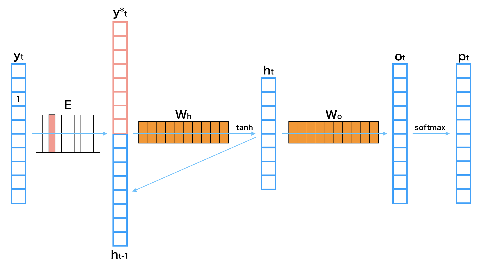
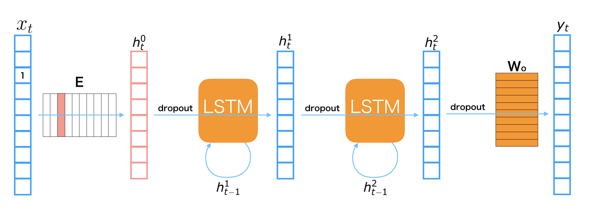

RNN Language Models
*******************

.. currentmodule:: chainer

0. Introduction
================

The **language model** is modeling the probability of generating natural language
sentences or documents. You can use the language model to estimate how natural a
sentence or a document is. Also, with the language model, you can generate new
sentences or documents.

Let's start with modeling the probability of generating sentences. We represent
a sentence as :math:`{\bf X} = ({\bf x}_0, {\bf x}_1, ..., {\bf x}_T)`, in which
:math:`{\bf x}_t` is a one-hot vector. Generally, :math:`{\bf x}_0` is the one-hot
vector of **BOS** (beginning of sentence), and :math:`{\bf x}_T` is that of
**EOS** (end of sentence).

A language model models the probability of a word occurrence under the condition of
its previous words in a sentence. Let :math:`{\bf X}_{[i, j]}` be
:math:`({\bf x}_i, {\bf x}_{i+1}, ..., {\bf x}_j)`, the occurrence probability
of sentence :math:`\bf X` can be represented as follows:

.. math:: P({\bf X}) = P({\bf x}_0) \prod_{t=1}^T P({\bf x}_t|{\bf X}_{[0, t-1]})

So, the language model :math:`P({\bf X})` can be decomposed into word probabilities
conditioned with its previous words. In this tutorial, we model
:math:`P({\bf x}_t|{\bf X}_{[0, t-1]})` with a recurrent neural network to obtain
a language model :math:`P({\bf X})`.

1. Basic Idea of Recurrent Neural Net Language Model
=====================================================

1.1 Recurrent Neural Net Language Model
---------------------------------------

**Recurrent Neural Net Language Model** (RNNLM) is a type of neural net
language models which contains the RNNs in the network. Since an RNN can deal with
the variable length inputs, it is suitable for modeling the sequential data such
as sentences in natural language. 

We show one layer of an RNNLM with these parameters.

=======================  =============================================
Symbol                   Definition 
=======================  =============================================
:math:`{\bf x}_t`        the one-hot vector of :math:`t`-th word 
:math:`{\bf y}_t`        the :math:`t`-th output
:math:`{\bf h}_t^{(i)}`  the :math:`t`-th hidden layer of :math:`i`-th layer 
:math:`{\bf p}_t`        the next word's probability of :math:`t`-th word 
:math:`{\bf E}`          Embedding matrix
:math:`{\bf W}_h`        Hidden layer matrix
:math:`{\bf W}_o`        Output layer matrix
=======================  =============================================

The process to get a next word prediction from :math:`i`-th input word :math:`{\bf x}_t`
^^^^^^^^^^^^^^^^^^^^^^^^^^^^^^^^^^^^^^^^^^^^^^^^^^^^^^^^^^^^^^^^^^^^^^^^^^^^^^^^^^^^^^^^^

#. Get the embedding vector: :math:`{\bf h}_t^{(0)} = {\bf E} {\bf x}_t`

#. Calculate the hidden layer: :math:`{\bf h}_t^{(1)} = {\rm tanh} \left( {\bf W}_h \left[ \begin{array}{cc} {\bf h}_t^{(0)} \\ {\bf h}_{t-1}^{(1)} \end{array} \right] \right)`

#. Calculate the output layer: :math:`{\bf y}_t = {\bf W}_o {\bf h}_t^{(1)}`

#. Transform to probability: :math:`{\bf p}_t = {\rm softmax}({\bf y}_t)`

.. note::
    * Note that :math:`\rm tanh` in the above equation is applied to the input
      vector in element-wise manner.
    * Note that :math:`\left[ \begin{array}{cc} {\bf a} \\ {\bf b} \end{array} \right]`
      denotes a concatenated vector of :math:`{\bf a}` and :math:`{\bf b}`.
    * Note that :math:`{\rm softmax}` in the above equation converts an arbitrary
      real vector to a probability vector which the summation over all elements is :math:`1`.

1.2 Perplexity (Evaluation of the language model)
--------------------------------------------------

**Perplexity** is the common evaluation metric for a language model.
Generally, it measures how well the proposed probability
model :math:`P_{\rm model}({\bf X})` represents the target data
:math:`P^*({\bf X})`.
Let a validation dataset be :math:`D = \{{\bf X}^{(n)}\}_{n=1}^{|D|}`,
which is a set of sentences, where the :math:`n`-th sentence length is
:math:`T^{(n)}`, and the vocabulary size of this dataset is :math:`|\mathcal{V}|`,
the perplexity is represented as follows:

.. math::
    b^z \ \ s.t. \ \ z = - \frac{1}{|\mathcal{V}|} \sum_{n=1}^{|D|} \sum_{t=1}^{T^{(n)}} \log_b P_{\rm model}({\bf x}_t^{(n)}, {\bf X}_{[a, t-1]}^{(n)})

We usually use :math:`b = 2` or :math:`b = e`. The perplexity shows how much
varied the predicted distribution for the next word is. When a language model
represents the dataset well, it should show a high probability only for the correct 
next word, so that the entropy should be high. In the above equation, the sign is
reversed, so that smaller perplexity means better model.

During training, we minimize the below cross entropy:

.. math::
    \mathcal{H}(\hat{P}, P_{\rm model}) = - \hat{P}({\bf X}) \log P_{\rm model}({\bf X})

where :math:`\hat P` is the empirical distribution of a sequence in the training dataset.

2. Implementation of Recurrent Neural Net Language Model
=========================================================

**There is an example of RNN language model in the official repository, so we will
explain how to implement a RNNLM in Chainer based on that:**
:tree:`examples/ptb`

2.1 Model Overview
-------------------

The RNNLM used in this notebook is depicted in the above figure. The symbols
appeared in the figure are defined as follows:

=======================  =============================================
Symbol                   Definition 
=======================  =============================================
:math:`{\bf x}_t`        the one-hot vector of :math:`t`-th word 
:math:`{\bf y}_t`        the :math:`t`-th output
:math:`{\bf h}_t^{(i)}`  the :math:`t`-th hidden layer of :math:`i`-th layer 
:math:`{\bf p}_t`        the next word's probability of :math:`t`-th word 
:math:`{\bf E}`          Embedding matrix
:math:`{\bf W}_h`        Hidden layer matrix
:math:`{\bf W}_o`        Output layer matrix
=======================  =============================================

**LSTMs** (long short-term memory) are used for the connection of hidden layers.
A LSTM is one of major recurrent neural net modules. It is designed for remembering
the long-term memory, so that it should be able to consider relationships of
distant words, such that a word at beginning of sentence and it at the end.
We also use **Dropout** before both LSTMs and linear transformations. Dropout is
one of regularization techniques for preventing overfitting on training dataset.

2.2 Step-by-step Implementation
--------------------------------

2.2.1 Import Package
^^^^^^^^^^^^^^^^^^^^^

First, let's import necessary packages.

.. literalinclude:: ../../../examples/ptb/train_ptb.py
   :language: python
   :lines: 12-18
   :caption: train_ptb.py

2.2.2 Define Training Settings
^^^^^^^^^^^^^^^^^^^^^^^^^^^^^^^

Define all training settings here.

.. literalinclude:: ../../../examples/ptb/train_ptb.py
   :language: python
   :start-after: argparse.ArgumentParser()
   :end-before: parser.parse_args
   :caption: train_ptb.py
   :dedent: 4

2.2.3 Define Network Structure
^^^^^^^^^^^^^^^^^^^^^^^^^^^^^^^

An RNNLM written in Chainer is shown below. It implements the model depicted in
the above figure.

.. literalinclude:: ../../../examples/ptb/train_ptb.py
   :language: python
   :pyobject: RNNForLM
   :caption: train_ptb.py

* When we instantiate this class for making a model, we give the vocabulary size
  to ``n_vocab`` and the size of hidden vectors to ``n_units``.
* This network uses :class:`chainer.links.LSTM`, :class:`chainer.links.Linear`,
  and :class:`chainer.functions.dropout` as its building blocks. All the layers
  are registered and initialized in the context with ``self.init_scope()``.
* You can access all the parameters in those layers by calling ``self.params()``.
* In the constructor, it initializes all parameters with values sampled from a
  uniform distribution :math:`U(-1, 1)`.
* The ``forward`` method takes an word ID ``x``, and calculates the word
  probability vector for the next word by forwarding it through the network,
  and returns the output.
* Note that the word ID ``x`` is automatically converted to a
  :math:`|\mathcal{V}|`-dimensional one-hot vector and then multiplied with the
  input embedding matrix in ``self.embed(x)`` to obtain an embed vector ``h0``
  at the first line of ``forward``.

2.2.4 Load the Penn Tree Bank Long Word Sequence Dataset
^^^^^^^^^^^^^^^^^^^^^^^^^^^^^^^^^^^^^^^^^^^^^^^^^^^^^^^^^

In this notebook, we use Penn Tree Bank dataset that contains number of sentences.
Chainer provides an utility function to obtain this dataset from server and convert
it to a long single sequence of word IDs. ``chainer.datasets.get_ptb_words()``
actually returns three separated datasets which are for train, validation, and test.

Let's download and make dataset objects using it:

.. literalinclude:: ../../../examples/ptb/train_ptb.py
   :language: python
   :start-after: parser.parse_args
   :end-before: n_vocab
   :caption: train_ptb.py
   :dedent: 4

2.2.5 Define Iterator for Making a Mini-batch from the Dataset
^^^^^^^^^^^^^^^^^^^^^^^^^^^^^^^^^^^^^^^^^^^^^^^^^^^^^^^^^^^^^^^

Dataset iterator creates a mini-batch of couple of words at different positions, namely,
pairs of current word and its next word. Each example is a part of sentences starting
from different offsets equally spaced within the whole sequence.

.. literalinclude:: ../../../examples/ptb/train_ptb.py
   :language: python
   :pyobject: ParallelSequentialIterator
   :caption: train_ptb.py

2.2.6 Define Updater
^^^^^^^^^^^^^^^^^^^^^

We use Backpropagation through time (BPTT) for optimize the RNNLM. BPTT can be implemented by
overriding ``update_core()`` method of :class:`~chainer.training.updaters.StandardUpdater`. First,
in the constructor of the ``BPTTUpdater``, it takes ``bprop_len`` as an argument in addition
to other arguments :class:`~chainer.training.updaters.StandardUpdater` needs. ``bprop_len`` defines the
length of sequence :math:`T` to calculate the loss:

.. math::
    \mathcal{L} = - \sum_{t=0}^T \sum_{n=1}^{|\mathcal{V}|}
    \hat{P}({\bf x}_{t+1}^{(n)})
    \log P_{\rm model}({\bf x}_{t+1}^{(n)} \mid {\bf x}_t^{(n)})

where :math:`\hat{P}({\bf x}_t^n)` is a probability for :math:`n`-th word in the vocabulary at
the position :math:`t` in the training data sequence.

.. literalinclude:: ../../../examples/ptb/train_ptb.py
   :language: python
   :pyobject: BPTTUpdater
   :caption: train_ptb.py

2.2.7 Define Evaluation Function (Perplexity)
^^^^^^^^^^^^^^^^^^^^^^^^^^^^^^^^^^^^^^^^^^^^^^

Define a function to calculate the perplexity from the loss value. If we take :math:`e`
as :math:`b` in the above definition of perplexity, calculating the perplexity is just
to give the loss value to the power of :math:`e`:

.. literalinclude:: ../../../examples/ptb/train_ptb.py
   :language: python
   :pyobject: compute_perplexity
   :caption: train_ptb.py

2.2.8 Create Iterator
^^^^^^^^^^^^^^^^^^^^^^

Here, the code below just creates iterator objects from dataset splits (train/val/test).

.. literalinclude:: ../../../examples/ptb/train_ptb.py
   :language: python
   :start-after: test[:100]
   :end-before: Prepare an RNNLM model
   :caption: train_ptb.py
   :dedent: 4

2.2.9 Create RNN and Classification Model
^^^^^^^^^^^^^^^^^^^^^^^^^^^^^^^^^^^^^^^^^^

Instantiate RNNLM model and wrap it with :class:`chainer.links.Classifier`
because it calculates softmax cross entropy as the loss.

.. literalinclude:: ../../../examples/ptb/train_ptb.py
   :language: python
   :start-after: Prepare an RNNLM model
   :end-before: args.gpu
   :caption: train_ptb.py
   :dedent: 4

Note that :class:`~chainer.links.Classifier` computes not only the loss but also accuracy based on a given
input/label pair. To learn the RNN language model, we only need the loss (cross entropy) in the
:class:`Classifier` because we calculate the perplexity instead of classification accuracy to check
the performance of the model. So, we turn off computing the accuracy by giving False to
``model.compute_accuracy`` attribute.

2.2.10 Setup Optimizer
^^^^^^^^^^^^^^^^^^^^^^^

Prepare an optimizer. Here, we use :class:`~chainer.optimizer.GradientClipping`
to prevent gradient explosion. It automatically clips
the gradient to be used to update the parameters in the model with given constant
``gradclip``.
  
.. literalinclude:: ../../../examples/ptb/train_ptb.py
   :language: python
   :start-after: Set up an optimizer
   :end-before: Set up a trainer
   :caption: train_ptb.py
   :dedent: 4

2.2.11 Setup and Run Trainer
^^^^^^^^^^^^^^^^^^^^^^^^^^^^^

Let's make a trainer object and start the training! Note that we add an
``eval_hook`` to the :class:`~chainer.training.extensions.Evaluator`
extension to reset the internal states before starting evaluation process. It can prevent to use
training data during evaluating the model.

.. literalinclude:: ../../../examples/ptb/train_ptb.py
   :language: python
   :start-after: Set up a trainer
   :end-before: Evaluate the final model
   :caption: train_ptb.py
   :dedent: 4

2.2.12 Evaluate the trained model on test dataset
^^^^^^^^^^^^^^^^^^^^^^^^^^^^^^^^^^^^^^^^^^^^^^^^^^

Let's see the perplexity on the test split. :class:`~chainer.training.Trainer`'s extension can be used as just a normal function
outside of :class:`~chainer.training.Trainer`.

.. literalinclude:: ../../../examples/ptb/train_ptb.py
   :language: python
   :start-after: Evaluate the final model
   :end-before: Serialize the final model
   :caption: train_ptb.py
   :dedent: 4

2.3 Run Example
----------------

2.3.1 Training the model
^^^^^^^^^^^^^^^^^^^^^^^^^

You can train the model with the script:
:blob:`examples/ptb/train_ptb.py`

.. code-block:: console

    $ pwd
    /root2chainer/chainer/examples/ptb
    $ python train_ptb.py --test  # run by test mode. If you want to use all data, remove "--test".
    Downloading from https://raw.githubusercontent.com/wojzaremba/lstm/master/data/ptb.train.txt...
    Downloading from https://raw.githubusercontent.com/wojzaremba/lstm/master/data/ptb.valid.txt...
    Downloading from https://raw.githubusercontent.com/wojzaremba/lstm/master/data/ptb.test.txt...
    #vocab = 10000
    test
    test perplexity: 29889.9857364

2.3.2 Generating sentences
^^^^^^^^^^^^^^^^^^^^^^^^^^^

You can generate the sentence which starts with a word in the vocabulary. In this example,
we generate a sentence which starts with the word apple.
We use the script in the PTB example of the official repository:
:blob:`examples/ptb/gentxt.py`

.. code-block:: console

    $ pwd
    /root2chainer/chainer/examples/ptb
    $ python gentxt.py -m model.npz -p apple
    apple a new u.s. economist with <unk> <unk> fixed more than to N the company said who is looking back to 
