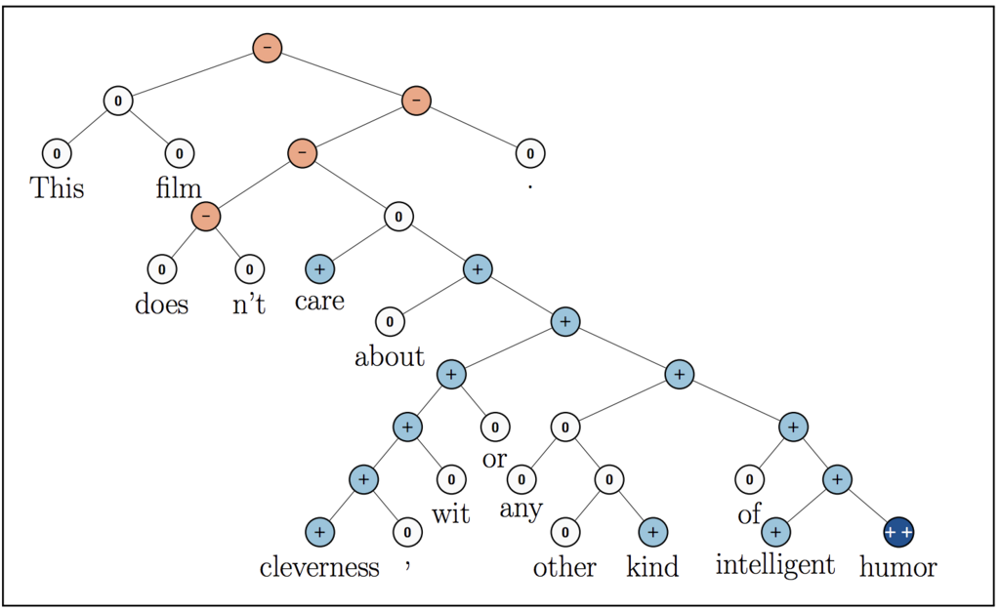
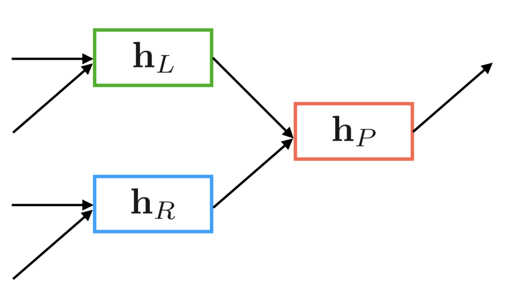
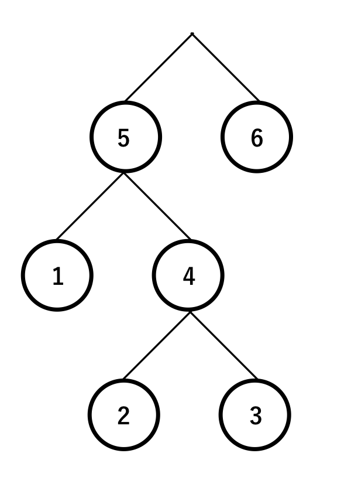

Sentiment Analysis with Recursive Neural Network
*************************************************

.. currentmodule:: chainer

0. Introduction
================

In this tutorial, we will use the Recursive Neural Network to analyze sentiment in sentences.

Sentiment analysis is one of the major tasks of Natural Language Processing (NLP),
which identifies writers’ sentiments in sentences. When expressing sentiment,
we basically uses labels whether it is positive or negative. For example,
in the case of the dataset used this time, emotions are expressed in 5 classes
like 1(very negative), 2(negative), 3(neutral), 4(positive), 5(very positive).

    cited from [1]

Sentiment analysis is implemented with Recursive Neural Networks. Recursive Neural
Networks are recurrent neural nets with a tree structure. NLP often expresses
sentences in a tree structure, Recursive Neural Networks are often used in NLP.
First, we explain the training method of Recursive Neural Networks without
mini-batch processing. After that, as an advanced story, we explain the training
method of a mini-batched Recursive Neural Network.

In this tutorial, we will learn the following:

#. What is a Recursive Neural Network?
#. Implementation of sentiment analysis by Recursive Neural Networks using Chainer

    * Training method of a Recursive Neural Network without mini-batches
    * Training method of a mini-batched Recursive Neural Network

1. What is a Recursive Neural Network? 
=======================================

A Recursive Neural Network is a Recurrent Neural Networks that extends to
a tree structure. As both networks are often written as RNN, we need to be
careful which one we are referring to. RNN usually refers to the Recurrent
Neural Networks, but in natural language processing it sometimes
refers to Recursive Neural Networks.

Recursive Neural Networks use a tree structure with a fixed number of branches.
In the case of a binary tree, the hidden state vector of the current node is
computed from the hidden state vectors of the left and right child nodes,
as follows:

.. math::
    {\bf h}_P = a \left( {\bf W} 
    \left[ \begin{array}{l}
        {\bf h}_L \\
        {\bf h}_R \\
    \end{array} \right]
    + {\bf b} \right)

This operation is sequentially calculated from the leaf nodes toward the root node.
Recursive Neural Networks are expected to express relationships between long-distance
elements compared to Recurrent Neural Networks, because the depth is enough with
:math:`log_2(T)` if the element count is :math:`T`.

2. Implementation of sentiment analysis by Recursive Neural Networks
=====================================================================

2.1 Preparation of training data
---------------------------------

In this tutorial, we will use the training data which are preprocessed by 
`chainer/examples/sentiment/download.py <https://github.com/chainer/chainer/blob/master/examples/sentiment/download.py>`_.

.. literalinclude:: ../../../examples/sentiment/download.py
   :language: python
   :caption: download.py

Let's run the following codes, download the necessary training data and unzip it.

.. code-block:: console

    $ ./download.py

Let's execute the following command and check if the training data have been prepared.

.. code-block:: console

    $ ls trees
    dev.txt  test.txt  train.txt

Let's look at the first line of test.txt and see how each sample is written.

.. code-block:: console

    $ head trees/dev.txt -n1
    (3 (2 It) (4 (4 (2 's) (4 (3 (2 a) (4 (3 lovely) (2 film))) (3 (2 with) (4 (3 (3 lovely) (2 performances)) (2 (2 by) (2 (2 (2 Buy) (2 and)) (2 Accorsi))))))) (2 .)))

As displayed above, each sample is defined by a tree structure.
The tree structure is recursively defined as ``(value, node)``, and the class label for node is value.
The class labels represent 1(very negative), 2(negative), 3(neutral), 4(positive), and 5(very positive), respectively.

The representation of one sample is shown below.

    cited from [1]

2.2 Setting parameters
---------------------------------

Here we set the parameters for training.

* ``n_epoch``: Epoch number. How many times we pass through the whole training data.
* ``n_units``: Number of units. How many hidden state vectors each Recursive Neural Network node has.
* ``batchsize``: Batch size. How many training data we will input as a block when updating parameters.
* ``n_label``: Number of labels. Number of classes to be identified. Since there are 5 labels this time, ``5``.
* ``epoch_per_eval``: How often to perform validation.

.. literalinclude:: ../../../examples/sentiment/train_sentiment.py
   :language: python
   :start-after: parser.parse_args
   :end-before: if args.test
   :caption: train_sentiment.py
   :dedent: 4

2.3 Preparing the iterator
----------------------------

Let's read the dataset used for training, validation, test and create an Iterator.

First, we convert each sample represented by ``str`` type to a tree structure data represented by a ``dictionary`` type.
We will tokenize the string with ``read_corpus`` implemented by the parser ``SexpParser``.
After that, we convert each tokenized sample to a tree structure data  by ``convert_tree``. In this way,
it is possible to express a label as ``int``, a node as a two-element ``tuple``, and a tree structure
as a ``dictionary``, making it a more manageable data structure than the original string.

.. literalinclude:: ../../../examples/sentiment/data.py
   :language: python
   :caption: data.py

Let's use ``read_corpus()`` and ``convert_tree()`` to create an iterator.

.. literalinclude:: ../../../examples/sentiment/train_sentiment.py
   :language: python
   :start-after: max_size = None
   :end-before: model = RecursiveNet
   :caption: train_sentiment.py
   :dedent: 4

2.4 Preparing the model
------------------------

We traverse each node of the tree structure data by ``traverse`` and calculate the loss ``loss``
of the whole tree. The implementation of ``traverse`` is a recursive call, which will traverse child nodes
in turn. (It is a common implementation when treating tree structure data!)

First, we calculate the hidden state vector ``v``. In the case of a leaf node, we obtain a hidden state vector
stored in ``embed`` by ``model.leaf(word)`` from word id ``word``. In the case of an intermediate node,
the hidden vector is calculated with the hidden state vector ``left`` and ``right`` of the child nodes by
``v = model.node(left, right)``.
``loss += F.softmax_cross_entropy(y, t)`` adds the loss of the current node to the loss of the child node,
then returns loss to the parent node by ``return loss, v``.
After the line ``loss += F.softmax_cross_entropy(y, t)``, there are some lines for logging accuracy and etc.
But it is not necessary for the model definition itself.

Let's define the network.

.. literalinclude:: ../../../examples/sentiment/train_sentiment.py
   :language: python
   :pyobject: RecursiveNet
   :caption: train_sentiment.py

One attention to the implementation of ``__call__``.
``x`` passed to ``__call__`` is mini-batched input data and contains samples ``s_n`` like ``[s_1, s_2, ..., s_N]``.
In a network such as Convolutional Network used for image recognition, it is possible to perform parallel
calculation collectively for mini batch ``x``. However, in the case of a tree-structured network like this one,
it is difficult to compute parallel because of the following reasons.

* Data length varies depending on samples.
* The order of calculation for each sample is different.

So, the implementation is to calculate each sample and finally summarize the results.

.. literalinclude:: ../../../examples/sentiment/train_sentiment.py
   :language: python
   :start-after: for tree in data.read_corpus('trees/test.txt'
   :end-before: def _convert(batch, _)
   :caption: train_sentiment.py
   :dedent: 4
 
.. note::
    Actually, we can perform parallel calculations for mini batches in Recursive Neural Networks by using stacks.
    Since it is published in the latter part of notebook as (Advanced), please refer to it.

2.5 Preparation and training of Updater and Trainer
-----------------------------------------------------

As usual, we define an updater and a trainer to train the model.
This time, I do not use :class:`~chainer.links.Classifier` and calculate the accuracy ``accuracy`` by myself.
You can easily implement it using :class:`~chainer.training.extensions.MicroAverage`.

.. literalinclude:: ../../../examples/sentiment/train_sentiment.py
   :language: python
   :start-after: optimizer.add_hook
   :end-before: print('Test evaluation')
   :caption: train_sentiment.py
   :dedent: 4

2.6 Checking the performance with test data
--------------------------------------------

.. literalinclude:: ../../../examples/sentiment/train_sentiment.py
   :language: python
   :pyobject: evaluate
   :caption: train_sentiment.py

.. literalinclude:: ../../../examples/sentiment/train_sentiment.py
   :language: python
   :start-after: trainer.run()
   :end-before: __main__
   :caption: train_sentiment.py
   :dedent: 4

2.7 Start training and check the performance
---------------------------------------------

.. code-block:: console

    $ pwd
    /root2chainer/chainer/examples/sentiment
    $ python train_sentiment.py --epoch 4 --test  # run by test mode. If we want to use all data, remove "--test".
    epoch       main/loss   validation/main/loss  main/accuracy  validation/main/accuracy  elapsed_time
    1           1573.94                           0.202703                                 1.06574       
    2           522.063     617.106               0.617117       0.415301                  1.70406       
    3           448.05                            0.693694                                 2.19765       
    4           410.08      544.221               0.722973       0.448087                  2.82558       
    Test evaluation
     Node accuracy: 46.47 %% (145/312)
     Root accuracy: 40.00 %% (4/10)

3. (Advanced) Mini-batching in Recursive Neural Networks[2]
============================================================

Recursive Neural Networks have difficulty computing mini-batched data in parallel because of the following reasons.

* Data length varies depending on samples.
* The order of calculation for each sample is different.

However, using the stack, Recursive Neural Networks can perform mini batch parallel calculation.

3.1 Preparation of Dataset, Iterator
-------------------------------------

First, we convert the recursive calculation of Recursive Neural Network to a serial calculation using a stack.
For each node of the tree structure dataset, numbers are assigned to each node in "returning order" as follows.

The returning order is a procedure of numbering nodes of a tree structure. It is a procedure of attaching
a smaller number to all child nodes than the parent node. If we process nodes in descending order of numbers,
we can trace the child nodes before the parent node.

.. literalinclude:: ../../../examples/sentiment/train_recursive_minibatch.py
   :language: python
   :pyobject: linearize_tree
   :caption: train_recursive_minibatch.py

.. literalinclude:: ../../../examples/sentiment/train_recursive_minibatch.py
   :language: python
   :start-after: parser.parse_args()
   :end-before: model = ThinStackRecursiveNet
   :caption: train_recursive_minibatch.py
   :dedent: 4

3.2 Definition of mini-batchable models
----------------------------------------

Recursive Neural Networks have two operations: Operation A for computing an embedding vector for the leaf node.
Operation B for computing the hidden state vector of the parent node from the hidden state vectors of the two
child nodes.

For each sample, we assign index to each node in returning order. If we traverse the node in return order,
we find that operation A is performed on the leaf node and operation B is performed at the other nodes.

This operation can also be regarded as using a stack to scan a tree structure. A stack is a last-in,
x first-out data structure that allows us to do two things: a push operation to add data and a pop operation
to get the last pushed data.
For operation A, push the calculation result to the stack. For operation B, pop two data and push the new
calculation result.

When we parallelize the above operation, it is necessary to traverse nodes and perform operation A and operation
B precisely, because the tree structure is different for each sample. However, by using the stack,
we can calculate different tree structures by simple repeating processing. Therefore, parallelization is possible.

.. literalinclude:: ../../../examples/sentiment/thin_stack.py
   :language: python
   :pyobject: ThinStackSet
   :caption: thin_stack.py

Let the sentence length be :math:`I`, and the number of dimensions of the hidden vector be :math:`D`,
the thin stack can efficiently use the memory by using the matrix of :math:`(2I-1) \times D`.
In a normal stack, we need :math:`O(I^2 D)` space computation, whereas thin stacks require :math:`O(ID)`.
This is realized by push operations ``thin_stack_set`` and pop operations ``thin_stack_get``.
First of all, we define ``ThinStackSet`` and ``ThinStackGet`` which inherit ``chainer.Function``.
``ThinStackSet`` is literally a function to set values on the thin stack.
``inputs`` in ``forward`` and `` backward``  can be broken down like ``stack, indices, values = inputs``.
``stack`` is shared by functions by setting it as a function argument in the thin stack itself.
Because ``chainer.Function`` does not have internal states inside, it handles ``stack`` externally by passing
it as a function argument.

.. literalinclude:: ../../../examples/sentiment/thin_stack.py
   :language: python
   :pyobject: ThinStackGet
   :caption: thin_stack.py

``ThinStackGet`` is literally a function to retrieve values from the thin stack.
``inputs`` in ``forward`` and ``backward`` can be broken down like ``stack, indices = inputs``.

.. literalinclude:: ../../../examples/sentiment/train_recursive_minibatch.py
   :language: python
   :pyobject: ThinStackRecursiveNet
   :caption: train_recursive_minibatch.py

.. literalinclude:: ../../../examples/sentiment/train_recursive_minibatch.py
   :language: python
   :start-after: test_data, args.batchsize, repeat=False, shuffle=False)
   :end-before: updater = training.StandardUpdater
   :caption: train_recursive_minibatch.py
   :dedent: 4

3.3 Preparation of Updater/Trainer and execution of training
----------------------------------------------------------------

Let's train with the new model ``ThinStackRecursiveNet``. Since we can now compute mini batches in parallel, we can see that training is faster.

.. literalinclude:: ../../../examples/sentiment/train_recursive_minibatch.py
   :language: python
   :start-after: optimizer.setup(model) 
   :end-before: __main__
   :caption: train_recursive_minibatch.py
   :dedent: 4

It should get much faster!

4. Reference
=============
* [1] `Socher, Richard; et al. "Recursive Deep Models for Semantic Compositionality Over a Sentiment Treebank". <https://nlp.stanford.edu/~socherr/EMNLP2013_RNTN.pdf>`_
* [2] `A Fast Unified Model for Parsing and Sentence Understanding <http://nlp.stanford.edu/pubs/bowman2016spinn.pdf>`_
