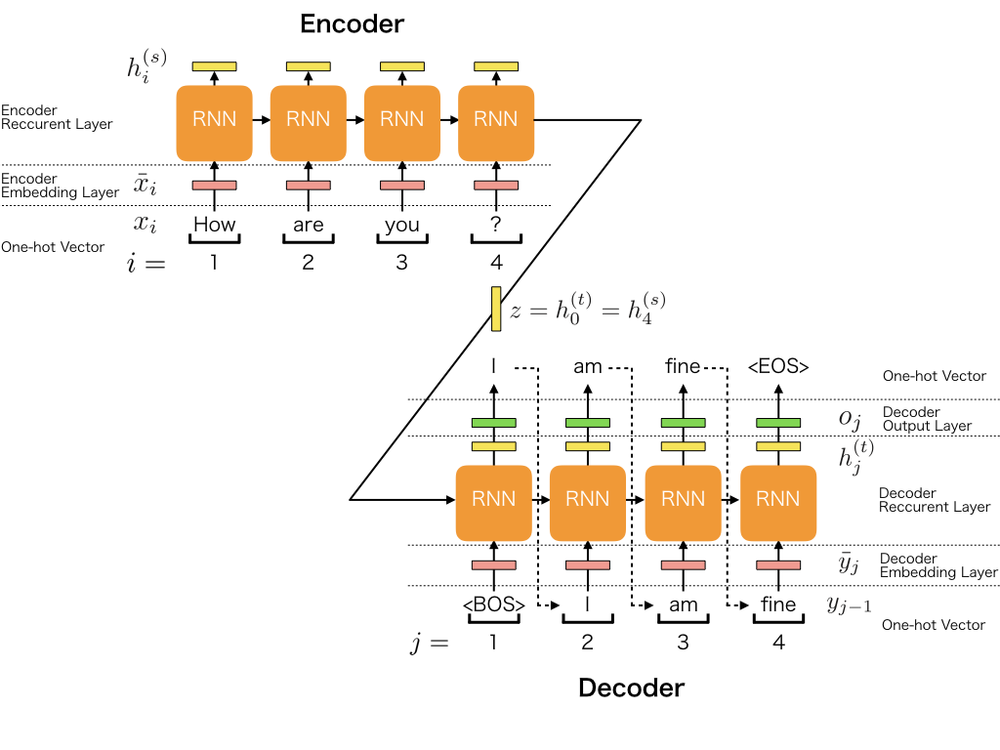
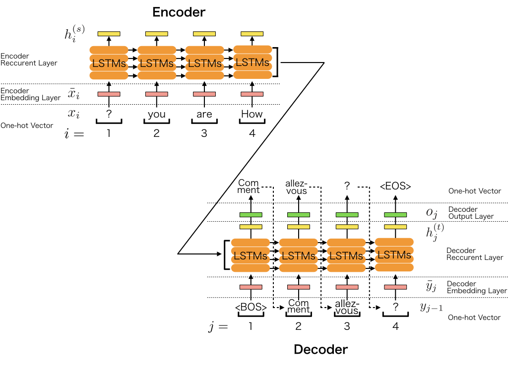

Write a Sequence to Sequence (seq2seq) Model
*********************************************

.. currentmodule:: chainer

0. Introduction
================

The **sequence to sequence (seq2seq) model**\ [1][2] is a learning model that converts an input
sequence into an output sequence. In this context, the **sequence** is a list of symbols,
corresponding to the words in a sentence. The seq2seq model has achieved great success
in fields such as machine translation, dialogue systems, question answering,
and text summarization. All of these tasks can be regarded as the task to learn a model
that converts an input sequence into an output sequence.

1. Basic Idea of Seq2seq Model
===============================

1.1 Overview of Seq2seq Model
------------------------------

The Notations of Sequence
^^^^^^^^^^^^^^^^^^^^^^^^^^

The seq2seq model converts an input sequence into an output sequence.
Let the input sequence and the output sequence be :math:`\bf X` and :math:`\bf Y`.
The :math:`i`-th element of the input sequence is represented as :math:`{\bf x}_i`, 
and the :math:`j`-th element of the output sequence is also represented as :math:`{\bf y}_j`.
Generally, each of the :math:`{\bf x}_i` and the :math:`{\bf y}_j` is the one-hot vector of
the symbols. For example, in natural language processing(NLP), the one-hot vector
represents the word and its size becomes the vocabulary size.

Let's think about the seq2seq model in the context of NLP.
Let the vocabulary of the inputs and the outputs be :math:`{\mathcal V}^{(s)}`
and :math:`{\mathcal V}^{(t)}`, all the elements :math:`{\bf x}_i` and :math:`{\bf y}_j`
satisfy :math:`{\bf x}_i \in \mathbb{R}^{|{\mathcal V}^{(s)}|}` and 
:math:`{\bf y}_i \in \mathbb{R}^{|{\mathcal V}^{(t)}|}`.
The input sequence :math:`\bf X` and the output sequence :math:`\bf Y` are represented as 
the following equations:

.. math::
    {\bf X} &= ({\bf x}_1, ..., {\bf x}_I) = ({\bf x}_i)_{i=1}^I \\
    {\bf Y} &= ({\bf y}_1, ..., {\bf y}_J) = ({\bf y}_j)_{j=1}^J

:math:`I` and :math:`J` are the length of the input sequence and the output sequence.
Using the typical NLP notation, :math:`{\bf y}_0` is the one-hot vector of `BOS`, which is the
virtual word representing the beginning of the sentence, and :math:`{\bf y}_{J+1}` is that
of `EOS`, which is the virtual word representing the end of the sentence.

The Notations of Conditional Probability :math:`P({\bf Y}|{\bf X})`
^^^^^^^^^^^^^^^^^^^^^^^^^^^^^^^^^^^^^^^^^^^^^^^^^^^^^^^^^^^^^^^^^^^

Next, let's think about the conditional probability :math:`P({\bf Y}|{\bf X})` generating 
the output sequence :math:`\bf Y` when the input sequence :math:`\bf X` is given. 
The purpose of seq2seq model is modeling the probability :math:`P({\bf Y}|{\bf X})`.
However, the seq2seq model does not model the probability :math:`P({\bf Y}|{\bf X})` directly.
Actually, it models the probability :math:`P({\bf y}_j|{\bf Y}_{<j}, {\bf X})`, which is the
probability of generating the :math:`j`-th element of the output sequence :math:`{\bf y}_j`
given the :math:`{\bf Y}_{<j}` and :math:`{\bf X}`. :math:`{\bf Y}_{<j}` means the output
sequence from :math:`1` to :math:`j-1`, or :math:`({\bf y}_j)_{j=1}^{j-1}`. In this notation,
you can write the model :math:`P_{\theta}({\bf Y}|{\bf X})` with the product of
:math:`P_{\theta}({\bf y}_j|{\bf Y}_{<j}, {\bf X})`:

.. math::
    P_{\theta}({\bf Y}|{\bf X}) = \prod_{j=1}^{J+1} P_{\theta}({\bf y}_j|{\bf Y}_{<j}, {\bf X})

Processing Steps in Seq2seq Model
^^^^^^^^^^^^^^^^^^^^^^^^^^^^^^^^^^

Now, let's think about the processing steps in seq2seq model. The feature of seq2seq model is that
it consists of the two processes:

#. The process that generates the fixed size vector :math:`\bf z` from the input sequence :math:`\bf X`
#. The process that generates the output sequence :math:`\bf Y` from :math:`\bf z`

In other words, the information of :math:`\bf X` is conveyed by :math:`\bf z`, and
:math:`P_{\theta}({\bf y}_j|{\bf Y}_{<j}, {\bf X})` is actually calculated by
:math:`P_{\theta}({\bf y}_j|{\bf Y}_{<j}, {\bf z})`.

First, we represent the process which generating :math:`\bf z` from :math:`\bf X` by
the function :math:`\Lambda`:

.. math::
    {\bf z} = \Lambda({\bf X})

The function :math:`\Lambda` may be the recurrent neural net such as LSTMs.

Second, we represent the process which generating :math:`\bf Y` from :math:`\bf z` by
the following formula:

.. math::
    P_{\theta}({\bf y}_j|{\bf Y}_{<j}, {\bf X}) = \Upsilon({\bf h}_j^{(t)}, {\bf y}_j) \\
    {\bf h}_j^{(t)} = \Psi({\bf h}_{j-1}^{(t)}, {\bf y}_{j-1})

:math:`\Psi` is the function to generate the hidden vectors :math:`{\bf h}_j^{(t)}`, and
:math:`\Upsilon` is the function to calculate the generative probability of the one-hot
vector :math:`{\bf y}_j`. When :math:`j=1`, :math:`{\bf h}_{j-1}^{(t)}` or :math:`{\bf h}_0^{(t)}`
is :math:`\bf z` generated by :math:`\Lambda({\bf X})`, and :math:`{\bf y}_{j-1}` or
:math:`{\bf y}_0` is the one-hot vector of `BOS`.

1.2 Model Architecture of Seq2seq Model
---------------------------------------

In this section, we describe the architecture of seq2seq model. To simplify the
explanation, we use the most basic architecture. The architecture of seq2seq model
can be separated to the five major roles.

#. Encoder Embedding Layer
#. Encoder Recurrent Layer
#. Decoder Embedding Layer
#. Decoder Recurrent Layer
#. Decoder Output Layer

The encoder consists of two layers: the embedding layer and the recurrent layer,
and the decoder consists of three layers: the embedding layer, the recurrent layer, and the
output layer.

In the explanation, we use the following symbols:

=======================  =========================================================================
Symbol                   Definition 
=======================  =========================================================================
:math:`H`                the size of the hidden vector
:math:`D`                the size of the embedding vector
:math:`{\bf x}_i`        the one-hot vector of :math:`i`-th word in the input sentence 
:math:`{\bf \bar x}_i`   the embedding vector of :math:`i`-th word in the input sentence 
:math:`{\bf E}^{(s)}`    Embedding matrix of the encoder
:math:`{\bf h}_i^{(s)}`  the :math:`i`-th hidden vector of the encoder
:math:`{\bf y}_j`        the one-hot vector of :math:`j`-th word in the output sentence
:math:`{\bf \bar y}_j`   the embedding vector of :math:`j`-th word in the output sentence
:math:`{\bf E}^{(t)}`    Embedding matrix of the decoder
:math:`{\bf h}_j^{(t)}`  the :math:`j`-th hidden vector of the decoder
=======================  =========================================================================

1.2.1 Encoder Embedding Layer
^^^^^^^^^^^^^^^^^^^^^^^^^^^^^^

The first layer, or the encoder embedding layer converts the each word in the input sentence to
the embedding vector.  When processing the :math:`i`-th word in the input sentence, the input and the output
of the layer are the following:

- The input is :math:`{\bf x}_i` : the one-hot vector which represents :math:`i`-th word
- The output is :math:`{\bf \bar x}_i` : the embedding vector which represents :math:`i`-th word

Each embedding vector is calculated by the following equation:

.. math::
    {\bf \bar x}_i = {\bf E}^{(s)} {\bf x}_i

:math:`{\bf E}^{(s)} \in {\mathbb R}^{D \times |{\mathcal V}^{(s)}|}` is the embedding matrix of
the encoder.

1.2.2 Encoder Recurrent Layer
^^^^^^^^^^^^^^^^^^^^^^^^^^^^^^

The encoder recurrent layer generates the hidden vectors from the embedding vectors.
When processing the :math:`i`-th embedding vector, the input and the output of the layer
are the following:

- The input is :math:`{\bf \bar x}_i` : the embedding vector which represents the :math:`i`-th word
- The output is :math:`{\bf h}_i^{(s)}` : the hidden vector of the :math:`i`-th position

For example, when using the uni-directional RNN of one layer, the process
can be represented as the following function :math:`\Psi^{(s)}`:

.. math::
    {\bf h}_i^{(s)} &= \Psi^{(s)}({\bf \bar x}_i, {\bf h}_{i-1}^{(s)}) \\
                    &= {\rm tanh} \left( {\bf W}^{(s)} \left[ \begin{array}{cc} {\bf h}_{i-1}^{(s)}
                    \\ {\bf \bar x}_{i} \end{array} \right] + {\bf b}^{(s)} \right)

In this case, we use the :math:`{\rm tanh}` as the activation function.

1.2.3 Decoder Embedding Layer
^^^^^^^^^^^^^^^^^^^^^^^^^^^^^^

The decoder embedding layer converts the each word in the output sentence to the embedding vector.
When processing the :math:`j`-th word in the output sentence, the input and the output
of the layer are the following:

- The input is :math:`{\bf y}_{j-1}` : the one-hot vector which represents the :math:`(j-1)`-th word generated
  by the decoder output layer
- The output is :math:`{\bf \bar y}_j` : the embedding vector which represents the :math:`(j-1)`-th word

Each embedding vector is calculated by the following equation:

.. math::
    {\bf \bar y}_j = {\bf E}^{(t)} {\bf y}_{j-1}

:math:`{\bf E}^{(t)} \in {\mathbb R}^{D \times |{\mathcal V}^{(t)}|}` is the embedding matrix of
the encoder.

1.2.4 Decoder Recurrent Layer
^^^^^^^^^^^^^^^^^^^^^^^^^^^^^^

The decoder recurrent layer generates the hidden vectors from the embedding vectors.
When processing the :math:`j`-th embedding vector, the input and the output of the layer
are the following:

- The input is :math:`{\bf \bar y}_j` : the embedding vector
- The output is :math:`{\bf h}_j^{(t)}` : the hidden vector of :math:`j`-th position    

For example, when using the uni-directional RNN of one layer, the process
can be represented as the following function :math:`\Psi^{(t)}`:

.. math::
    {\bf h}_j^{(t)} &= \Psi^{(t)}({\bf \bar y}_j, {\bf h}_{j-1}^{(t)}) \\
                    &= {\rm tanh} \left( {\bf W}^{(t)} \left[ \begin{array}{cc} {\bf h}_{j-1}^{(t)}
                    \\ {\bf \bar y}_{j} \end{array} \right] + {\bf b}^{(t)} \right)

In this case, we use the :math:`{\rm tanh}` as the activation function.
And we must use the encoder's hidden vector of the last position as the decoder's hidden vector of first position
as following:

.. math:: {\bf h}_0^{(t)} = {\bf z} = {\bf h}_I^{(s)}

1.2.5 Decoder Output Layer
^^^^^^^^^^^^^^^^^^^^^^^^^^^

The decoder output layer generates the probability of the :math:`j`-th word of the output sentence
from the hidden vector.
When processing the :math:`j`-th embedding vector, the input and the output of the layer
are the following:

- The input is :math:`{\bf h}_j^{(t)}` : the hidden vector of :math:`j`-th position
- The output is :math:`p_j` : the probability of generating the one-hot vector :math:`{\bf y}_j` of the :math:`j`-th word

.. math::
    p_j &= P_{\theta}({\bf y}_j|{\bf Y}_{<j}) = {\rm softmax}({\bf o}_j) \cdot {\bf y}_j \\
        &= {\rm softmax}({\bf W}^{(o)}{\bf h}_j^{(t)} + {\bf b}^{(o)}) \cdot {\bf y}_j

.. note::
    There are a lot of varieties of seq2seq models. We can use the different RNN
    models in terms of: (1) directionality (unidirectional or bidirectional),
    (2) depth (single-layer or multi-layer), (3) type (a vanilla RNN,
    a Long Short-term Memory (LSTM), or a gated recurrent unit (GRU)), and
    (4) additional functionality (s.t. Attention Mechanism).

2. Implementation of Seq2seq Model
===================================

**The official Chainer repository includes a neural machine translation example using the seq2seq model.
We will now provide an overview of the example and explain its implementation in detail.**
`chainer/examples/seq2seq <https://github.com/chainer/chainer/tree/master/examples/seq2seq>`_

2.1 Model Overview
-------------------

In this simple example, an input sequence is processed by a stacked **LSTM-RNN** 
(long short-term memory recurrent neural networks) and
it is encoded as a fixed-size vector. The output sequence is also processed by
another stacked LSTM-RNN. At decoding time, an output sequence is generated using
argmax.

2.2 Step-by-step Implementation
--------------------------------

2.2.1 Import Package
^^^^^^^^^^^^^^^^^^^^^

First, let's import necessary packages.

.. literalinclude:: ../../../examples/seq2seq/seq2seq.py
   :language: python
   :lines: 5-15
   :caption: seq2seq.py

2.2.2 Define Training Settings
^^^^^^^^^^^^^^^^^^^^^^^^^^^^^^^

Define all training settings here.

.. literalinclude:: ../../../examples/seq2seq/seq2seq.py
   :language: python
   :start-after: argparse.ArgumentParser
   :end-before: parser.parse_args
   :caption: seq2seq.py
   :dedent: 4

2.2.3 Define Network Structure
^^^^^^^^^^^^^^^^^^^^^^^^^^^^^^^

The Chainer implementation of seq2seq is shown below.  It implements the model
depicted in the above figure.

.. literalinclude:: ../../../examples/seq2seq/seq2seq.py
   :language: python
   :pyobject: Seq2seq
   :caption: seq2seq.py

* In ``Seq2seq``, three functions are defined: the constructor ``__init__``,
  the function call ``forward``, and the function for translation ``translate``.

.. literalinclude:: ../../../examples/seq2seq/seq2seq.py
   :language: python
   :pyobject: Seq2seq.__init__
   :caption: seq2seq.py

* When we instantiate this class for making a model, we give the number of
  stacked lstms to ``n_layers``, the vocabulary size of the source language
  to ``n_source_vocab``, the vocabulary size of the target language
  to ``n_target_vocab``, and the size of hidden vectors to ``n_units``.
* This network uses :class:`chainer.links.NStepLSTM`, :class:`chainer.links.EmbedID`,
  and :class:`chainer.links.Linear` as its building blocks. All the layers
  are registered and initialized in the context with ``self.init_scope()``.
* You can access all the parameters in those layers by calling ``self.params()``.
* In the constructor, it initializes all parameters with values sampled from a
  uniform distribution :math:`U(-1, 1)`.

.. literalinclude:: ../../../examples/seq2seq/seq2seq.py
   :language: python
   :pyobject: Seq2seq.forward
   :caption: seq2seq.py

* The ``forward`` method takes sequences of source language's word IDs ``xs``
  and sequences of target language's word IDs ``ys``. Each sequence represents a
  sentence, and the size of ``xs`` is mini-batch size.
* Note that the sequences of word IDs ``xs`` and ``ys`` are converted to a
  vocabulary-size one-hot vectors and then multiplied with the embedding matrix
  in ``sequence_embed`` to obtain embedding vectors ``exs`` and ``eys``.

    .. literalinclude:: ../../../examples/seq2seq/seq2seq.py
       :language: python
       :pyobject: sequence_embed
       :caption: seq2seq.py

* ``self.encoder`` and ``self.decoder`` are the encoder and the decoder of the
  seq2seq model. Each element of the decoder output ``os`` is
  :math:`h_{[1:J]}^{(t)}` in the figure above.
* After calculating the recurrent layer output, the loss ``loss`` and the
  perplexity ``perp`` are calculated, and the values are logged by
  :class:`chainer.report`.

.. note::
    It is well known that the seq2seq model learns much better when the source
    sentences are reversed.
    The paper[1] says that "`While the LSTM is capable of solving problems with
    long term dependencies, we discovered that the LSTM learns much better when
    the source sentences are reversed (the target sentences are not reversed).
    By doing so, the LSTM’s test perplexity dropped from 5.8 to 4.7, and the test
    BLEU scores of its decoded translations increased from 25.9 to 30.6.`"
    So, at the first line in the ``forward``, the input sentences are reversed
    ``xs = [x[::-1] for x in xs]``.

.. literalinclude:: ../../../examples/seq2seq/seq2seq.py
   :language: python
   :pyobject: Seq2seq.translate
   :caption: seq2seq.py

* After the model learned the parameters, the function ``translate`` is called
  to generate the translated sentences ``outs`` from the source sentences ``xs``.
* So as not to change the parameters, the codes for the translation are nested
  in the scope ``chainer.no_backprop_mode()`` and
  ``chainer.using_config('train', False)``.

2.2.4 Load French-English Corpus from WMT15 Dataset
^^^^^^^^^^^^^^^^^^^^^^^^^^^^^^^^^^^^^^^^^^^^^^^^^^^^

In this tutorial, we use French-English corpus from WMT15
`website <http://www.statmt.org/wmt15/translation-task.html>`_ that contains 10^9 documents.
We must prepare additional libraries, dataset, and parallel corpus.
To understand the pre-processing, see :ref:`requirements-label`.

After the pre-processing the dataset, let's make dataset objects:

.. literalinclude:: ../../../examples/seq2seq/seq2seq.py
   :language: python
   :start-after: chainerx._cuda.cupy_share_allocator()
   :end-before: # Set the current device
   :caption: seq2seq.py
   :dedent: 4

* This code uses utility functions below:

    .. literalinclude:: ../../../examples/seq2seq/seq2seq.py
       :language: python
       :pyobject: load_vocabulary
       :caption: seq2seq.py

    .. literalinclude:: ../../../examples/seq2seq/seq2seq.py
       :language: python
       :pyobject: load_data
       :caption: seq2seq.py

    .. literalinclude:: ../../../examples/seq2seq/seq2seq.py
       :language: python
       :pyobject: calculate_unknown_ratio
       :caption: seq2seq.py

2.2.5 Define Evaluation Function (Bleu Score)
^^^^^^^^^^^^^^^^^^^^^^^^^^^^^^^^^^^^^^^^^^^^^^

**BLEU**\ [3] (bilingual evaluation understudy) is the evaluation metric for the quality of
text which has been machine-translated from one natural language to another.

.. literalinclude:: ../../../examples/seq2seq/seq2seq.py
   :language: python
   :pyobject: CalculateBleu
   :caption: seq2seq.py

2.2.6 Create Iterator
^^^^^^^^^^^^^^^^^^^^^^

Here, the code below just creates iterator objects.

.. literalinclude:: ../../../examples/seq2seq/seq2seq.py
   :language: python
   :start-after: Setup iterator
   :end-before: Setup updater and trainer
   :caption: seq2seq.py
   :dedent: 4

2.2.7 Create RNN and Classification Model
^^^^^^^^^^^^^^^^^^^^^^^^^^^^^^^^^^^^^^^^^^

Instantiate ``Seq2seq`` model.

.. literalinclude:: ../../../examples/seq2seq/seq2seq.py
   :language: python
   :start-after: Setup model
   :end-before: model.to_device(device)
   :caption: seq2seq.py
   :dedent: 4

2.2.8 Setup Optimizer
^^^^^^^^^^^^^^^^^^^^^^^

Prepare an optimizer. We use :class:`chainer.optimizers.Adam`.

.. literalinclude:: ../../../examples/seq2seq/seq2seq.py
   :language: python
   :start-after: Setup optimizer
   :end-before: Setup iterator
   :caption: seq2seq.py
   :dedent: 4

2.2.9 Setup and Run Trainer
^^^^^^^^^^^^^^^^^^^^^^^^^^^^^

Let's make a trainer object.

.. literalinclude:: ../../../examples/seq2seq/seq2seq.py
   :language: python
   :start-after: Setup updater and trainer
   :end-before: if args.validation_source
   :caption: seq2seq.py
   :dedent: 4

Setup the trainer's extension to see the BLEU score on the test data.

.. literalinclude:: ../../../examples/seq2seq/seq2seq.py
   :language: python
   :start-after: if args.validation_source
   :end-before: start training
   :caption: seq2seq.py
   :dedent: 4

Let's start the training!

.. literalinclude:: ../../../examples/seq2seq/seq2seq.py
   :language: python
   :start-after: start training
   :end-before: __main__
   :caption: seq2seq.py
   :dedent: 4

2.3 Run Example
----------------

.. _requirements-label:

2.3.1 Requirements
^^^^^^^^^^^^^^^^^^^^^^

Before running the example, you must prepare additional libraries, dataset, and
parallel corpus.

- See the detail description: `chainer/examples/seq2seq/README.md <https://github.com/chainer/chainer/tree/master/examples/seq2seq/README.md>`_

2.3.1 Training the model
^^^^^^^^^^^^^^^^^^^^^^^^^

You can train the model with the script:
`chainer/examples/seq2seq/seq2seq.py <https://github.com/chainer/chainer/tree/master/examples/seq2seq/seq2seq.py>`_

.. code-block:: console

    $ pwd
    /root2chainer/chainer/examples/seq2seq
    $ python seq2seq.py --gpu=0 giga-fren.preprocess.en giga-fren.preprocess.fr \
    vocab.en vocab.fr \
    --validation-source newstest2013.preprocess.en \
    --validation-target newstest2013.preprocess.fr > log
    100% (22520376 of 22520376) |#############| Elapsed Time: 0:09:20 Time: 0:09:20
    100% (22520376 of 22520376) |#############| Elapsed Time: 0:10:36 Time: 0:10:36
    100% (3000 of 3000) |#####################| Elapsed Time: 0:00:00 Time: 0:00:00
    100% (3000 of 3000) |#####################| Elapsed Time: 0:00:00 Time: 0:00:00
    epoch       iteration   main/loss   validation/main/loss  main/perp   validation/main/perp  validation/main/bleu  elapsed_time
    0           200         171.449                           991.556                                                 85.6739
    0           400         143.918                           183.594                                                 172.473
    0           600         133.48                            126.945                                                 260.315
    0           800         128.734                           104.127                                                 348.062
    0           1000        124.741                           91.5988                                                 436.536
    ...

.. note::
    Before running the script, be careful the locale and the python's encoding. Please setup them to use utf-8 encoding.

2.3.1 Validate the model
^^^^^^^^^^^^^^^^^^^^^^^^^

While you are training the model, you can get the validation results:

.. code-block:: console

    ...
    # source : We knew the Government had tried many things , like launching <UNK> with <UNK> or organising speed dating evenings .
    # result : Nous savions que le gouvernement avait <UNK> plusieurs fois , comme le <UNK> <UNK> , le <UNK> ou le <UNK> <UNK> .
    # expect : Nous savions que le gouvernement avait tenté plusieurs choses comme lancer des parfums aux <UNK> ou organiser des soirées de <UNK>
    ...
    
3. Reference
=============
- [1] `Sequence to Sequence Learning with Neural Networks <https://papers.nips.cc/paper/5346-sequence-to-sequence-learning-with-neural-networks.pdf>`_
- [2] `Learning Phrase Representations using RNN Encoder–Decoder for Statistical Machine Translation <http://emnlp2014.org/papers/pdf/EMNLP2014179.pdf>`_
- [3] `BLEU <https://en.wikipedia.org/wiki/BLEU>`_
