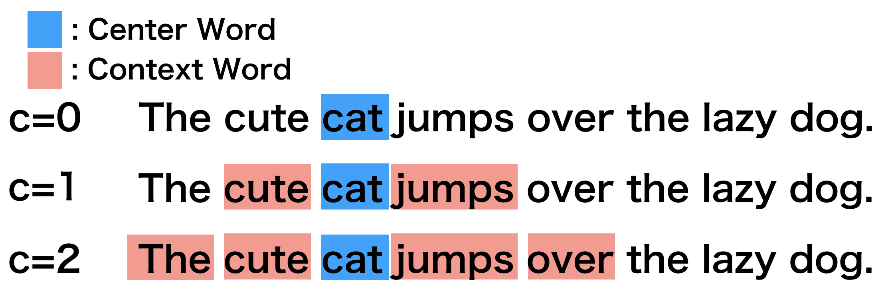
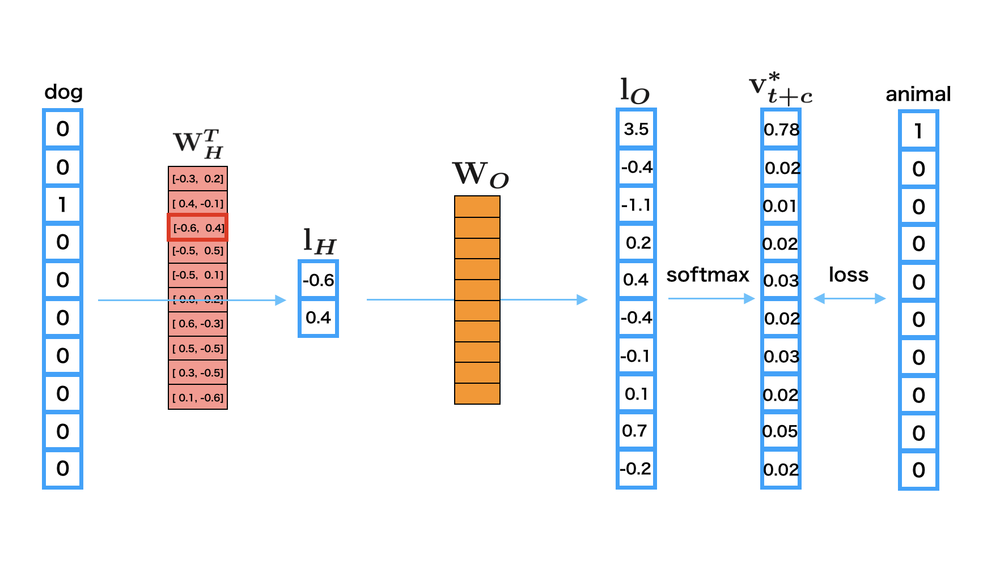

Word2Vec: Obtain word embeddings
*********************************

.. currentmodule:: chainer

0. Introduction
================

**Word2vec** is the tool for generating the distributed representation of words,
which is proposed by Mikolov et al[1]. When the tool assigns a real-valued vector
to each word, the closer the meanings of the words, the greater similarity the
vectors will indicate.

**Distributed representation** means assigning a real-valued vector for each
word and representing the word by the vector. When representing a word by
distributed representation, we call the **word embeddings**.
In this tutorial, we aim at explaining how to get the word embeddings from
Penn Tree Bank dataset.

Let's think about what the meaning of word is. Since we are human, we can
understand that the words "animal" and "dog" are deeply related each other.
But what information will Word2vec use to learn the vectors for words? The words
"animal" and "dog" should have similar vectors, but the words "food" and "dog"
should be far from each other. How to know the features of those words automatically?

1. Basic Idea
==============

Word2vec learns the similarity of word meanings from simple information. It learns
the representation of words from sentences. The core idea is based on the assumption
that the meaning of a word is affected by the words around it. This idea follows
**distributional hypothesis**\ [2].

The word we focus on to learn its representation is called **center word**,
and the words around it are called **context words**. The window
size :math:`C` determines the number of context words which is considered.

Here, let's see the algorithm by using an example sentence: "**The cute cat jumps over the lazy dog.**".

* All of the following figures consider "cat" as the center word.
* According to the window size :math:`C`, you can see that the number of context words is changed.

2. Main Algorithm
==================

Word2vec, the tool for creating the word embeddings, is actually
built with two models, which are called **Skip-gram** and **CBoW**.

To explain the models with the figures below, we will use the following
symbols.

=====================   ===============================================================================================================================
Symbol                  Definition                                               
=====================   ===============================================================================================================================
:math:`|\mathcal{V}|`   The size of vocabulary                                   
:math:`D`               The size of embedding vector                             
:math:`{\bf v}_t`       A one-hot center word vector                             
:math:`V_{t \pm C}`     A set of :math:`2C` context vectors around :math:`{\bf v}_t`, namely, :math:`\{{\bf v}_{t+c}\}_{c=-C}^C \backslash {\bf v}_t`
:math:`{\bf l}_H`       An embedding vector of an input word vector              
:math:`{\bf l}_O`       An output vector of the network                          
:math:`{\bf W}_H`       The embedding matrix for inputs                          
:math:`{\bf W}_O`       The embedding matrix for outputs                         
=====================   ===============================================================================================================================

.. note::

    Using **negative sampling** or **hierarchical softmax** for the loss
    function is very common, however, in this tutorial, we will use the
    **softmax over all words** and skip the other variants for the sake
    of simplicity.

2.1 Skip-gram
--------------

This model learns to predict context words :math:`V_{t \pm C}` when a center word
:math:`{\bf v}_t` is given. In the model, each row of the embedding
matrix for input :math:`{\bf W}_H` becomes a word embedding of each word.

When you input a center word :math:`{\bf v}_t` into the network,
you can predict one of context words :math:`\hat {\bf v}_{t+c} \in V_{t \pm C}` as follows:

1. Calculate an embedding vector of the input center word vector: :math:`{\bf l}_H = {\bf W}_H {\bf v}_t`
2. Calculate an output vector of the embedding vector: :math:`{\bf l}_O = {\bf W}_O {\bf l}_H`
3. Calculate a probability vector of a context word: :math:`\hat {\bf v}_{t+c} = \text{softmax}({\bf l}_O)`

Each element of the :math:`|\mathcal{V}|`-dimensional vector :math:`\hat {\bf v}_{t+c}` is a probability
that a word in the vocabulary turns out to be a context word at position :math:`c`.
So, the probability :math:`p({\bf v}_{t+c}|{\bf v}_t)` can be estimated by a dot product of the one-hot vector
:math:`{\bf v}_{t+c}` which represents the actual word at the position :math:`c` and the output vector
:math:`\hat {\bf v}_{t+c}`.

.. math::
    p({\bf v}_{t+c}|{\bf v}_t) = {\bf v}_{t+c}^T \hat {\bf v}_{t+c}

The loss function to predict all the context words :math:`V_{t \pm C}`
given a center word :math:`{\bf v}_t` is defined as follows:

.. math::
    L(V_{t \pm C} | {\bf v}_t; {\bf W}_H, {\bf W}_O) &= \sum_{V_{t \pm C}} -\log\left(p({\bf v}_{t+c} \mid {\bf v}_t)\right) \\
    &= \sum_{V_{t \pm C}} -\log({\bf v}_{t+c}^T \hat{\bf v}_{t+c})

2.2 Continuous Bag of Words (CBoW)
-----------------------------------

This model learns to predict center word :math:`{\bf v}_t` when context words
:math:`V_{t \pm C}` is given. When you give a set of context words
:math:`V_{t \pm C}` to the network, you can estimate the probability of the 
center word :math:`\hat {\bf v}_t` as follows:

1. Calculate a mean embedding vector over all context words: :math:`{\bf l}_H = \frac{1}{2C} \sum_{V_{t \pm C}} {\bf W}_H {\bf v}_{t+c}`
2. Calculate an output vector of the embedding vector: :math:`{\bf l}_O = {\bf W}_O {\bf l}_H`
3. Calculate a probability vector of a center word: :math:`\hat {\bf v}_t = \text{softmax}({\bf l}_O)`

Each element of the :math:`|\mathcal{V}|`-dimensional vector :math:`\hat {\bf v}_t` is a probability
that a word in the vocabulary turns out to be a center word.
So, the probability :math:`p({\bf v}_t|V_{t \pm C})` can be estimated by a dot product of the one-hot vector
:math:`{\bf v}_t` which represents the actual center word and the output vector
:math:`\hat {\bf v}_t`.

.. math::
    p({\bf v}_t|V_{t \pm C}) = {\bf v}_t^T \hat {\bf v}_t

The loss function to predict the center word :math:`{\bf v}_t`
given context words :math:`V_{t \pm C}` is defined as follows:

.. math::
    L({\bf v}_t | V_{t \pm C}; {\bf W}_H, {\bf W}_O) &= -\log\left(p({\bf v}_t \mid V_{t \pm C})\right) \\
    &= -\log({\bf v}_t^T \hat {\bf v}_t)

3. Details of Skip-gram
========================

In this tutorial, we mainly explain Skip-gram model because

1. It is easier to understand the algorithm than CBoW.
2. Even if the number of words increases, the accuracy is largely maintained.
   So, it is more scalable.

So, let's think about a concrete example of calculating Skip-gram under this setup:

* The size of vocabulary :math:`|\mathcal{V}|` is 10.
* The size of embedding vector :math:`D` is 2.
* Center word is "dog".
* Context word is "animal".

Since there should be more than one context word, repeat the following process for each context word.

1. The one-hot vector of "dog" is ``[0 0 1 0 0 0 0 0 0 0]`` and you input it as the
   center word.
2. The third row of embedding matrix :math:`{\bf W}_H`
   is used for the word embedding of "dog" :math:`{\bf l}_H`.
3. Then, multiply :math:`{\bf W}_O` with :math:`{\bf l}_H` to obtain the output
   vector :math:`{\bf l}_O`.
4. Give :math:`{\bf l}_O` to the softmax function to make it a predicted probability
   vector :math:`\hat {\bf v}_{t+c}` for a context word at the position :math:`c`.
5. Calculate the error between :math:`\hat {\bf v}_{t+c}` and the one-hot vector
   of "animal"; ``[1 0 0 0 0 0 0 0 0 0 0]``.
6. Propagate the error back to the network to update the parameters.

4. Implementation of Skip-gram in Chainer
==========================================

There is an example of Word2vec in the official repository of Chainer,
so we will explain how to implement Skip-gram based on this:
:tree:`examples/word2vec`

4.1 Preparation
--------------------------

First, let's import necessary packages:

.. literalinclude:: ../../../examples/word2vec/train_word2vec.py
   :language: python
   :lines: 6-20
   :caption: train_word2vec.py

4.2 Define a Skip-gram model
-----------------------------

Next, let's define a network for Skip-gram.

.. literalinclude:: ../../../examples/word2vec/train_word2vec.py
   :language: python
   :pyobject: SkipGram
   :caption: train_word2vec.py

.. literalinclude:: ../../../examples/word2vec/train_word2vec.py
   :language: python
   :pyobject: SoftmaxCrossEntropyLoss
   :caption: train_word2vec.py

.. note::

    * The weight matrix ``self.embed.W`` is the embedding matrix for input vector
      ``x``.
    * The function call ``forward`` takes the word ID of a center word ``x`` and
      word IDs of context words contexts as inputs, and outputs the error calculated
      by the loss function ``loss_func`` s.t. ``SoftmaxCrossEntropyLoss``.
    * Note that the initial shape of ``x`` and contexts are ``(batch_size,)``
      and ``(batch_size, n_context)``, respectively.
    * The ``batch_size`` means the size of mini-batch, and ``n_context`` means the
      number of context words.
      
First, we obtain the embedding vectors of contexts by ``e = self.embed(contexts)``.
Then ``F.broadcast_to(x[:, None], (batch_size, n_context))`` performs broadcasting of
``x`` (its shape is ``(batch_size,)``) to ``(batch_size, n_context)`` by copying the
same value ``n_context`` time to fill the second axis, and then the broadcasted ``x``
is reshaped into 1-D vector ``(batchsize * n_context,)`` while ``e`` is reshaped to
``(batch_size * n_context, n_units)``.
In Skip-gram model, predicting a context word from the center word is the same as
predicting the center word from a context word because the center word is always
a context word when considering the context word as a center word. So, we create
``batch_size * n_context`` center word predictions by applying ``self.out`` linear
layer to the embedding vectors of context words. Then, calculate softmax cross
entropy between the broadcasted center word ID x and the predictions.

4.3 Prepare dataset and iterator
---------------------------------

Let's retrieve the Penn Tree Bank (PTB) dataset by using Chainer's dataset utility
``get_ptb_words()`` method.

.. literalinclude:: ../../../examples/word2vec/train_word2vec.py
   :language: python
   :start-after: Load the dataset
   :end-before: counts.update
   :dedent: 4

Then define an iterator to make mini-batches that contain a set of center words with their context words.
``train`` and ``val`` means training data and validation data. Each data contains
the list of Document IDs:

    .. code-block:: console
    
        >>> train
        array([ 0,  1,  2, ..., 39, 26, 24], dtype=int32)
        >>> val
        array([2211,  396, 1129, ...,  108,   27,   24], dtype=int32)

.. literalinclude:: ../../../examples/word2vec/train_word2vec.py
   :language: python
   :pyobject: WindowIterator
   :caption: train_word2vec.py

* In the constructor, we create an array ``self.order`` which denotes shuffled
  indices of ``[window, window + 1, ..., len(dataset) - window - 1]`` in order to
  choose a center word randomly from dataset in a mini-batch.
* The iterator definition ``__next__`` returns ``batch_size`` sets of center word
  and context words.
* The code ``self.order[i:i_end]`` returns the indices for a set of center words
  from the random-ordered array ``self.order``. The center word IDs center at the
  random indices are retrieved by ``self.dataset.take``.
* ``np.concatenate([np.arange(-w, 0), np.arange(1, w + 1)])`` creates a set of
  offsets to retrieve context words from the dataset.
* The code ``position[:, None] + offset[None, :]`` generates the indices of context
  words for each center word index in position. The context word IDs context are
  retrieved by ``self.dataset.take``.

4.4 Prepare model, optimizer, and updater
------------------------------------------

.. literalinclude:: ../../../examples/word2vec/train_word2vec.py
   :language: python
   :start-after: if args.model
   :end-before: elif args.model
   :caption: train_word2vec.py
   :dedent: 4

.. literalinclude:: ../../../examples/word2vec/train_word2vec.py
   :language: python
   :start-after: Set up an optimizer
   :end-before: Set up an iterator
   :caption: train_word2vec.py
   :dedent: 4

.. literalinclude:: ../../../examples/word2vec/train_word2vec.py
   :language: python
   :start-after: Set up an iterator
   :end-before: Set up a trainer
   :caption: train_word2vec.py
   :dedent: 4

.. literalinclude:: ../../../examples/word2vec/train_word2vec.py
   :language: python
   :start-after: Set up a trainer
   :end-before: Save the word2vec model
   :caption: train_word2vec.py
   :dedent: 4

4.5 Start training
-------------------

.. code-block:: console

    $ pwd
    /root2chainer/chainer/examples/word2vec
    $ python train_word2vec.py --test  # run by test mode. If you want to use all data, remove "--test".
    GPU: -1
    # unit: 100
    Window: 5
    Minibatch-size: 1000
    # epoch: 20
    Training model: skipgram
    Output type: hsm
    
    n_vocab: 10000
    data length: 100
    epoch       main/loss   validation/main/loss
    1           4233.75     2495.33               
    2           1411.14     4990.66               
    3           4233.11     1247.66               
    4           2821.66     4990.65               
    5           4231.94     1247.66               
    6           5642.04     2495.3                
    7           5640.82     4990.64               
    8           5639.31     2495.28               
    9           2817.89     4990.62               
    10          1408.03     3742.94               
    11          5633.11     1247.62               
    12          4221.71     2495.21               
    13          4219.3      4990.56               
    14          4216.57     2495.16               
    15          4213.52     2495.12               
    16          5616.03     1247.55               
    17          5611.34     3742.78               
    18          2800.31     3742.74               
    19          1397.79     2494.95               
    20          2794.1      3742.66

4.5 Search the similar words
-----------------------------

.. code-block:: console

    $ pwd
    /root2chainer/chainer/examples/word2vec
    $ python search.py 
    >> apple
    query: apple
    compaq: 0.6169619560241699
    chip: 0.49579331278800964
    retailer: 0.4904134273529053
    maker: 0.4684058427810669
    computer: 0.4652436673641205
    >> animal      
    query: animal
    beauty: 0.5680124759674072
    human: 0.5404794216156006
    insulin: 0.5365156531333923
    cell: 0.5186758041381836
    photographs: 0.5077002048492432

5. Reference
=============
* [1] `Mikolov, Tomas; et al. "Efficient Estimation of Word Representations in Vector Space". arXiv:1301.3781 <https://arxiv.org/abs/1301.3781>`_
* [2] `Distributional Hypothesis <https://aclweb.org/aclwiki/Distributional_Hypothesis>`_
