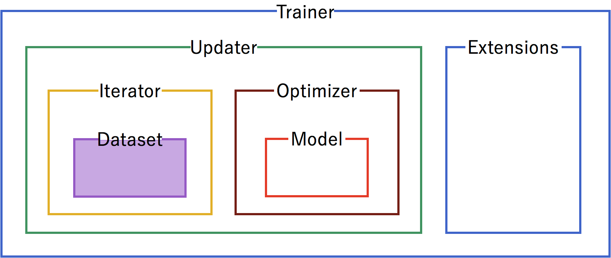
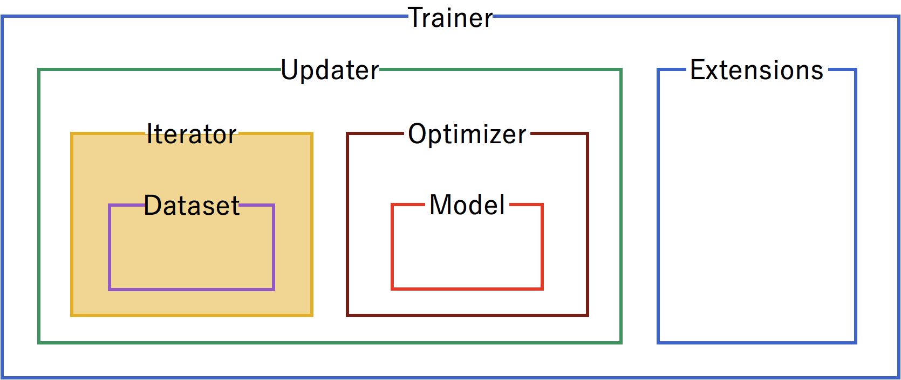
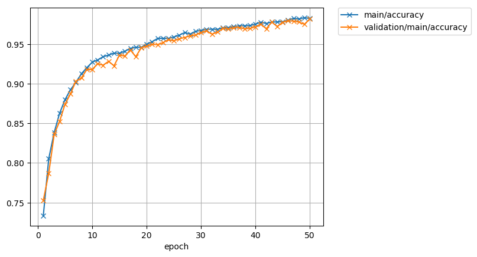

Chainer at a Glance
===================

.. currentmodule:: chainer

Welcome to Chainer!

Chainer is a rapidly growing neural network platform. The strengths of Chainer are:

* Python-based -- Chainer is developed in Python, allowing for inspection and customization of all code in python and understandable python messages at run time
* Define by Run -- neural networks definitions are defined on-the-fly at run time, allowing for dynamic network changes
* NumPy based syntax for working with arrays, thanks to CuPy implementation
* Fully customizable -- since Chainer is pure python, all classes and methods can be adapted to allow for the latest cutting edge or specialized approaches
* Broad and deep support -- Chainer is actively used for most of the current approaches for neural nets (CNN, RNN, RL, etc.), aggressively adds new approaches as they're developed, and provides support for many kinds of hardware as well as parallelization for multiple GPUs

Mushrooms -- tasty or deadly?
-----------------------------

Let's take a look at a basic program of Chainer to see how it works. For a dataset, we'll work with `Kaggle's edible vs. poisonous mushroom dataset <https://www.kaggle.com/uciml/mushroom-classification>`_, which has over 8,000 examples of mushrooms, labelled by 22 categories including odor, cap color, habitat, etc., in a `mushrooms.csv file <https://raw.githubusercontent.com/chainer/chainer/master/examples/glance/mushrooms.csv>`_.

How will Chainer learn which mushrooms are edible and which mushrooms will kill you? Let's see!

The code below is from the glance example in the :tree:`examples/glance` directory.

Code Breakdown
--------------

Initialization
~~~~~~~~~~~~~~

Let's start the program. Here are the typical imports for a Chainer program. :mod:`chainer.links` contain trainable parameters and :mod:`chainer.functions` do not.

.. literalinclude:: ../../examples/glance/glance.py
   :language: python
   :linenos:
   :lines: 6-13
   :lineno-start: 6

We'll use Matplotlib for the graphs to show training progress.

.. literalinclude:: ../../examples/glance/glance.py
   :language: python
   :linenos:
   :lines: 15-16
   :lineno-start: 15

Trainer Structure
~~~~~~~~~~~~~~~~~

A :class:`trainer <chainer.training.Trainer>` is used to set up our neural network and data for training. The components of the :class:`trainer <chainer.training.Trainer>` are generally hierarchical, and are organized as follows:

.. image:: ../image/glance/trainer.png

Each of the components is fed information from the components within it. Setting up the trainer starts at the inner components, and moves outward, with the exception of :ref:`extensions <extensions>`, which are added after the :class:`trainer <chainer.training.Trainer>` is defined.

Dataset
~~~~~~~

Our first step is to format the :mod:`~chainer.dataset`. From the raw mushrooms.csv, we format the data into a Chainer :class:`~chainer.datasets.TupleDataset`.

.. literalinclude:: ../../examples/glance/glance.py
   :language: python
   :linenos:
   :lines: 18-27
   :lineno-start: 18

Iterator
~~~~~~~~

Configure :mod:`~chainer.iterators` to step through batches of the data for training and for testing validation. In this case, we'll use a batch size of 100. For the training iterator, repeating and shuffling are implicitly enabled, while they are explicitly disabled for the testing iterator.

.. literalinclude:: ../../examples/glance/glance.py
   :language: python
   :linenos:
   :lines: 29-31
   :lineno-start: 29

Model
~~~~~~~~~~
.. image:: ../image/glance/trainer-model.png
   :scale: 50 %
   :width: 835px
   :height: 353px

Next, we need to define the neural network for inclusion in our model. For our mushrooms, we'll chain together two fully-connected, :class:`~chainer.links.Linear`, hidden layers between the input and output layers.

As an activation function, we'll use standard Rectified Linear Units (:func:`~chainer.functions.relu`).

Using :class:`~chainer.Sequential` allows us to define the neural network model in a compact format.

.. literalinclude:: ../../examples/glance/glance.py
   :language: python
   :linenos:
   :lines: 34-40
   :lineno-start: 34

Since mushrooms are either edible or poisonous (no information on psychedelic effects!) in the dataset, we'll use a Link :class:`~chainer.links.Classifier` for the output, with 44 units (double the features of the data) in the hidden layers and a single edible/poisonous category for classification.

.. literalinclude:: ../../examples/glance/glance.py
   :language: python
   :linenos:
   :lines: 43-44
   :lineno-start: 43

Note that in the two code snippets above we have not specified the size of the input layer. Once we start feeding the neural network with samples, Chainer will recognize the dimensionality of the input automatically and initialize the matrix for each layer with the appropriate shape. In the example above, that is 44×22 for the first hidden layer, 44×44 for the second hidden layer, and 1×44 for the output layer.

Optimizer
~~~~~~~~~~~~
.. image:: ../image/glance/trainer-optimizer.png
   :scale: 50 %
   :width: 835px
   :height: 353px

Pick an :class:`optimizer <chainer.Optimizer>`, and set up the ``model`` to use it.

.. literalinclude:: ../../examples/glance/glance.py
   :language: python
   :linenos:
   :lines: 46-47
   :lineno-start: 46

Updater
~~~~~~~~~
.. image:: ../image/glance/trainer-updater.png
   :scale: 50 %
   :width: 835px
   :height: 353px

Now that we have the training :class:`iterator <chainer.dataset.Iterator>` and :class:`optimizer <chainer.Optimizer>` set up, we link them both together into the :class:`updater <chainer.training.Updater>`. The :class:`updater <chainer.training.Updater>` uses the minibatches from the :class:`iterator <chainer.dataset.Iterator>`, does the forward and backward processing of the model, and updates the parameters of the model according to the :class:`optimizer <chainer.Optimizer>`. Setting the ``device=-1`` sets the device as the CPU. To use a GPU, set ``device`` equal to the number of the GPU, usually ``device=0``.

.. literalinclude:: ../../examples/glance/glance.py
   :language: python
   :linenos:
   :lines: 49-50
   :lineno-start: 49

Finally we create a :class:`Trainer <chainer.training.Trainer>` object. The ``trainer`` processes minibatches using the ``updater`` defined above until a certain stop condition is met and allows the use of extensions during the training. We set it to run for 50 epochs and store all files created by the extensions (see below) in the ``result`` directory.

.. literalinclude:: ../../examples/glance/glance.py
   :language: python
   :linenos:
   :lines: 52-53
   :lineno-start: 52

Extensions
~~~~~~~~~~
.. image:: ../image/glance/trainer-extensions.png
   :scale: 50 %
   :width: 835px
   :height: 353px

Extensions can be used to execute code at certain events during the training, such as every epoch or every 1000 iterations. This mechanism is used in Chainer to evaluate models during training, print progress messages, or dump intermediate model files.

First, use the testing :class:`iterator <chainer.dataset.Iterator>` defined above for an :class:`~chainer.training.extensions.Evaluator` extension to the trainer to provide test scores. If using a GPU instead of the CPU, set ``device`` to the ID of the GPU, usually ``0``.

.. literalinclude:: ../../examples/glance/glance.py
   :language: python
   :linenos:
   :lines: 54-55
   :lineno-start: 54

Save a computational graph from ``loss`` variable at the first iteration. ``main`` refers to the target link of the ``main`` :class:`optimizer <chainer.Optimizer>`. The graph is saved in the `Graphviz's <https://www.graphviz.org/>`_ dot format. The output location (directory) to save the graph is set by the ``out`` argument of :class:`trainer <chainer.training.Trainer>`.

.. literalinclude:: ../../examples/glance/glance.py
   :language: python
   :linenos:
   :lines: 57-59
   :lineno-start: 57

Take a snapshot of the :class:`trainer <chainer.training.Trainer>` object every 20 epochs.

.. literalinclude:: ../../examples/glance/glance.py
   :language: python
   :linenos:
   :lines: 61
   :lineno-start: 61

Write a log of evaluation statistics for each epoch.

.. literalinclude:: ../../examples/glance/glance.py
   :language: python
   :linenos:
   :lines: 63-64
   :lineno-start: 63

Save two plot images to the result directory.

.. literalinclude:: ../../examples/glance/glance.py
   :language: python
   :linenos:
   :lines: 66-74
   :lineno-start: 66

Print selected entries of the log to standard output.

.. literalinclude:: ../../examples/glance/glance.py
   :language: python
   :linenos:
   :lines: 76-79
   :lineno-start: 76

Main Loop
~~~~~~~~~

Finally, with the ``trainer`` and all the extensions set up, we can add the line that actually starts the main loop:

.. literalinclude:: ../../examples/glance/glance.py
   :language: python
   :linenos:
   :lines: 81-82
   :lineno-start: 81

Inference
~~~~~~~~~

Once the training is complete, only the model is necessary to make predictions. Let's check that a random line from the test data set and see if the inference is correct:

.. literalinclude:: ../../examples/glance/glance.py
   :language: python
   :linenos:
   :lines: 84-
   :lineno-start: 84

Output
-------

Output for this instance will look like:

::

   epoch       main/loss   validation/main/loss  main/accuracy  validation/main/accuracy  elapsed_time
   1           0.550724    0.502818              0.733509       0.752821                  0.215426      
   2           0.454206    0.446234              0.805439       0.786926                  0.902108      
   3           0.402783    0.395893              0.838421       0.835979                  1.50414       
   4           0.362979    0.359988              0.862807       0.852632                  2.24171       
   5           0.32713     0.329881              0.88           0.874232                  2.83247       
   6           0.303469    0.31104               0.892456       0.887284                  3.45173       
   7           0.284755    0.288553              0.901754       0.903284                  3.9877        
   8           0.26801     0.272033              0.9125         0.907137                  4.54794       
   9           0.25669     0.261355              0.920175       0.917937                  5.21672       
   10          0.241789    0.251821              0.927193       0.917937                  5.79541       
   11          0.232291    0.238022              0.93           0.925389                  6.3055        
   12          0.222805    0.22895               0.934035       0.923389                  6.87083       
   13          0.21276     0.219291              0.93614        0.928189                  7.54113       
   14          0.204822    0.220736              0.938596       0.922589                  8.12495       
   15          0.197671    0.207017              0.938393       0.936042                  8.69219       
   16          0.190285    0.199129              0.941053       0.934842                  9.24302       
   17          0.182827    0.193303              0.944386       0.942695                  9.80991       
   18          0.176776    0.194284              0.94614        0.934042                  10.3603       
   19          0.16964     0.177684              0.945789       0.945242                  10.8531       
   20          0.164831    0.171988              0.949825       0.947347                  11.3876       
   21          0.158394    0.167459              0.952982       0.949747                  11.9866       
   22          0.153353    0.161774              0.956964       0.949347                  12.6433       
   23          0.148209    0.156644              0.957368       0.951747                  13.3825       
   24          0.144814    0.15322               0.957018       0.955495                  13.962        
   25          0.138782    0.148277              0.958947       0.954147                  14.6          
   26          0.135333    0.145225              0.961228       0.956695                  15.2284       
   27          0.129593    0.141141              0.964561       0.958295                  15.7413       
   28          0.128265    0.136866              0.962632       0.960547                  16.2711       
   29          0.123848    0.133444              0.966071       0.961347                  16.7772       
   30          0.119687    0.129579              0.967193       0.964547                  17.3311       
   31          0.115857    0.126606              0.968596       0.966547                  17.8252       
   32          0.113911    0.124272              0.968772       0.962547                  18.3121       
   33          0.111502    0.122548              0.968596       0.965095                  18.8973       
   34          0.107427    0.116724              0.970526       0.969747                  19.4723       
   35          0.104536    0.114517              0.970877       0.969095                  20.0804       
   36          0.099408    0.112128              0.971786       0.970547                  20.6509       
   37          0.0972982   0.107618              0.973158       0.970947                  21.2467       
   38          0.0927064   0.104918              0.973158       0.969347                  21.7978       
   39          0.0904702   0.101141              0.973333       0.969747                  22.3328       
   40          0.0860733   0.0984015             0.975263       0.971747                  22.8447       
   41          0.0829282   0.0942095             0.977544       0.974947                  23.5113       
   42          0.082219    0.0947418             0.975965       0.969347                  24.0427       
   43          0.0773362   0.0906804             0.977857       0.977747                  24.5252       
   44          0.0751769   0.0886449             0.977895       0.972147                  25.1722       
   45          0.072056    0.0916797             0.978246       0.977495                  26.0778       
   46          0.0708111   0.0811359             0.98           0.979347                  26.6648       
   47          0.0671919   0.0783265             0.982456       0.978947                  27.2929       
   48          0.0658817   0.0772342             0.981754       0.977747                  27.8119       
   49          0.0634615   0.0762576             0.983333       0.974947                  28.3876       
   50          0.0622394   0.0710278             0.982321       0.981747                  28.9067       
   Predicted Edible Actual Edible

Our prediction was correct. Success!

The loss function:

.. image:: ../image/glance/loss.png

And the accuracy

