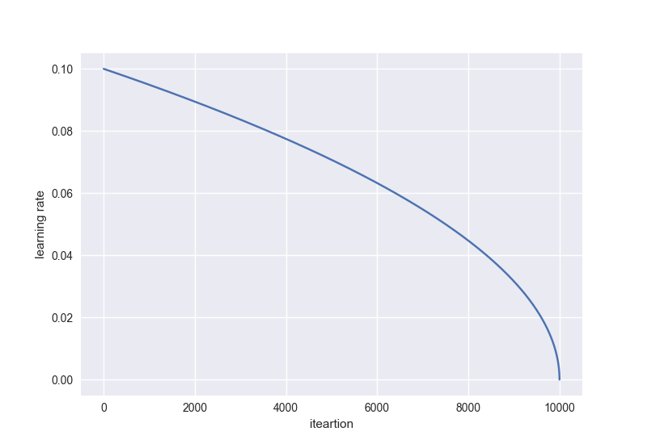

Create your own trainer extension
=================================

.. currentmodule:: chainer

In this section, you will learn about the following things:

- :ref:`basic`
- How to create your own trainer extension

    * :ref:`by defining a simple function<function>`
    * :ref:`by defining a function decorated with @make_extension <decorator>`
    * :ref:`by defining a class inherited from Extension class <class>`

.. _basic:

What is trainer Extension?
--------------------------

:class:`~chainer.training.Extension` is a callable object that takes a :class:`~chainer.training.Trainer` object as an argument. Adding an :class:`~chainer.training.Extension` to a :class:`~chainer.training.Trainer` using :meth:`~chainer.training.Trainer.extend` method, the :class:`~chainer.training.Extension` will be called at the given timing you specified by using ``trigger`` object (See the details in :ref:`trigger`)

A :class:`~chainer.training.Trainer` object has all information used in a training loop, e.g., models, optimizers, updaters, iterators, and datasets, etc. So you can change the settings of optimizers

.. _function:

Write a simple function
-----------------------

You can make a new :class:`~chainer.training.Extension` by writing a simple function which takes :class:`~chainer.training.Trainer` object as its argument. For example, when you want to reduce the learning rate at specified timing during training, ``lr_drop`` extension can be written as follows:

.. testcode::

    def lr_drop(trainer):
        trainer.updater.get_optimizer('main').lr *= 0.1

Then you can add this function to a :class:`~chainer.training.Trainer` object via :meth:`~chainer.training.Trainer.extend` method.

.. code-block:: python

    trainer.extend(lr_drop, trigger=(10, 'epoch'))

It lowers the learning rate every 10 epochs by multiplying 0.1 with the current learning rate.

.. _decorator:

Write a function decorated with @make_extension
-----------------------------------------------

:meth:`~chainer.training.make_extension` is a decorator that adds some attributes to a given function. For example, the simple extension we created above can be written in this form:

.. testcode::

    @training.make_extension(trigger=(10, 'epoch'))
    def lr_drop(trainer):
        trainer.updater.get_optimizer('main').lr *= 0.1

The difference between the above one and this is whether it has a default ``trigger`` or not. In this latter case, :meth:`lr_drop` has its default ``trigger`` so that unless another ``trigger`` is specified via :meth:`~chainer.training.Trainer.extend` method, the ``trigger`` specified in :meth:`~chainer.training.make_extension` is used as default. So the code below acts the same as the former example, i.e., it reduces the learning rate every 10 epochs.

.. code-block:: python

    trainer.extend(lr_drop)

There are several attributes you can add using the :meth:`~chainer.training.make_extension` decorator.

.. _trigger:

1. trigger
^^^^^^^^^^

``trigger`` is an object that takes a :class:`~chainer.training.Trainer` object as an argument and returns a boolean value. If a tuple in a form ``(period, unit)`` is given as a trigger, it will be considered as an :class:`~chainer.training.triggers.IntervalTrigger` that invokes the extension at every ``period`` ``unit``. For example, when the given tuple is ``(10, 'epoch')``, the extension will be fired at every 10 epochs.

``trigger`` can also be given to the :meth:`~chainer.training.trainer.extend` method that adds an extension to a :class:`~chainer.training.Trainer` object. The priority of ``trigger``\ s is as follows:

- When both :meth:`~chainer.training.Trainer.extend` and a given :class:`~chainer.training.Extension` have ``trigger``\ s, the ``trigger`` given to :meth:`~chainer.training.Trainer.extend` is used.
- When ``None`` is given to :meth:`~chainer.training.Trainer.extend` as the ``trigger`` argument and a given :class:`~chainer.training.Extension` has ``trigger``, the ``trigger`` given to the :class:`~chainer.training.Extension` is used.
- When both ``trigger`` attributes in :meth:`~chainer.training.Trainer.extend` and :class:`~chainer.training.Extension` are ``None``, the :class:`~chainer.training.Extension` will be fired every iteration.

See the details in the documentation of :meth:`~chainer.training.get_trigger`.

2. default_name
^^^^^^^^^^^^^^^

An :class:`~chainer.training.Extension` is kept in a dictionary which is a property in a :class:`~chainer.training.Trainer`. This argument gives the name of the :class:`~chainer.training.Extension`. Users will see this name in keys of the snapshot which is a dictionary generated by serialization.

3. priority
^^^^^^^^^^^

The priority that is used to determine the order of execution of extensions in a :class:`~chainer.training.Trainer` object. There are three standard values for the priorities:

- :data:`~chainer.training.extension.PRIORITY_WRITER`: The priority for extensions that write some records to the observation dictionary. It includes cases that the extension directly adds values to the observation dictionary, or the extension uses the chainer.report() function to report values to the observation dictionary. Extensions which write something to reporter should go first because the other Extensions which read those values could be added.
- :data:`~chainer.training.extension.PRIORITY_EDITOR`: The priority for extensions that edit the observation dictionary based on already reported values. Extensions which edit some values of reported ones should go after the extensions which write values to reporter but before extensions which read the final values.
- :data:`~chainer.training.extension.PRIORITY_READER`: The priority for extensions that only read records from the observation dictionary. This is also suitable for extensions that do not use the observation dictionary at all. Extensions which read the reported values should be fired after all the extensions which have other priorities, e.g, :data:`PRIORITY_WRITER` and :data:`PRIORITY_EDITOR` because it should read the final values.

See the details in the documentation of :class:`~chainer.training.Trainer`.

4. finalizer
^^^^^^^^^^^^

You can specify a function which takes :class:`~chainer.training.Trainer` object to finalize the extension. It is called once at the end of the whole training loops, namely, the :meth:`~chainer.training.Trainer.run` finished.

5. initializer
^^^^^^^^^^^^^^

You can specify a function which takes :class:`~chainer.training.Trainer` object to initialize the extension. It is called once at the beginning of the training loop, namely, before starting the actual loop.

.. _class:

Write a class inherited from Extension class
--------------------------------------------

This is the way to define your own extension with the maximum degree of freedom. You can keep any values inside of the extension and serialize them.

As an example, let's make an extension that drops the learning rate polynomially. It calculates the learning rate by this equation:

.. math::

    \eta = \eta_{\rm init} \left( 1 - \frac{t}{t_{\rm max}} \right)^{\rm power}

The learning rate will be dropped like the curve below with :math:`{\rm power} = 0.5`:

.. testcode::

    class PolynomialShift(training.Extension):

        def __init__(self, attr, power, stop_trigger, batchsize=None,
                     len_dataset=None):
            self._attr = attr
            self._power = power
            self._init = None
            self._t = 0
            self._last_value = 0

            if stop_trigger[1] == 'iteration':
                self._maxiter = stop_trigger[0]
            elif stop_trigger[1] == 'epoch':
                if batchsize is None or len_dataset is None:
                    raise ValueError(
                        'When the unit of \'stop_trigger\' is \'epoch\', '
                        '\'batchsize\' and \'len_dataset\' should be '
                        'specified to calculate the maximum iteration.')
                n_iter_per_epoch = len_dataset / float(batchsize)
                self._maxiter = float(stop_trigger[0] * n_iter_per_epoch)

        def initialize(self, trainer):
            optimizer = trainer.updater.get_optimizer('main')
            # ensure that _init is set
            if self._init is None:
                self._init = getattr(optimizer, self._attr)

        def __call__(self, trainer):
            self._t += 1

            optimizer = trainer.updater.get_optimizer('main')
            value = self._init * ((1 - (self._t / self._maxiter)) ** self._power)
            setattr(optimizer, self._attr, value)
            self._last_value = value

        def serialize(self, serializer):
            self._t = serializer('_t', self._t)
            self._last_value = serializer('_last_value', self._last_value)
            if isinstance(self._last_value, np.ndarray):
                self._last_value = np.asscalar(self._last_value)

.. code-block:: python

    stop_trigger = (10000, 'iteration')
    trainer.extend(PolynomialShift('lr', 0.5, stop_trigger)

This extension ``PolynomialShift`` takes five arguments.

- ``attr``: The name of optimizer property you want to update by this extension.
- ``power``: The power of the above equation to calculate the learning rate.
- ``stop_trigger``: The trigger given to the :class:`~chainer.traininig.Trainer` object to specify when to stop the training loop.
- ``batchsize``: The training mini-batchsize.
- ``len_dataset``: The length of dataset, i.e., the number of data in the training dataset.

This extension calculates the number of iterations which will be performed in training by using ``stop_trigger``, ``batchsize``, and ``len_dataset``, then store it as a property ``_maxiter``. This property will be used in :meth:`__call__` method to update the learning rate. :meth:`initialize` method obtains the initial learning rate from the optimizer set to give :class:`~chainer.training.Trainer` object. :meth:`~chainer.traininig.serialize` method stores or recovers the properties, ``_t`` (number of iterations) and ``_last_value`` (the latest learning rate), which this extension has.
