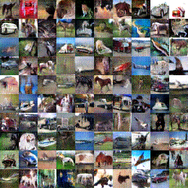
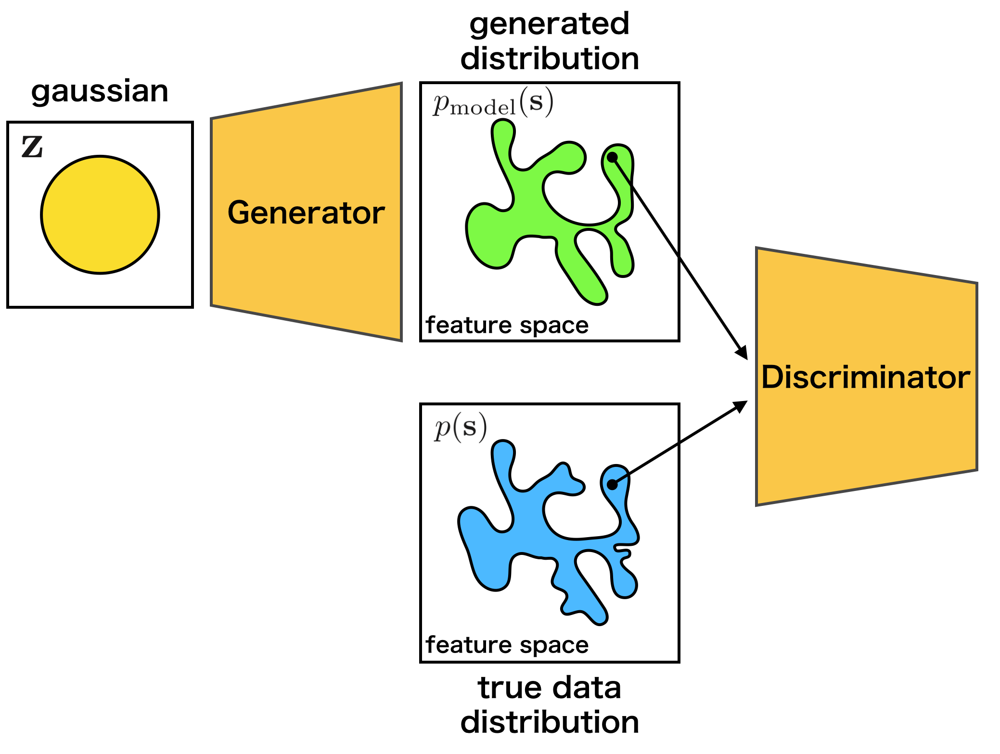

DCGAN: Generate the images with Deep Convolutional GAN
******************************************************

.. currentmodule:: chainer

0. Introduction
================

In this tutorial, we generate images with **generative adversarial network (GAN)**.
It is a kind of generative model with deep neural network, and often applied to
the image generation. The GAN technique is also applied to 
`PaintsChainer <https://paintschainer.preferred.tech/index_en.html>`_,
a famous automatic coloring service.

In the tutorial, you will learn the following things:

1. Generative Adversarial Networks (GAN)
2. Implementation of DCGAN in Chainer

1. Generarive Adversarial Networks (GAN)
=========================================

1.1 What is the GAN?
---------------------

As explained in the GAN tutorial in NIPS 2016 [1], the generative models can be classified into the categories as shown in the following figure:

.. figure:: ../../image/dcgan/class-generative-model.png
   :scale: 100%

   cited from [1]

Besides GAN, other famous generative models are Fully visible belief networks (FVBNs) and Variational autoencoder (VAE).
Unlike FVBNs and VAE, GAN does not explicitly models the probability distribution :math:`p({\bf s})`
that generates the training data. Instead, we model a generator :math:`G: {\bf z} \mapsto {\bf s}`.
The generator :math:`G` samples :math:`{\bf s} \sim p({\bf s})` from the latent variable :math:`\bf z`.
Apart from the generator :math:`G`, we create a discriminator :math:`D({\bf x})`
which identified the samples from the generator :math:`G` and the true samples from training data.
While training the discriminator :math:`D`, the generator :math:`G` is also trained so that
the generated samples cannot be identified by the discriminator.
The advantages of GAN are low sampling cost and state-of-the-art in image generation.
The disadvantage is that we cannot calculate the probability distribution
:math:`p_{\mathrm {model}}({\bf s})` because we do not model any probability distribution,
and we cannot infer the latent variable :math:`\bf z` from a sample.

1.2 How the GAN works?
-----------------------

As explained above, GAN uses the two models, the generator and the discriminator. In other words,
we set up two neural networks for GAN.

When training the networks, we should match the distribution of the samples
:math:`{\bf s} \sim p({\bf s})` generated from the true distribution with the distribution of the samples
:math:`{\bf s} = G ({\bf z})` generated from the generator.

The generator :math:`G` learns the target distribution on the idea of
**Nash equilibrium** [2] of game theory.
In detail, while training the discriminator :math:`D`,
the generator :math:`G` is also trained so that the discriminator :math:`D`
cannot identify the generated samples.

As an intuitive example, the relationship between counterfeiters of
banknotes and police is frequently used. The counterfeiters try to make counterfeit notes
that are similar to real banknotes. The police try to distinguish real bank notes from counterfeit notes.
It is supposed that the ability of the police gradually rises, so that real banknotes and counterfeit
notes can be recognized well. Then, the counterfeiters will not be able to use counterfeit banknotes,
so they will build more similar counterfeit banknotes to real. As the police improve the skill further,
so that they can distinguish real and counterfeit notes... Eventually, the counterfeiter will
be able to produce as similar banknote as genuine.

The training process is explained by mathematical expressions as follows.
First, since the discriminator :math:`D({\bf s})` is a probability 
that the sample :math:`\bf s` is generated from the true distribution,
it can be expressed as follows:

.. math::
    D({\bf s}) = \frac{p({\bf s})}{p({\bf s}) + p_{\mathrm{model}}({\bf s})}

Then, when we match the distributions of
the samples :math:`{\bf s} \sim p({\bf s})` generated from true distribution
and the samples :math:`{\bf s} \sim p_{\mathrm{model}}({\bf s})`
generated from the generator :math:`G`,
it means that we should minimize the dissimilarity between
the two distributions.
It is common to use **Jensen-Shannon Divergence** :math:`D_{\mathrm{JS}}`
to measure the dissimilarity between the distributions[3].

The :math:`D_{\mathrm{JS}}` of :math:`p_{\mathrm{model}}({\bf s})` and
:math:`p({\bf s})` can be written as follows by using :math:`D({\bf s})`:

.. math::
     2 D_{\mathrm{JS}} &=& D_{\mathrm{KL}}(p(x)||\bar{p}(x)) + D_{\mathrm{KL}}(p_{\mathrm{model}}(x)||\bar{p}(x)) \\
     &=& \mathbb{E}_{p(x)} \log \frac{2p(x)}{p(x) + p_{\mathrm{model}}(x)} + \mathbb{E}_{p_{\mathrm{model}}} \log \frac{2p_{\mathrm{model}}(x)}{p(x) + p_{\mathrm{model}}(x)} \\
     &=& \mathbb{E}_{p(x)} \log D(x) + \mathbb{E}_{p_{\mathrm{model}}} \log (1-D(x)) + \log 4

The :math:`D_{\mathrm{JS}}` will be maximized by the discriminator :math:`D` and minimized by
the generator :math:`G`, or :math:`p_{\mathrm{model}}`.
And the distribution :math:`p_{\mathrm model}({\bf s})`
generated by :math:`G({\bf x})` can match the true distribution :math:`p({\bf s})`.

.. math::
    \min_{G} \max_{D} \mathbb{E}_{p(x)} \log D(x) + \mathbb{E}_{p_{\mathrm{model}}} \log (1-D(x))

When training actually, the above min-max problem is solved by alternately updating the
discriminator :math:`D({\bf s})` and the generator :math:`G({\bf x})` [4].

.. figure:: ../../image/dcgan/update-gan.png
   :scale: 100%

   cited from [4]

1.3 What is DCGAN?
-------------------

In this section, we will introduce the model called DCGAN(Deep Convolutional GAN) proposed by Radford et al.[5].
As shown below, it is a model using CNN(Convolutional Neural Network) as its name suggests.

.. figure:: ../../image/dcgan/dcgan.png
   :scale: 100%

   cited from [5]

In addition, although GAN is known for its difficulty in learning, this paper introduces various techniques
for successful learning:

1. Convert max-pooling layers to convolution layers
2. Convert fully connected layers to global average pooling layers in the discriminator
3. Use batch normalization layers in the generator and the discriminator
4. Use leaky ReLU activation functions in the discriminator

2. Implementation of DCGAN in Chainer
=======================================

There is an example of DCGAN in the official repository of Chainer,
so we will explain how to implement DCGAN based on this:
`chainer/examples/dcgan <https://github.com/chainer/chainer/tree/master/examples/dcgan>`_

2.1 Define the generator model
-------------------------------

First, let's define a network for the generator.

.. literalinclude:: ../../../examples/dcgan/net.py
   :language: python
   :pyobject: Generator
   :caption: train_dcgan.py

When we make a network in Chainer, we should follow some rules:

1. Define a network class which inherits :class:`~chainer.Chain`.
2. Make :class:`chainer.links` 's instances in the ``init_scope():`` 
   of the initializer ``__init__``.
3. Concatenate :class:`chainer.links` 's instances with :class:`chainer.functions`
   to make the whole network.

If you are not familiar with constructing a new network, you can read
:ref:`this tutorial<creating_models>`.

As we can see from the initializer ``__init__``, the ``Generator``
uses the deconvolution layer :class:`~chainer.links.Deconvolution2D`
and the batch normalization :class:`~chainer.links.BatchNormalization`.
In ``__call__``, each layer is concatenated by :class:`~chainer.functions.relu`
except the last layer.

Because the first argument of ``L.Deconvolution`` is the channel size of input and
the second is the channel size of output, we can find that each layer halve the
channel size. When we construct ``Generator`` with ``ch=1024``, the network
is same with the image above.

.. note::
    Be careful when you concatenate a fully connected layer's output and
    a convolutinal layer's input. As we can see the 1st line of ``__call__``,
    the output and input have to be concatenated with reshaping by 
    :class:`~chainer.functions.reshape`.

2.2 Define the discriminator model
-----------------------------------

In addtion, let's define a network for the discriminator.

.. literalinclude:: ../../../examples/dcgan/net.py
   :language: python
   :pyobject: Discriminator
   :caption: train_dcgan.py

The ``Discriminator`` network is almost same with the transposed network
of the ``Generator``. However, there are minor different points:

1. Use :class:`~chainer.functions.leaky_relu` as activation functions
2. Deeper than ``Generator``
3. Add some noise when concatenating layers

.. literalinclude:: ../../../examples/dcgan/net.py
   :language: python
   :pyobject: add_noise
   :caption: train_dcgan.py

2.3 Prepare dataset and iterator
---------------------------------

Let's retrieve the CIFAR-10 dataset by using Chainer's dataset utility function
:class:`~chainer.datasets.get_cifar10`. CIFAR-10 is a set of small natural images.
Each example is an RGB color image of size 32x32. In the original images,
each component of pixels is represented by one-byte unsigned integer.
This function scales the components to floating point values in
the interval ``[0, scale]``.

.. literalinclude:: ../../../examples/dcgan/train_dcgan.py
   :language: python
   :start-after: Load the CIFAR10
   :end-before: else
   :dedent: 8

.. literalinclude:: ../../../examples/dcgan/train_dcgan.py
   :language: python
   :start-after: Setup an iterator
   :end-before: Setup a updater
   :caption: train_dcgan.py
   :dedent: 4

2.4 Prepare model and optimizer
--------------------------------

Let's make the instances of the generator and the discriminator.

.. literalinclude:: ../../../examples/dcgan/train_dcgan.py
   :language: python
   :start-after: Set up a neural network to train
   :end-before: if
   :caption: train_dcgan.py
   :dedent: 4

Next, let's make optimizers for the models created above.

.. literalinclude:: ../../../examples/dcgan/train_dcgan.py
   :language: python
   :start-after: Setup an optimizer
   :end-before: if
   :caption: train_dcgan.py
   :dedent: 4

2.5 Prepare updater
--------------------

The GAN needs the two models: the generator and the discriminator. Usually,
the default updaters pre-defined in Chainer take only one model.
So, we need to define a custom updater for the GAN training.

The definition of ``DCGANUpdater`` is a little complicated. However, it just
minimize the loss of the discriminator and that of the generator alternately.
We will explain the way of updating the models.

As you can see in the class definiton, ``DCGANUpdater`` inherits 
:class:`~chainer.training.updaters.StandardUpdater`. In this case,
almost all necessary functions are defined in
:class:`~chainer.training.updaters.StandardUpdater`,
we just override the functions of ``__init__`` and ``update_core``.

.. note::
    We do not need to define ``loss_dis`` and ``loss_gen`` because the functions
    are called only in ``update_core``. It aims at improving readability.

.. literalinclude:: ../../../examples/dcgan/updater.py
   :language: python
   :pyobject: DCGANUpdater
   :caption: train_dcgan.py

In the intializer ``__init__``, an addtional key word argument ``models`` is
required as you can see the codes below. Also, we use key word arguments
``iterator``, ``optimizer`` and ``device``. Be careful for the ``optimizer``.
We needs not only two models but also two optimizers. So, we should input
``optimizer`` as dictionary ``{'gen': opt_gen, 'dis': opt_dis}``.
In the ``DCGANUpdater``, you can access the iterator with ``self.get_iterator('main')``.
Also, you can access the optimizers with
``self.get_optimizer('gen')`` and ``self.get_optimizer('dis')``.

In ``update_core``, the two loss functions ``loss_dis`` and ``loss_gen``
are minimized by the optimizers. At first two lines, we access to 
the optimizers. Then, we generates next batch of training data by
``self.get_iterator('main').next()``, and convert ``batch`` to
``x_real`` to make the training data suitable for ``self.device`` 
(e.g. GPU or CPU). After that, we minimize the loss functions with
the optimizers.

.. note::
    When we define ``update_core``, we usually want manipulate ``array`` with
    ``numpy`` library. Be careful that ``array`` should be ``numpy`` on
    CPU, but on GPU it should be ``cupy``. But you do not need to write
    ``if`` condition because you can access the correct library by
    ``xp = chainer.backends.cuda.get_array_module(array.data)``.
    On GPU, ``xp`` is ``cupy``, otherwise ``numpy``.

.. literalinclude:: ../../../examples/dcgan/train_dcgan.py
   :language: python
   :start-after: Setup a updater
   :end-before: Setup a trainer
   :caption: train_dcgan.py
   :dedent: 4

2.6 Prepare trainer and run
----------------------------

.. literalinclude:: ../../../examples/dcgan/train_dcgan.py
   :language: python
   :start-after: Setup a trainer
   :end-before: args.resume
   :caption: train_dcgan.py
   :dedent: 4

.. literalinclude:: ../../../examples/dcgan/train_dcgan.py
   :language: python
   :start-after: Run the training
   :end-before: __main__
   :caption: train_dcgan.py
   :dedent: 4

2.7 Start training
-------------------

We can run the exemple as follows.

.. code-block:: console

    $ pwd
    /root2chainer/chainer/examples/dcgan
    $ python train_dcgan.py --gpu 0 
    GPU: 0
    # Minibatch-size: 50
    # n_hidden: 100
    # epoch: 1000
    
    epoch       iteration   gen/loss    dis/loss  ................]  0.01%
    0           100         1.2292      1.76914     
         total [..................................................]  0.02%
    this epoch [#########.........................................] 19.00%
           190 iter, 0 epoch / 1000 epochs
        10.121 iters/sec. Estimated time to finish: 1 day, 3:26:26.372445.

The results will be saved in the director ``/root2chainer/chainer/examples/dcgan/result/``.
The image is generated by the generator trained with 1000 epochs, and the GIF image
on the top of this page shows generated images at the each 10 epoch.

.. image:: ../../image/dcgan/generated-image-epoch1000.png

3. Reference
=============
* [1] `NIPS 2016 Tutorial: Generative Adversarial Networks <http://arxiv.org/abs/1701.00160>`_
* [2] `Nash equilibrium <http://en.wikipedia.org/wiki/Nash_equilibrium>`_
* [3] `Jensen-Shannon Divergence <http://en.wikipedia.org/wiki/Jensen%E2%80%93Shannon_divergence>`_
* [4] `Generative Adversarial Networks <https://arxiv.org/abs/1406.2661>`_
* [5] `Unsupervised Representation Learning with Deep Convolutional Generative Adversarial Networks <https://arxiv.org/abs/1511.06434>`_
