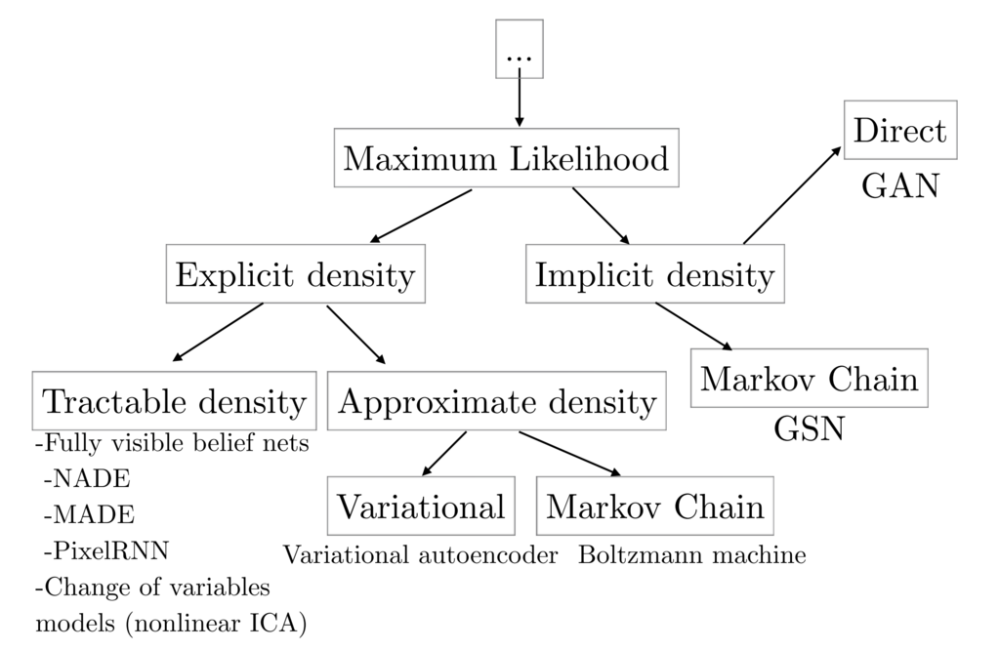

DCGAN: Generate the images from Deep Convolutinal GAN
******************************************************

.. currentmodule:: chainer

0. Introduction
================

In this tutorial, we generate images from **generative adversarial network (GAN)**.
It is a kind of generative model with deep neural network, and often applied to
the image generation. The GAN technich is also applied to 
`PaintsChainer <https://paintschainer.preferred.tech/index_en.html>`_,
a famous automatic coloring service.

In the tutorial, you will learn about the following things:

1. Basic Idea of Generative Model
2. The Difference among GAN and Other Generative Models
3. Details of GAN
4. Implementation of DCGAN in Chainer

1. Basic Idea of Generative Model
==================================

1.1 What is Model?
--------------------

In the field of science and engineering, we describe a system using mathematical
concepts and language. The description is called as **mathematical model**,
and the process of developing a mathematical model is **mathematical modeling**.
Especially, in the context of machine learning, we explain a target model by a
map :math:`f` from an input :math:`x` to an output :math:`y`.

.. math::
    f: x \mapsto y
    
Therefore, the purpose of model training is obtaining the map :math:`f` from training data.
In the case of unsupervised learning, we use datasets of inputs
:math:`\{s^{(n)}\}=\{d_1, d_2, \cdots, d_N\}` as the training data,
and create model :math:`f`.
In supervised learning, we use datasets of inputs and thier outputs
:math:`\{s^{(n)}\}=\{(d_1, c_1), \cdots, (d_N, c_N)\}`. As a simple example,
let's consider about a supervised learing problem such as classifying images as
dogs or cats. Then, the training datasets consist of input images
:math:`d_1, d_2, \cdots, d_N` and their labels
:math:`c_1={\rm cat}, c_2={\rm dog}, \cdots, c_N={\rm cat}`.

1.2 What is Generative Model?
-------------------------------

When we consider about the generarive model, it models the probability distribution
:math:`p: s \mapsto p(s)` which generates the training data :math:`s`. The most simple
generative model models the probability distribution :math:`p` with the map :math:`f`.
We assign each :math:`x` and :math:`y` of :math:`f: x \mapsto y` as following.

* :math:`x` : the training data :math:`s`
* :math:`y` : the likelihood of generating the training data :math:`s`

In the case, because we models the probability distribution :math:`p` explicitly,
we can calculate the likelihood :math:`p(s)`. So, we can maximize the likelihood.
There is an advantage that the training process is simple. However, there is a
disadvantage that we have to make a mechanism for sampling because we have only
the process for calculating the likelihood.

In the fitst place, we often just want to sample :math:`s \sim p(s)`
according to the distribution in practice. The likelihood :math:`p(s)` is used
only for model training. In the case, we sometimes do not model the probability distribution
:math:`p(s)` directly but other targets to facilitate sampling. 

The first case is to model the probability distributions :math:`p(z)` and :math:`p(s|z)`
by introducing the latent variable :math:`z`. The VAE, which is described later,
belongs to this category.
Second, we introduce the latent variable :math:`z` and model the sample generator
`s = G(z)` which fits the distribution :math:`p(s)`. The GAN belongs to this category.
These models can generate the training data :math:`s \sim p(s)` by generating
the latent variable :math:`z` based on random numbers. 

These generative models can be used for the following purposes:

* Assistance for creative activities (e.g. line drawing coloring)
* Providing interfaces to people (e.g. generating natural sentences)
* Reduction of data creation cost (e.g. use as a simulator)

.. note::
    When we talk about generative model, we sometimes explain it aginst discrimination
    model in classification problem [1]. However, when we talk about generating
    model in GAN, it is natural to define it as a model of probability distribution
    that generates training data.

2. The Difference among GAN and Other Generative Models
========================================================

As explained in GAN tutorial in NIPS 2016 [2], the generative models can be classified into the categories
as shown in the following figure:

   sited from [1]

Besides GAN, other famous generative models are Fully visible belief networks (FVBNs) and Variational autoencoder
(VAE).

2.1 Fully Visible Belief Networks (FVBNs)
------------------------------------------

FVBNs decomposes the probability distribution :math:`p({\bf s})` into one-dimensional probability distributions
using the Bayes' theorem as shown in the following equation:

.. math::
    p_{\mathrm{model}}({\bf s}) = \prod^{n}_{i=1}p_{\mathrm{model}} (s_i | s_1, \cdots, s_{i-1})

Since the dimensions from :math:`s_2, \cdots, s_n`, excluding the first dimension :math:`s_1`, are
generated based on the dimensions previously generated, FVBNs can be said to be an autoregressive model.
PixcelRNN and PixcelCNN, which are categorized as FVBNs, model one-dimensional distribution functions
with Recurrent Neural Networks(RNN) and Convolutional Neural Networks(CNN), respectively.
The advantage of FVBNs is that the model can learn with explicitly computable likelihood.
The disadvantage is that sampling cost can be expensive because each dimension can only be generated sequentially.

2.2 Variational Auto-Encoder (VAE)
-----------------------------------

The VAE models the probability distribution :math:`p({\bf s})` that generates the training data as follows:

.. math::
    p_{\mathrm {model}}({\bf s}) = \int p_{\mathrm {model}}({\bf s}|{\bf z}) p_{\mathrm {model}}({\bf z}) d{\bf z}

:math:`p_{\mathrm {model}}({\bf s})` is modeled by the two probability distributions
:math:`p_{\mathrm {model}}({\bf z})` and :math:`p_{\mathrm {model}}({\bf s} | {\bf z})`
using the latent variable :math:`\bf z`.

When training a model using the maximum likelihood estimation on :math:`\{{\bf s}^{(n)}\}`,
we should calculate :math:`p_{\mathrm {model}}({\bf s})` or :math:`p_{\mathrm {model}}({\bf z}|{\bf s})`
explicitly. However, because :math:`p_{\mathrm {model}}({\bf s})` includes integral operator as
shown in above equation, it is difficult to calculate :math:`p_{\mathrm {model}}({\bf s})` and
:math:`p_{\mathrm {model}}({\bf z}|{\bf s})`.

So, VAE approximates :math:`p_{\mathrm {model}}({\bf z}|{\bf s})` with
:math:`q_{\mathrm {model}}({\bf z}|{\bf s})`.
As a result, we can calculate the lower bound of the likelihood,
and train the model by maximizing the lower bound of the likelihood. The advantage of VAE is
that sampling is low cost, and you can estimate latent variables by
:math:`q_{\mathrm {model}}({\bf z}|{\bf s})`.
The disadvantage is that calculation of the probability distribution :math:`p_{\mathrm {model}}({\bf s})`
is difficult, and approximate values are used for training model.

3. Generarive Adversarial Networks (GAN)
=========================================

3.1 What is GAN?
-----------------

Unlike FVBNs and VAE, GAN does not explicitly models the probability distribution :math:`p({\bf s})`
that generates the training data. Instead, we model a generator :math:`G: {\bf z} \mapsto {\bf s}`.
The generator :math:`G` samples :math:`{\bf s} \sim p({\bf s})` from the latent variable :math:`\bf z`.
Apart from the generator :math:`G`, we create a discriminator :math:`D({\bf x})`
which identified the samples from the generator :math:`G` and the true samples from training data.
While training the discriminator :math:`D`, the generator :math:`G` is also trained so that
th generated samples can not be identified by the discriminator.
The advantages of GAN are low sampling cost and state-of-the-art in image generation.
The disadvantage is that we can not calculate the probability distribution
:math:`p_{\mathrm {model}}({\bf s})` because we do not model any probability distribution,
and we can not infer the latent variable :math:`\bf z` from a sample.

3.2 How GAN works?
-------------------

As explained above, GAN uses the two models, the generator and the discriminator. In other words,
we setup two neural networks for GAN.

When training the networks, we should match the distribution of the samples
:math:`{\bf s} \sim p({\bf s})` generated from the true distribution with the distribution of the samples
:math:`{\bf s} = G ({\bf z})` generated from the generator.

.. image:: ../../image/dcgan/gan-overview.png

The generator :math:`G` learns the target distribution on the idea of
**Nash equilibrium** [3] of game theory.
In detail, while training the discriminator :math:`D`,
the generator :math:`G` is also trained so that the discriminator :math:`D`
can not identify the generated samples.

As an intuitive example, the relationship between counterfeiters of
banknotes and police is frequently used. The counterfeiters try to make counterfeit notes
that are similar to real banknotes. The police try to distinguish real bank notes from counterfeit notes.
It is supposed that the ability of the police gradually rises, so that real banknotes and counterfeit
notes can be recognized well. Then, the counterfeiters will not be able to use counterfeit banknotes,
so they will build more similar counterfeit banknotes to real. As the police improve the skill further,
so that they can distinguish real and counterfeit notes... Eventually, the counterfeiter will
be able to produce as similar banknote as genuine.

The training process is explained by mathematical expressions as follows.
First, since the discriminator :math:`D({\bf s})` is a probability 
that the sample :math:`\bf s` is generated from the true distribution,
it can be expressed as follows:

.. math::
    D({\bf s}) = \frac{p({\bf s})}{p({\bf s}) + p_{\mathrm{model}}({\bf s})}

Then, when we match the distributions of
the samples :math:`{\bf s} \sim p({\bf s})` generated from true distribution
and the samples :math:`{\bf s} \sim p_{\mathrm{model}}({\bf s})`
generated from the generator :math:`G`,
it means that we should minimize the dissimilality between
the two distributions.
It is common to use **Jensen-Shannon Divergence** :math:`D_{\mathrm{JS}}`
to measure the dissimilality between the distributions[4].

The :math:`D_{\mathrm{JS}}` of :math:`p_{\mathrm{model}}({\bf s})` and
:math:`p({\bf s})` can be written as following by using :math:`D({\bf s})`:

.. math::
     2 D_{\mathrm{JS}} &=& D_{\mathrm{KL}}(p(x)||\bar{p}(x)) + D_{\mathrm{KL}}(p_{\mathrm{model}}(x)||\bar{p}(x)) \\
     &=& \mathbb{E}_{p(x)} \log \frac{2p(x)}{p(x) + p_{\mathrm{model}}(x)} + \mathbb{E}_{p_{\mathrm{model}}} \log \frac{2p_{\mathrm{model}}(x)}{p(x) + p_{\mathrm{model}}(x)} \\
     &=& \mathbb{E}_{p(x)} \log D(x) + \mathbb{E}_{p_{\mathrm{model}}} \log (1-D(x)) + \log 4

The :math:`D_{\mathrm{JS}}` will be maximized by the discriminator :math:`D` and minimized by
the generator :math:`G`, or :math:`p_{\mathrm{model}}`.
And the distribution :math:`p_{\mathrm model}({\bf s})`
generated by :math:`G({\bf x})` can match the true distribution :math:`p({\bf s})`.

.. math::
    \min_{G} \max_{D} \mathbb{E}_{p(x)} \log D(x) + \mathbb{E}_{p_{\mathrm{model}}} \log (1-D(x))

When training actually, the above min-max problem is solved by alternately updating the
discriminator :math:`D({\bf s})` and the generator :math:`G({\bf x})` [5].

.. figure:: ../../image/dcgan/update-gan.png
   :scale: 100%

   sited from [5]

3.3 What is DCGAN?
-------------------

In this section, we will introduce the model called DCGAN(Deep Convolutional GAN) proposed by Radford et al.[6].
As shown below, it is a model using CNN(Convolutional Neural Network) as its name suggests.

.. figure:: ../../image/dcgan/dcgan.png
   :scale: 100%

   sited from [6]

In addition, although GAN is known for its difficulty in learning, this paper introduces various techniques
for successful learning:

1. Convert max-pooling layers to convolution layers 
2. Convert fully connected layers to global average plling layers
3. Use batch normalization layers
4. Use leaky ReLu activation functions

4. Implementation of DCGAN in Chainer
==========================================

There is an example of DCGAN in the official repository of Chainer,
so we will explain how to implement DCGAN based on this:
`chainer/examples/dcgan <https://github.com/chainer/chainer/tree/master/examples/dcgan>`_

4.1 Define the generator model
-------------------------------

Next, let's define a network for the generator.

.. literalinclude:: ../../../examples/dcgan/net.py
   :language: python
   :pyobject: Generator
   :caption: train_dcgan.py

4.2 Define the discriminator model
-----------------------------------

In addtion, let's define a network for the discriminator.

.. literalinclude:: ../../../examples/dcgan/net.py
   :language: python
   :pyobject: Discriminator
   :caption: train_dcgan.py

4.3 Prepare dataset and iterator
---------------------------------

Let's retrieve the Penn Tree Bank (PTB) dataset by using Chainer's dataset utility
``get_ptb_words()`` method.

.. literalinclude:: ../../../examples/dcgan/train_dcgan.py
   :language: python
   :start-after: Load the CIFAR10
   :end-before: else
   :dedent: 8

.. literalinclude:: ../../../examples/dcgan/train_dcgan.py
   :language: python
   :start-after: Setup an iterator
   :end-before: Setup a trainer
   :caption: train_dcgan.py
   :dedent: 4

4.4 Prepare model and optimizer
--------------------------------

.. literalinclude:: ../../../examples/dcgan/train_dcgan.py
   :language: python
   :start-after: Set up a neural network to train
   :end-before: if
   :caption: train_dcgan.py
   :dedent: 4

.. literalinclude:: ../../../examples/dcgan/train_dcgan.py
   :language: python
   :start-after: Setup an optimizer
   :end-before: if
   :caption: train_dcgan.py
   :dedent: 4

4.5 Prepare updater
--------------------

.. literalinclude:: ../../../examples/dcgan/updater.py
   :language: python
   :pyobject: DCGANUpdater
   :caption: train_dcgan.py

.. literalinclude:: ../../../examples/dcgan/train_dcgan.py
   :language: python
   :start-after: Setup a updater
   :end-before: Setup a trainer
   :caption: train_dcgan.py
   :dedent: 4

4.6 Prepare trainer and run
----------------------------

.. literalinclude:: ../../../examples/dcgan/train_dcgan.py
   :language: python
   :start-after: Setup a trainer
   :end-before: snapshot_interval
   :caption: train_dcgan.py
   :dedent: 4

4.5 Start training
-------------------

.. code-block:: console

    $ pwd
    /root2chainer/chainer/examples/word2vec

5. Reference
=============
* [1] `Wikipedia: Generative model <https://en.wikipedia.org/wiki/Generative_model>`_
* [2] `NIPS 2016 Tutorial: Generative Adversarial Networks <http://arxiv.org/abs/1701.00160>`_
* [3] `Nash equilibrium <http://en.wikipedia.org/wiki/Nash_equilibrium>`_
* [4] `Jensen-Shannon Divergence <http://en.wikipedia.org/wiki/Jensen%E2%80%93Shannon_divergence>`_
* [5] `Generative Adversarial Networks <https://arxiv.org/abs/1406.2661>`_
* [6] `Unsupervised Representation Learning with Deep Convolutional Generative Adversarial Networks <https://arxiv.org/abs/1511.06434>`_
