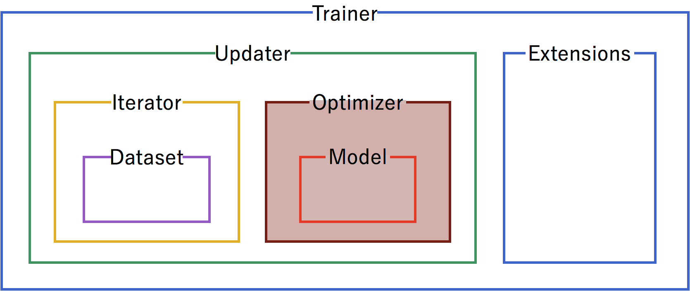
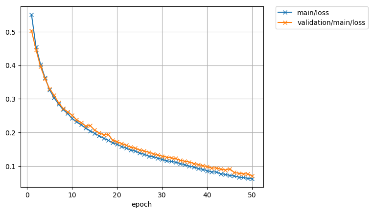

Chainer at a Glance
================

.. currentmodule:: chainer

Welcome to Chainer!

Chainer is a rapidly growing neural network platform. The strengths of Chainer are:

* 100% pure Python -- Chainer is developed from the entirely in Python, allowing for inspection and customization of all code in python and understandable python messages at run time
* Define by Run -- neural networks definitions are defined on-the-fly at run time, allowing for dynamic network changes
* Fully customizable -- since Chainer is pure python, all classes and methods can be adapted to allow for the latest cutting edge or specialized approaches
* Broad and deep support -- Chainer is actively used for most of the current approaches for neural nets (CNN, RNN, RL, etc.), aggressively adds new approaches as they're developed, and provides support for many kinds of hardware as well as parallelization for multiple GPUs

Mushrooms -- tasty or deathly?
~~~~~~~~~~~~

Let's take a look at a basic program of Chainer to see how it works. For a dataset, we'll work with `Kaggle's edible vs. poisonous mushroom dataset <https://www.kaggle.com/uciml/mushroom-classification>`_, which has over 8,000 examples of mushrooms, labelled by 22 categories including odor, cap color, habitat, etc.

How will Chainer learn which mushrooms are edible and which mushrooms will kill you? Let's see!

Full Code
---------------

Here's the whole picture of the code:

.. testcode::
    
   #!/usr/bin/env python
   
   from __future__ import print_function
   
   try:
       import matplotlib
   
       matplotlib.use('Agg')
   except ImportError:
       pass
   
   import chainer
   import chainer.functions as F
   import chainer.links as L
   from chainer import datasets
   from chainer import training
   from chainer.training import extensions
   
   import numpy as np
   import sklearn.preprocessing as sp
   
   data_array = np.genfromtxt(
       'mushrooms.csv', delimiter=',', dtype=str, skip_header=1)
   labelEncoder = sp.LabelEncoder()
   for col in range(data_array.shape[1]):
       data_array[:, col] = labelEncoder.fit_transform(data_array[:, col])
   
   X = data_array[:, 1:].astype(np.float32)
   Y = data_array[:, 0].astype(np.int32)[:, None]
   train, test = datasets.split_dataset_random(
       datasets.TupleDataset(X, Y), int(data_array.shape[0] * .7))
   
   train_iter = chainer.iterators.SerialIterator(train, 100)
   test_iter = chainer.iterators.SerialIterator(
       test, 100, repeat=False, shuffle=False)
   
   
   # Network definition
   class MLP(chainer.Chain):
       def __init__(self, n_units, n_out):
           super(MLP, self).__init__()
           with self.init_scope():
               # the input size to each layer inferred from the layer before
               self.l1 = L.Linear(n_units)  # n_in -> n_units
               self.l2 = L.Linear(n_units)  # n_units -> n_units
               self.l3 = L.Linear(n_out)  # n_units -> n_out
   
       def __call__(self, x):
           h1 = F.relu(self.l1(x))
           h2 = F.relu(self.l2(h1))
           return self.l3(h2)
   
   
   model = L.Classifier(
       MLP(44, 1), lossfun=F.sigmoid_cross_entropy, accfun=F.binary_accuracy)
   
   # Setup an optimizer
   optimizer = chainer.optimizers.SGD()
   optimizer.setup(model)
   
   gpu_id = -1  # Change to -1 to use CPU
   
   # Set up a trainer
   updater = training.StandardUpdater(train_iter, optimizer, device=gpu_id)
   trainer = training.Trainer(updater, (50, 'epoch'), out='result')
   
   # Evaluate the model with the test dataset for each epoch
   trainer.extend(extensions.Evaluator(test_iter, model, device=gpu_id))
   
   # Dump a computational graph from 'loss' variable at the first iteration
   # The "main" refers to the target link of the "main" optimizer.
   trainer.extend(extensions.dump_graph('main/loss'))
   
   trainer.extend(extensions.snapshot(), trigger=(20, 'epoch'))
   
   # Write a log of evaluation statistics for each epoch
   trainer.extend(extensions.LogReport())
   
   # Save two plot images to the result dir
   if extensions.PlotReport.available():
       trainer.extend(
           extensions.PlotReport(['main/loss', 'validation/main/loss'],
                                 'epoch', file_name='loss.png'))
       trainer.extend(
           extensions.PlotReport(
               ['main/accuracy', 'validation/main/accuracy'],
               'epoch', file_name='accuracy.png'))
   
   # Print selected entries of the log to stdout
   trainer.extend(extensions.PrintReport(
       ['epoch', 'main/loss', 'validation/main/loss',
        'main/accuracy', 'validation/main/accuracy', 'elapsed_time']))
   
   # Run the training
   trainer.run()
   
   x, t = test[np.random.randint(len(test))]
   predict = model.predictor(x[None]).data
   predict = predict[0][0] >= 0
   
   print('Predicted', 'Edible' if predict == 0 else 'Poisonous',
         'Actual', 'Edible' if t[0] == 0 else 'Poisonous')     
   
If you've worked with other neural net frameworks, some of that code may look familiar. Let's break down what it's doing.

Code Breakdown
--------------

Initialization
~~~~~~~~~~~~

Let's start our python program. Matplotlib is used for the graphs to show training progress.

.. code-block:: python

   #!/usr/bin/env python
   
   from __future__ import print_function
   
   try:
       import matplotlib
       matplotlib.use('Agg')
   except ImportError:
       pass

Typical imports for a Chainer program. :class:`~chainer.links` contain trainable parameters and :class:`~chainer.functions` do not.

.. code-block:: python

   import chainer
   import chainer.functions as F
   import chainer.links as L
   from chainer import training
   from chainer import datasets
   from chainer.training import extensions
   
   import numpy as np
   import sklearn.preprocessing as sp
   
Trainer Structure
~~~~~~~~~~~~~~~~~

A :class:`chainer.trainer` is used to set up our neural network and data for training. The components of the :class:`chainer.trainer` are generally hierarchical, and are organized as follows:

.. image:: ../../image/glance/trainer.png

Each of the components is fed information from the components within it. Setting up the trainer starts at the inner components, and moves outward, with the exception of :class:`~chainer.training.extensions`, which are added after the :class:`chainer.trainer` is defined.

Dataset
~~~~~~~
.. image:: ../../image/glance/trainer-dataset.png

Our first step is to format the :mod:`~chainer.datasets`. From the raw mushroom.csv, we format the data into a Chainer :class:`~chainer.datasets.TupleDataset`. Chainer requires a numpy array for the features in the ``X`` matrix and a flattened array if the label is one-dimensional.

.. code-block:: python

   data_array = np.genfromtxt(
       'mushrooms.csv', delimiter=',', dtype=str, skip_header=1)
   labelEncoder = sp.LabelEncoder()
   for col in range(data_array.shape[1]):
       data_array[:, col] = labelEncoder.fit_transform(data_array[:, col])
   
   X = data_array[:, 0].astype(np.float32)[:, None]
   Y = np.ndarray.flatten(data_array[:, 0].astype(np.int32))
   train, test = datasets.split_dataset_random(
       datasets.TupleDataset(X, Y), int(data_array.shape[0] * .7))
   
Iterator
~~~~~~~~
.. image:: ../../image/glance/trainer-iterator.png

Configure :class:`~chainer.iterators` to step through batches of the data for training and for testing validation. In this case, we'll use a batch size of 100, no repeating, and shuffling not required since we already shuffled the dataset on reading it in.

.. code-block:: python

   train_iter = chainer.iterators.SerialIterator(train, 100)
   test_iter = chainer.iterators.SerialIterator(
       test, 100, repeat=False, shuffle=False)

Model
~~~~~~~~~~
.. image:: ../../image/glance/trainer-model.png

Next, we need to define the neural network for inclusion in our model. For our mushrooms, we'll chain together two fully-connected, :class:`~chainer.links.Linear`, hidden layers between the input and output layers.

As an activation function, we'll use standard Rectified Linear Units (:meth:`~chainer.functions.relu`).

.. code-block:: python

   # Network definition
   class MLP(chainer.Chain):
   
       def __init__(self, n_units, n_out):
           super(MLP, self).__init__()
           with self.init_scope():
               # the input size to each layer inferred from the layer before
               self.l1 = L.Linear(n_units)  # n_in -> n_units
               self.l2 = L.Linear(n_units)  # n_units -> n_units
               self.l3 = L.Linear(n_out)  # n_units -> n_out
   
       def __call__(self, x):
           h1 = F.relu(self.l1(x))
           h2 = F.relu(self.l2(h1))
           return self.l3(h2)
   
Since mushrooms are either edible or poisonous (no information on psychedelic effects!) in the dataset, we'll use a Link :class:`~chainer.links.Classifier` for the output, with 44 units in the hidden layers and a single true/false category for classification.
   
.. code-block:: python

     model = L.Classifier(
         MLP(44, 1), lossfun=F.sigmoid_cross_entropy, accfun=F.binary_accuracy)

Optimizer
~~~~~~~~~~~~

Pick an :class:`~chainer.optimizer`, and set up the :class:`~chainer.model` to use it.

.. code-block:: python

   # Setup an optimizer
   optimizer = chainer.optimizers.SGD()
   optimizer.setup(model)
   
Updater
~~~~~~~~~
.. image:: ../../image/glance/trainer-updater.png

Now that we have the training :class:`~chainer.iterator` and :class:`~chainer.optimizer` set up, we link them both together into the :class:`~chainer.updater`. The :class:`~chainer.updater` uses the minibatches from the :class:`~chainer.iterator`, and then does the forward and backward processing of the model, and updates the parameters of the model according to the :class:`~chainer.optimizer`.

If using a CPU instead of the GPU, set ``gpu_id`` to ``-1``. Otherwise, use the ID of the GPU, usually ``0``.

.. code-block:: python

   gpu_id = 0  # Change to -1 to use CPU
   updater = training.StandardUpdater(train_iter, optimizer, device=gpu_id)
   
Set up the :class:`~chainer.updater` to be called after the training batches and set the number of batches per epoch to 100. The learning rate per epoch will be output to the directory `result`.

.. code-block:: python

   # Set up a trainer
   trainer = training.Trainer(updater, (50, 'epoch'), out='result')
   
Extensions
~~~~~~~~~
.. image:: ../../image/glance/trainer-extensions.png

Use the testing :class:`~chainer.iterator` defined above for an :class:`~chainer.training.extensions.Evaluator` extension to the trainer to provide test scores.

.. code-block:: python

   trainer.extend(extensions.Evaluator(test_iter, model, device=gpu_id))
   
Save a computational graph from 'loss' variable at the first iteration. The "main" refers to the target link of the "main" :class:`~chainer.optimizer`. The graph is saved in the `Graphviz <http://www.graphviz.org/>_`s dot format. The output location (directory) to save the graph is set by the :attr:`~chainer.training.Trainer.out argument of :class:`~chainer.training.Trainer`.

.. code-block:: python

   trainer.extend(extensions.dump_graph('main/loss'))
   
Take a snapshot of the :class:`~chainer.trainer` object every 20 epochs.

.. code-block:: python

   trainer.extend(extensions.snapshot(), trigger=(20, 'epoch'))
   
Write a log of evaluation statistics for each epoch.

.. code-block:: python

   trainer.extend(extensions.LogReport())
   
Save two plot images to the result directory.

.. code-block:: python

   if extensions.PlotReport.available():
       trainer.extend(
   	extensions.PlotReport(['main/loss', 'validation/main/loss'],
   			      'epoch', file_name='loss.png'))
       trainer.extend(
   	extensions.PlotReport(
   	    ['main/accuracy', 'validation/main/accuracy'],
   	    'epoch', file_name='accuracy.png'))
   
Print selected entries of the log to standard output.

.. code-block:: python

   trainer.extend(extensions.PrintReport(
       ['epoch', 'main/loss', 'validation/main/loss',
        'main/accuracy', 'validation/main/accuracy', 'elapsed_time']))
   
Run the training.

.. code-block:: python

   trainer.run()
   
Inference
~~~~~~~~~

Once the training is complete, only the model is necessary to make predictions. Let's check that a random line from the test data set and see if the inference is correct:

.. code-block:: python

   x, t = test[np.random.randint(len(test))]
   predict = model.predictor(x[None]).data
   predict = predict[0][0] >= 0
   
   print('Predicted', 'Edible' if predict == 0 else 'Poisonous',
         'Actual', 'Edible' if t[0] == 0 else 'Poisonous')     
   
Output
-------

Output for this instance will look like:

::

   epoch       main/loss   validation/main/loss  main/accuracy  validation/main/accuracy  elapsed_time
   1           0.550724    0.502818              0.733509       0.752821                  0.215426      
   2           0.454206    0.446234              0.805439       0.786926                  0.902108      
   3           0.402783    0.395893              0.838421       0.835979                  1.50414       
   4           0.362979    0.359988              0.862807       0.852632                  2.24171       
   5           0.32713     0.329881              0.88           0.874232                  2.83247       
   6           0.303469    0.31104               0.892456       0.887284                  3.45173       
   7           0.284755    0.288553              0.901754       0.903284                  3.9877        
   8           0.26801     0.272033              0.9125         0.907137                  4.54794       
   9           0.25669     0.261355              0.920175       0.917937                  5.21672       
   10          0.241789    0.251821              0.927193       0.917937                  5.79541       
   11          0.232291    0.238022              0.93           0.925389                  6.3055        
   12          0.222805    0.22895               0.934035       0.923389                  6.87083       
   13          0.21276     0.219291              0.93614        0.928189                  7.54113       
   14          0.204822    0.220736              0.938596       0.922589                  8.12495       
   15          0.197671    0.207017              0.938393       0.936042                  8.69219       
   16          0.190285    0.199129              0.941053       0.934842                  9.24302       
   17          0.182827    0.193303              0.944386       0.942695                  9.80991       
   18          0.176776    0.194284              0.94614        0.934042                  10.3603       
   19          0.16964     0.177684              0.945789       0.945242                  10.8531       
   20          0.164831    0.171988              0.949825       0.947347                  11.3876       
   21          0.158394    0.167459              0.952982       0.949747                  11.9866       
   22          0.153353    0.161774              0.956964       0.949347                  12.6433       
   23          0.148209    0.156644              0.957368       0.951747                  13.3825       
   24          0.144814    0.15322               0.957018       0.955495                  13.962        
   25          0.138782    0.148277              0.958947       0.954147                  14.6          
   26          0.135333    0.145225              0.961228       0.956695                  15.2284       
   27          0.129593    0.141141              0.964561       0.958295                  15.7413       
   28          0.128265    0.136866              0.962632       0.960547                  16.2711       
   29          0.123848    0.133444              0.966071       0.961347                  16.7772       
   30          0.119687    0.129579              0.967193       0.964547                  17.3311       
   31          0.115857    0.126606              0.968596       0.966547                  17.8252       
   32          0.113911    0.124272              0.968772       0.962547                  18.3121       
   33          0.111502    0.122548              0.968596       0.965095                  18.8973       
   34          0.107427    0.116724              0.970526       0.969747                  19.4723       
   35          0.104536    0.114517              0.970877       0.969095                  20.0804       
   36          0.099408    0.112128              0.971786       0.970547                  20.6509       
   37          0.0972982   0.107618              0.973158       0.970947                  21.2467       
   38          0.0927064   0.104918              0.973158       0.969347                  21.7978       
   39          0.0904702   0.101141              0.973333       0.969747                  22.3328       
   40          0.0860733   0.0984015             0.975263       0.971747                  22.8447       
   41          0.0829282   0.0942095             0.977544       0.974947                  23.5113       
   42          0.082219    0.0947418             0.975965       0.969347                  24.0427       
   43          0.0773362   0.0906804             0.977857       0.977747                  24.5252       
   44          0.0751769   0.0886449             0.977895       0.972147                  25.1722       
   45          0.072056    0.0916797             0.978246       0.977495                  26.0778       
   46          0.0708111   0.0811359             0.98           0.979347                  26.6648       
   47          0.0671919   0.0783265             0.982456       0.978947                  27.2929       
   48          0.0658817   0.0772342             0.981754       0.977747                  27.8119       
   49          0.0634615   0.0762576             0.983333       0.974947                  28.3876       
   50          0.0622394   0.0710278             0.982321       0.981747                  28.9067       
   Predicted Edible Actual Edible
      
Our prediction was correct. Success!

The loss function:

And the accuracy

.. image:: ../../image/glance/accuracy.png

Next Steps

To continue learning about Chainer, we recommend you look at specific examples of specialized neural nets:

<links to other neural nets here>

Or learn how to customize existing Chainer code to implement your own approach to neural nets:

<links to customization tutorials here>
