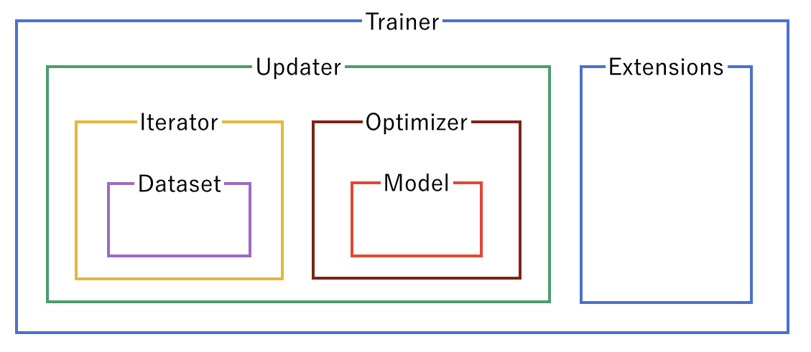
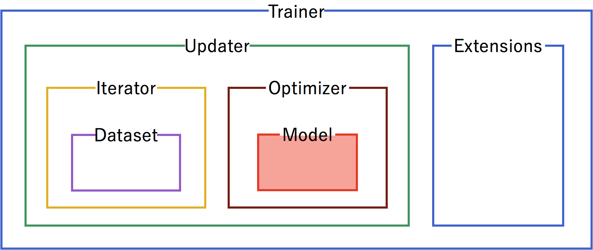
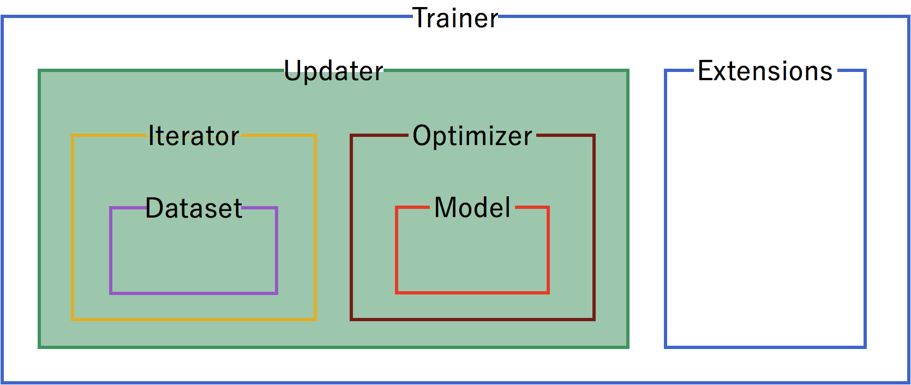
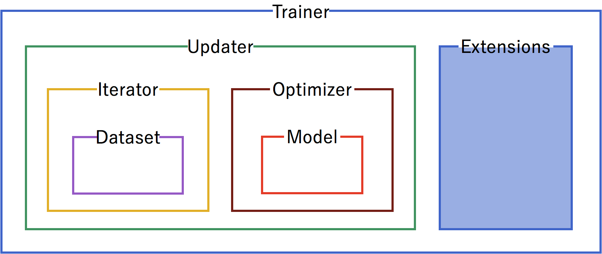

Chainer at a Glance
-----------------------

.. currentmodule:: chainer

Welcome to Chainer!

Chainer is a rapidly growing neural network platform. The strengths of Chainer are:

* 100% pure Python -- Chainer is developed from the beginning in Python, source code and errors follow the Pythonic way
* Define by Run -- neural networks definitions are defined on-the-fly at run time, allowing for easier customisation
* Broad and deep support -- Chainer is actively used for most of the current approaches for neural nets (CNN, RNN, RL, etc.), aggressively adds new approaches as they're developed, and provides support for many kinds of hardware as well as parallelization for multiple GPUs

Mushrooms -- tasty or deathly?
~~~~~~~~~~~~

Let's take a look at a basic program of Chainer to see how it works. For a dataset, we'll work with the edible vs. poisonous mushroom dataset (https://www.kaggle.com/uciml/mushroom-classification), which has over 8,000 examples of mushrooms, labelled by 22 categories including odor, cap color, habitat, etc.

How will Chainer learn which mushrooms are edible and which mushrooms will kill you? Let's see!

Full Code
~~~~~~~~~~~~

Here's the whole picture of the code:

.. testcode::
    
    #!/usr/bin/env python
    
    from __future__ import print_function
    
    try:
        import matplotlib
        matplotlib.use('Agg')
    except ImportError:
        pass
    
    import chainer
    import chainer.functions as F
    import chainer.links as L
    from chainer import training
    from chainer import datasets
    from chainer.training import extensions
    
    import numpy as np
    import sklearn.preprocessing as sp
    
    data_array = np.genfromtxt(
        'mushrooms.csv', delimiter=',', dtype=str, skip_header=1)
    labelEncoder = sp.LabelEncoder()
    for col in range(data_array.shape[1]):
        data_array[:, col] = labelEncoder.fit_transform(data_array[:, col])
    
    X = data_array[:, 0].astype(np.float32)[:, None]
    Y = np.ndarray.flatten(data_array[:, 0].astype(np.int32))
    train, test = datasets.split_dataset_random(
        datasets.TupleDataset(X, Y), int(data_array.shape[0] * .7))
    
    gpu_id = 0  # Change to -1 to use CPU
    
    # Network definition
    class MLP(chainer.Chain):
    
        def __init__(self, n_units, n_out):
    	    super(MLP, self).__init__()
            with self.init_scope():
                # the size of the inputs to each layer inferred from the layer before
                self.l1 = L.Linear(n_units)  # n_in -> n_units
                self.l2 = L.Linear(n_units)  # n_units -> n_units
                self.l3 = L.Linear(n_out)  # n_units -> n_out
    
        def __call__(self, x):
    	    h1 = F.relu(self.l1(x))
    	    h2 = F.relu(self.l2(h1))
    	    return self.l3(h2)
    
    
    model = L.Classifier(
        MLP(44, 1), lossfun=F.sigmoid_cross_entropy, accfun=F.binary_accuracy)

    if gpu_id >= 0:
        # Make a specified GPU current
        chainer.cuda.get_device_from_id(gpu_id).use()
        model.to_gpu()  # Copy the model to the GPU
    
    # Setup an optimizer
    optimizer = chainer.optimizers.SGD()
    optimizer.setup(model)
    
    train_iter = chainer.iterators.SerialIterator(train, 44)
    test_iter = chainer.iterators.SerialIterator(test, 44,
        repeat=False, shuffle=False)
    
    # Set up a trainer
    updater = training.StandardUpdater(train_iter, optimizer, device=gpu_id)
    trainer = training.Trainer(updater, (30, 'epoch'), out='result')
    
    # Evaluate the model with the test dataset for each epoch
    trainer.extend(extensions.Evaluator(test_iter, model, device=gpu_id))
    
    # Dump a computational graph from 'loss' variable at the first iteration
    # The "main" refers to the target link of the "main" optimizer.
    trainer.extend(extensions.dump_graph('main/loss'))
    
    trainer.extend(extensions.snapshot(), trigger=(20, 'epoch'))
    
    # Write a log of evaluation statistics for each epoch
    trainer.extend(extensions.LogReport())
    
    # Save two plot images to the result dir
    if extensions.PlotReport.available():
        trainer.extend(
    	extensions.PlotReport(['main/loss', 'validation/main/loss'],
    			      'epoch', file_name='loss.png'))
        trainer.extend(
    	extensions.PlotReport(
    	    ['main/accuracy', 'validation/main/accuracy'],
    	    'epoch', file_name='accuracy.png'))
    
    # Print selected entries of the log to stdout
    trainer.extend(extensions.PrintReport(
        ['epoch', 'main/loss', 'validation/main/loss',
         'main/accuracy', 'validation/main/accuracy', 'elapsed_time']))
    
    # Print a progress bar to stdout
    trainer.extend(extensions.ProgressBar(update_interval=570))
    
    # Run the training
    trainer.run()
    
If you've worked with other neural net frameworks, some of the that code may look familiar. Let's break down what it's doing.

Code Initialization
~~~~~~~~~~~~

Let's start our python program. Matplotlib is used for the graphs to show training progress.

.. code-block:: python

   #!/usr/bin/env python
   
   from __future__ import print_function
   
   try:
       import matplotlib
       matplotlib.use('Agg')
   except ImportError:
       pass

Typical imports for a Chainer program. Links contain trainable parameters and functions do not.

.. code-block:: python

   import chainer
   import chainer.functions as F
   import chainer.links as L
   from chainer import training
   from chainer import datasets
   from chainer.training import extensions
   
   import numpy as np
   import sklearn.preprocessing as sp
   
Trainer Structure
~~~~~~~~~~~~~~~~~

A ``chainer.trainer`` is used to set up our neural network and data for training. The components of the trainer are generally hierarchical, and are organized as follows:

Each of the components is fed information from the components within it. Setting up the trainer starts at the inner components, and moves outward, with the exception of extensions, which are added after the trainer is defined.

Dataset
~~~~~~~
.. image:: ../../image/glance/trainer-dataset.png

Our first step is to format the data. From the raw mushroom.csv, we format the data into a Chainer dataset. Chainer requires a numpy array for the features in the ``X`` matrix and a flattened array if the label is one-dimensional.

.. code-block:: python

   data_array = np.genfromtxt(
       'mushrooms.csv', delimiter=',', dtype=str, skip_header=1)
   labelEncoder = sp.LabelEncoder()
   for col in range(data_array.shape[1]):
       data_array[:, col] = labelEncoder.fit_transform(data_array[:, col])
   
   X = data_array[:, 0].astype(np.float32)[:, None]
   Y = np.ndarray.flatten(data_array[:, 0].astype(np.int32))
   train, test = datasets.split_dataset_random(
       datasets.TupleDataset(X, Y), 623)
   
Configure iterators to step through batches of the data for training and for testing validation. In this case, we'll use a batch size of 100, no repeating, and shuffling not required since we already shuffled the dataset on reading it in.

Iterator
~~~~~~~~
.. image:: ../../image/glance/trainer-iterator.png

.. code-block:: python

   train_iter = chainer.iterators.SerialIterator(train, 100)
   test_iter = chainer.iterators.SerialIterator(test, 100,
       repeat=False, shuffle=False)

Model
~~~~~~~~~~

Next, we need to define the neural network for inclusion in our model. For our mushrooms, we'll use two fully-connected, hidden layers between the input and output layers.

.. code-block:: python

   # Network definition
   class MLP(chainer.Chain):
   
       def __init__(self, n_units, n_out):
           super(MLP, self).__init__()
           with self.init_scope():
               # the size of the inputs to each layer inferred from the layer before
               self.l1 = L.Linear(n_units)  # n_in -> n_units
               self.l2 = L.Linear(n_units)  # n_units -> n_units
               self.l3 = L.Linear(n_out)  # n_units -> n_out
   
As an activation function, we'll use standard Rectified Linear Units (relu).

.. code-block:: python

       def __call__(self, x):
           h1 = F.relu(self.l1(x))
           h2 = F.relu(self.l2(h1))
           return self.l3(h2)
   
Since mushrooms are either edible or poisonous (no information on psychedelic effects!) in the dataset, we'll use a classifier Link for the output, with 44 units in the hidden layers and a single true/false category for classification.
   
.. code-block:: python

     model = L.Classifier(
         MLP(44, 1), lossfun=F.sigmoid_cross_entropy, accfun=F.binary_accuracy)

If using a CPU instead of the GPU, set ``gpu_id`` to ``-1``. Otherwise, use the ID of the GPU, usually ``0``.

.. code-block:: python

   gpu_id = 0  # Change to -1 to use CPU
   
   if gpu_id >= 0:
       # Make a specified GPU current
       chainer.cuda.get_device_from_id(gpu_id).use()
       model.to_gpu()  # Copy the model to the GPU
   
Optimizer
~~~~~~~~~~~~
.. image:: ../../image/glance/trainer-optimizer.png

Pick an optimizer, and set up the model to use it.

.. code-block:: python

   # Setup an optimizer
   optimizer = chainer.optimizers.SGD()
   optimizer.setup(model)
   

Now that we have the training iterator and optimizer set up, we link them both together into the updater. The updater uses the minibatches from the iterator, and then does the forward and backward processing of the model, and updates the parameters of the model according to the optimizer.

.. code-block:: python

   updater = training.StandardUpdater(train_iter, optimizer, device=gpu_id)
   
Set up the updater to be called after the training batches and set the number of batches per epoch to 100. The learning rate per epoch will be output to the directory `result`.

.. code-block:: python

   # Set up a trainer
   trainer = training.Trainer(updater, (100, 'epoch'), out='result')
   

Use the testing iterator defined above for an Evaluator extension to the trainer to provide test scores.

.. code-block:: python

   trainer.extend(extensions.Evaluator(test_iter, model, device=gpu_id))
   
Dump a computational graph from 'loss' variable at the first iteration. The "main" refers to the target link of the "main" optimizer.

.. code-block:: python

   trainer.extend(extensions.dump_graph('main/loss'))
   
Take a snapshot of the training every 20 epochs.

.. code-block:: python

   trainer.extend(extensions.snapshot(), trigger=(20, 'epoch'))
   
Write a log of evaluation statistics for each epoch.

.. code-block:: python

   trainer.extend(extensions.LogReport())
   
Save two plot images to the result directory.

.. code-block:: python

   if extensions.PlotReport.available():
       trainer.extend(
   	extensions.PlotReport(['main/loss', 'validation/main/loss'],
   			      'epoch', file_name='loss.png'))
       trainer.extend(
   	extensions.PlotReport(
   	    ['main/accuracy', 'validation/main/accuracy'],
   	    'epoch', file_name='accuracy.png'))
   
Print selected entries of the log to standard output.

.. code-block:: python

   trainer.extend(extensions.PrintReport(
       ['epoch', 'main/loss', 'validation/main/loss',
        'main/accuracy', 'validation/main/accuracy', 'elapsed_time']))
   
Print a progress bar to standard output.

.. code-block:: python

   trainer.extend(extensions.ProgressBar())
   
Run the training.

.. code-block:: python

   trainer.run()
   
That's it for the basic program.

Output
~~~~~~~~~~~~

Output for this instance will look like:

::

    epoch       main/loss   validation/main/loss  main/accuracy  validation/main/accuracy  elapsed_time
    1           0.559586    0.345394              0.728421       0.874147                  0.219806      
    2           0.284338    0.225777              0.889649       0.9148                    0.883616      
    3           0.198175    0.172281              0.925439       0.9424                    1.5727        
    4           0.149827    0.135195              0.945789       0.9516                    2.32576       
    5           0.11638     0.107237              0.960526       0.9648                    3.18188       
    6           0.0901659   0.0857776             0.971404       0.9716                    3.85539       
    7           0.0693224   0.0671695             0.978772       0.98                      4.56471       
    8           0.0524943   0.0527184             0.985893       0.9816                    5.30566       
    9           0.0404199   0.0417276             0.989825       0.9868                    5.90703       
    10          0.0320204   0.0322432             0.99193        0.9892                    6.57901       
         total [################..................................] 33.42%
    this epoch [#.................................................]  2.46%
           570 iter, 10 epoch / 30 epochs
           inf iters/sec. Estimated time to finish: 0:00:00.
    11          0.0246184   0.0265795             0.995263       0.9924                    7.30374       
    12          0.020102    0.0207354             0.995965       0.9944                    7.83883       
    13          0.0164383   0.0199368             0.997368       0.9972                    8.39198       
    14          0.0135698   0.0173004             0.997544       0.996                     8.94759       
    15          0.0107982   0.0116371             0.998214       0.998                     9.55126       
    16          0.00930458  0.0110862             0.998947       0.998                     10.2036       
    17          0.00746534  0.0111632             0.999649       0.9968                    10.8803       
    18          0.00685934  0.00874451            0.999474       0.9984                    11.4715       
    19          0.00658732  0.0071556             0.999123       0.9988                    12.0214       
    20          0.00482299  0.00585984            0.999825       0.9996                    12.5992       
         total [#################################.................] 66.83%
    this epoch [##................................................]  4.92%
          1140 iter, 20 epoch / 30 epochs
        95.654 iters/sec. Estimated time to finish: 0:00:05.915068.
    21          0.00433979  0.00498487            0.999825       1                         13.2685       
    22          0.00392953  0.00504426            0.999821       0.9992                    13.8358       
    23          0.00331257  0.00428024            0.999825       0.9996                    14.4833       
    24          0.00316109  0.00388227            0.999825       0.9996                    15.1739       
    25          0.00277103  0.00483679            1              0.9988                    15.8676       
    26          0.00239999  0.00317067            1              0.9996                    16.5415       
    27          0.00218161  0.00290506            1              0.9996                    17.1783       
    28          0.0020123   0.00299441            1              0.9996                    17.771        
    29          0.00175197  0.00279005            1              0.9996                    18.3446       
    30          0.00156215  0.00248266            1              0.9996                    18.9357       
    
The loss function:

.. image:: ../../image/glance/loss.png

And the accuracy

.. image:: ../../image/glance/accuracy.png

Next Steps

To continue learning about Chainer, we recommend you look at specific examples of specialized neural nets:

<links to other neural nets here>

Or learn how to customize existing Chainer code to implement your own approach to neural nets:

<links to customization tutorials here>
