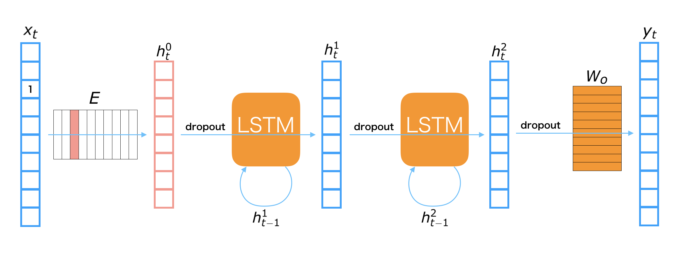

Write an RNN Language Model
****************************

.. currentmodule:: chainer

0. Introduction
================

The **language model** is modeling the probability of generating natural language
sentences or documents. You can use the language model to estimate how natural a
sentence or a document is. Also, with the language model, you can generate new
sentences or documents.

Let's start with modeling the probability of generating sentences. We represent
a sentence as :math:`{\bf X} = ({\bf x}_0, {\bf x}_1, ..., {\bf x}_T)`, in which
:math:`{\bf x}_t` is a one-hot vector. Generally, :math:`{\bf x}_0` is the one-hot
vector of **BOS** (beginning of sentence), and :math:`{\bf x}_T` is that of
**EOS** (end of sentence).

A language model models the probability of a word occurance under the condition of
its previous words in a sentence. Let :math:`{\bf X}_{[i, j]}` be
:math:`({\bf x}_i, {\bf x}_{i+1}, ..., {\bf x}_j)`, the occurrence probability
of sentence :math:`\bf X` can be represented as follows:

.. math:: P({\bf X}) = P({\bf x}_0) \prod_{t=1}^T P({\bf x}_t|{\bf X}_{[0, t-1]})

So, the language model :math:`P({\bf X})` can be decomposed into word probablities
conditioned with its previous words. In this tutorial, we model
:math:`P({\bf x}_t|{\bf X}_{[0, t-1]})` with a recurrent neural network to obtain
a language model :math:`P({\bf X})`.

1. Basic Idea of Recurrent Neural Net Language Model
=====================================================

1.1 Recurrent Neural Net Language Model
---------------------------------------

**Recurrent Neurral Net Language Model** (RNNLM) is a type of neural net
language models which contains the RNNs in the network. Since an RNN can deal with
the variable length inputs, it is suitable for modeling the sequential data such
as sentences in natural language. 

We show one layer of an RNNLM with these parameters.

=======================  =============================================
Symbol                   Definition 
=======================  =============================================
:math:`{\bf x}_t`        the one-hot vector of :math:`t`-th word 
:math:`{\bf y}_t`        the :math:`t`-th output
:math:`{\bf h}_t^{(i)}`  the :math:`t`-th hidden layer of :math:`i`-th layer 
:math:`{\bf p}_t`        the next word's probability of :math:`t`-th word 
:math:`{\bf E}`          Embedding matrix
:math:`{\bf W}_h`        Hidden layer matrix
:math:`{\bf W}_o`        Output layer matrix
=======================  =============================================

.. image:: ../../image/ptb/rnnlm.png

The process to get a next word prediction from :math:`i`-th input word :math:`{\bf x}_t`
^^^^^^^^^^^^^^^^^^^^^^^^^^^^^^^^^^^^^^^^^^^^^^^^^^^^^^^^^^^^^^^^^^^^^^^^^^^^^^^^^^^^^^^^^

#. Get the embedding vector: :math:`{\bf h}_t^{(0)} = {\bf E} {\bf x}_t`

#. Calculate the hidden layer: :math:`{\bf h}_t^{(1)} = {\rm tanh} \left( {\bf W}_h \left[ \begin{array}{cc} {\bf h}_t^{(0)} \\ {\bf h}_{t-1}^{(1)} \end{array} \right] \right)`

#. Calculate the output layer: :math:`{\bf y}_t = {\bf W}_o {\bf h}_t^{(1)}`

#. Transform to probability: :math:`{\bf p}_t = {\rm softmax}({\bf y}_t)`

- Note that :math:`\rm tanh` in the above equation is applied to the input
  vector in element-wise manner.
- Note that :math:`\left[ \begin{array}{cc} {\bf a} \\ {\bf b} \end{array} \right]`
  denotes a concatenated vector of :math:`{\bf a}` and :math:`{\bf b}`.
- Note that :math:`{\rm softmax}` in the above equation converts an arbitrary
  real vector to a probability vector which the summation over all elements is :math:`1`.

1.2 Perplexity (Evaluation of the language model)
--------------------------------------------------

**Perplexity** is the common evaluation metric for a language model.
Generally, it measures how well the proposed probability
model :math:`P_{\rm model}({\bf X})` represents the target data
:math:`P^*({\bf X})`.
Let a validation dataset be :math:`D = \{{\bf X}^{(n)}\}_{n=1}^{|D|}`,
which is a set of sentences, where the :math:`n`-th sentence length is
:math:`T^{(n)}`, and the vocabulary size of this dataset is :math:`|\mathcal{V}|`,
the perplexity is represented as follows:

.. math::
    b^z \ \ s.t. \ \ z = - \frac{1}{|\mathcal{V}|} \sum_{n=1}^{|D|} \sum_{t=1}^{T^{(n)}} \log_b P_{\rm model}({\bf x}_t^{(n)}, {\bf X}_{[a, t-1]}^{(n)})

We usually use :math:`b = 2` or :math:`b = e`. The perplexity shows how much
varied the predicted distribution for the next word is. When a language model well
represents the dataset, it should show a high probability only for the correct next
word, so that the entropy should be high. In the above equation, the sign is
reversed, so that smaller perplexity means better model.

During training, we minimize the below cross entropy:

.. math::
    \mathcal{H}(\hat{P}, P_{\rm model}) = - \hat{P}({\bf X}) \log P_{\rm model}({\bf X})

where :math:`\hat P` is the empirical distribution of a sequence in the training dataset.

2. Implementation of Recurrent Neural Net Language Model
=========================================================

* There is an example related to the RNN language model on the GitHub repository,
  so we will explain based on that.

    * `chainer/examples/ptb <https://github.com/chainer/chainer/tree/master/examples/ptb>`_

2.1 Overview of the Example
----------------------------

* In this example, we use the recurrent neural model above.

    * :math:`x_t` : the one-hot vector of :math:`t`-th input.
    * :math:`y_t` : the :math:`t`-th output.
    * :math:`h_t^i` : the :math:`t`-th hidden layer of `i`-th layer.
    * :math:`E` : Embedding matrix
    * :math:`W_o` : Output layer matrix

* We use the **LSTM** (long short-term memory) for the connection of hidden layers.
  The LSTM is the one of major recurrent neural net unit. It is desined for
  remembering the long-term memory, which means the the relation of the separated
  words, such that the word at beginning of sentence and that at end. 
* We also use the **dropout** before the LSTM and linear transformation. Dropout is
  the one of the refularization techniques for reducing overfitting on training
  data.

2.2 Implementation Method
--------------------------

Import Package
^^^^^^^^^^^^^^^

.. literalinclude:: ../../../examples/ptb/train_ptb.py
   :language: python
   :lines: 14-18
   :caption: train_ptb.py

* Basically, if you use chainer, you import in this way.
* Importing functions as ``F`` and links as ``L`` makes it easy to use.

Define Network Structure
^^^^^^^^^^^^^^^^^^^^^^^^^

.. literalinclude:: ../../../examples/ptb/train_ptb.py
   :language: python
   :pyobject: RNNForLM
   :caption: train_ptb.py

* Next, we define the network structure of the RNN language model.
* When we call the constructor ``__init__``, we pass the vocavulary size
  ``n_vocab`` and the size of the hidden vectors ``n_units``.

    * As the connection of layers, :class:`~chainer.links.LSTM`,
      :class:`~chainer.links.Linear`, and :class:`~chainer.functions.dropout` are
      used.
    * The :class:`~chainer.Parameter` s are initialized in ``self.init_scope()``.

        * It is recommended to initialize :class:`~chainer.Parameter` here.
        * Since we set :class:`~chainer.Parameter` as the attribute of Link,
          there are effects such as making IDE easier to follow code.
        * For details, see :ref:`upgrade-new-param-register`.

    * You can access all the parameters by ``self.params()`` and initialze by
      ``np.random.uniform(-0.1, 0.1, param.data.shape)``.

* The function call ``__call__`` takes the input word's ID ``x``. In this function,
  the nerwork structure of RNN language model is defined.

    * The input word' ID ``x`` is converted to the embedding vector  ``h0``
      by ``self.embed(x)``.
    * After tha embedding vector ``h0`` passes through the network, the output ``y``
      is returned.

Define Iterator for Data
^^^^^^^^^^^^^^^^^^^^^^^^^

.. literalinclude:: ../../../examples/ptb/train_ptb.py
   :language: python
   :pyobject: ParallelSequentialIterator
   :caption: train_ptb.py

Define Updater
^^^^^^^^^^^^^^^

.. literalinclude:: ../../../examples/ptb/train_ptb.py
   :language: python
   :pyobject: BPTTUpdater
   :caption: train_ptb.py

Define Evaluation Function (Perplexity)
^^^^^^^^^^^^^^^^^^^^^^^^^^^^^^^^^^^^^^^^

.. literalinclude:: ../../../examples/ptb/train_ptb.py
   :language: python
   :pyobject: compute_perplexity
   :caption: train_ptb.py

Main Function
^^^^^^^^^^^^^^

.. literalinclude:: ../../../examples/ptb/train_ptb.py
   :language: python
   :start-after: parser.parse_args
   :end-before: n_vocab
   :caption: train_ptb.py

* We download the Penn Treebank dataset by :class:`~chainer.datasets.get_ptb_words`.
  Each data contains the list of Document IDs
  
    * ``train`` is the training data.
    * ``val`` is the validation data. 
    * ``test`` is the test data. 

.. literalinclude:: ../../../examples/ptb/train_ptb.py
   :language: python
   :start-after: test[:100]
   :end-before: Prepare an RNNLM model
   :caption: train_ptb.py

* From the datasets ``train``, ``val`` and ``test``, we create the iterators for
  the datasets.
  
.. literalinclude:: ../../../examples/ptb/train_ptb.py
   :language: python
   :start-after: Prepare an RNNLM model
   :end-before: args.gpu
   :caption: train_ptb.py

* We create the recurrent neural net ``rnn`` and the classification model ``model``
  by :class:`~chainer.links.Classifier`.
* :class:`~chainer.links.Classifier` computes the loss and accuracy based on a given
  input/label pair. To learn the RNN language model, we only need the loss 
  (perplexity). So, we turn off computing the accuracy. In this setting, the loss is
  calculated by :class:`~chainer.functions.softmax_cross_entropy`.
  
.. literalinclude:: ../../../examples/ptb/train_ptb.py
   :language: python
   :start-after: Set up an optimizer
   :end-before: Set up a trainer
   :caption: train_ptb.py

* We setup the optimizer by :class:`~chainer.optimizers.SGD`.

.. literalinclude:: ../../../examples/ptb/train_ptb.py
   :language: python
   :start-after: Set up a trainer
   :end-before: Evaluate the final model
   :caption: train_ptb.py

* We setup and run the trainer.

.. literalinclude:: ../../../examples/ptb/train_ptb.py
   :language: python
   :start-after: Evaluate the final model
   :end-before: Serialize the final model
   :caption: train_ptb.py

* We evaluate the final model.

2.3 Run Example
----------------

Training the model
^^^^^^^^^^^^^^^^^^^

.. code-block:: console

    $ pwd
    /root2chainer/chainer/examples/ptb
    $ python train_ptb.py --test  # run by test mode. If you want to use all data, remove "--test".
    Downloading from https://raw.githubusercontent.com/wojzaremba/lstm/master/data/ptb.train.txt...
    Downloading from https://raw.githubusercontent.com/wojzaremba/lstm/master/data/ptb.valid.txt...
    Downloading from https://raw.githubusercontent.com/wojzaremba/lstm/master/data/ptb.test.txt...
    #vocab = 10000
    test
    test perplexity: 29889.9857364

Generating sentences
^^^^^^^^^^^^^^^^^^^^^

* You can generate the sentence which starts with the word in the vocabulary.

    * In this example, we generate the sentence which starts with the word **apple**. 

.. code-block:: console

    $ pwd
    /root2chainer/chainer/examples/ptb
    $ python gentxt.py -m model.npz -p apple
    apple a new u.s. economist with <unk> <unk> fixed more than to N the company said who is looking back to 
