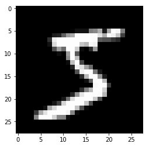
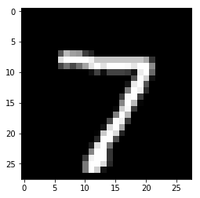

How to write a training loop in Chainer
```````````````````````````````````````

.. currentmodule:: chainer

In this tutorial section, we will learn how to train a deep neural network to classify images of hand-written digits in the popular MNIST dataset. This dataset contains 50,000 training examples and 10,000 test examples. Each example is a set of a 28 x 28 greyscale image and a corresponding class label. Since the digits from 0 to 9 are used, there are 10 classes for the labels.

Chainer provides a feature called :class:`~chainer.training.Trainer` that can simplify the training procedure of your model. However, it is also good to know how the training works in Chainer before starting to use the useful :class:`~chainer.training.Trainer` class that hides the actual processes. For advanced users, it sometimes needs to write their own custom training loop.

The complete training procedure consists of the following steps:

1. Prepare a dataset.
2. Create an iterator for the dataset.
3. Write a training loop that performs the following operations in each iteration:
    1. Retrieve a set of examples (mini-batch) from the training dataset.
    2. Feed the mini-batch to your network.
    3. Run a forward pass of the network and compute the loss.
    4. Just call the :meth:`~chainer.Variable.backward` method from the loss :class:`~chainer.Variable` to compute the gradients for all trainable parameters.
    5. Run the optimizer to update those parameters.
    6. (Optional): Check the network performance on the validation/test set.

1. Prepare the dataset
''''''''''''''''''''''

Chainer contains some built-in functions to use some popular datasets like MNIST, CIFAR10/100, etc. Those can automatically download the data from servers and provide dataset objects which are easy to use.

The below code shows how to retrieve the MNIST dataset from the server and save an image from its training split to make sure the images are correctly obtained.

.. testcode::

    import matplotlib.pyplot as plt
    from chainer.datasets import mnist

    # Download the MNIST data if you haven't downloaded it yet
    train, test = mnist.get_mnist(withlabel=True, ndim=1)

    # Display an example from the MNIST dataset.
    # `x` contains the input image array and `t` contains that target class
    # label as an integer.
    x, t = train[0]
    plt.imshow(x.reshape(28, 28), cmap='gray')
    plt.savefig('5.png')
    print('label:', t)

.. testoutput::

    label: 5

The saved image ``5.png`` will look like:




2. Create the dataset iterators
'''''''''''''''''''''''''''''''

Although this is an optional step, we'd like to introduce the :class:`~chainer.dataset.Iterator` class that enables to retrieve a set of data and labels from the given dataset and give a mini-batch easily. There are some subclasses that can perform the same thing in different ways, e.g., using multi-processing to parallelize the data loading part, etc.

Here, we use :class:`~chainer.iterators.SerialIterator`, which is also a subclass of :class:`~chainer.dataset.Iterator` in the below example code. The :class:`~chainer.iterators.SerialIterator` can provide mini-batches with or without shuffling the order of data in the given dataset.

All :class:`~chainer.dataset.Iterator` s produce a new mini-batch by calling its :meth:`~chainer.dataset.Iterator.next` method. All
:class:`~chainer.dataset.Iterator` s also have properties to know how many times we have taken all the data from the given dataset (:attr:`~chainer.dataset.Iterator.epoch`) and whether the next mini-batch will be the start of a new epoch (:attr:`~chainer.dataset.Iterator.is_new_epoch`), and so on.

The below code shows how to create a :class:`~chainer.iterators.SerialIterator` object from a dataset object.

.. testcode::

    from chainer import iterators

    # Choose the minibatch size.
    batchsize = 128

    train_iter = iterators.SerialIterator(train, batchsize)
    test_iter = iterators.SerialIterator(test, batchsize,
                                         repeat=False, shuffle=False)

.. note::

    :class:`~chainer.dataset.iterator` s can take a built-in Python list as a given dataset. It means that the below code example is able to work,

    .. code-block:: python

        train = [(x1, t1), (x2, t2), ...]  # A list of tuples
        train_iter = iterators.SerialIterator(train, batchsize)

    where ``x1, x2, ...`` denote the input data and ``t1, t2, ...`` denote the corresponding labels.

Details of SerialIterator
............................

- :class:`~chainer.iterators.SerialIterator` is a built-in subclass of :class:`~chainer.dataset.Iterator` that can retrieve a mini-batch from a given dataset in either sequential or shuffled order.
- The :class:`~chainer.dataset.Iterator` 's constructor takes two arguments: a dataset object and a mini-batch size.
- If you want to use the same dataset repeatedly during the training process, set the ``repeat`` argument to ``True`` (default). Otherwise, the dataset will be used only one time. The latter case is actually for the evaluation.
- If you want to shuffle the training dataset every epoch, set the ``shuffle`` argument to ``True``. Otherwise, the order of each data retrieved from the dataset will be always the same at each epoch.

In the example code shown above, we set ``batchsize = 128`` create both ``train_iter`` and ``test_iter``. So, these iterators will provide 128 images and corresponding labels at a time.

3. Define a network
'''''''''''''''''''

Now let's define a neural network that we will train to classify the MNIST images. For simplicity, we use a three-layer perceptron here. We set each hidden layer to have 100 units and set the output layer to have 10 units, which is corresponding to the number of class labels of the MNIST.

We first briefly explain about :class:`~chainer.Link`, :class:`~chainer.Function`, :class:`~chainer.Chain`, and :class:`~chainer.Variable`. These are the basic components to define a network in Chainer.

Link and Function
.................

In Chainer, each layer of a neural network is usually a :class:`~chainer.Function` or a :class:`~chainer.Link`.

- **:class:`~chainer.Function` is a function without any learnable paremeters.**
- **:class:`~chainer.Link` is a function that contains learnable parameters.** A :class:`~chainer.Link` calls a corresponding :class:`~chainer.Function` with the learnable parameters which are kept as its object properties.

In Chainer, a network is written as a code for its forward pass computation. It typically uses several links and functions. Chainer takes care of the backward pass automatically and so you do not need to write backward computation explicitly for the network unless it contained user-defined differentiable functions (when you use a custom function in the network, the implementation of the function should have `backward` method explicitly.)

- See :mod:`chainer.functions` module for various built-in :class:`~chainer.Function` s.
- See :mod:`chainer.links` module for various built-in :class:`~chainer.Link` s.
- For example, see the :class:`~chainer.links.Linear` link which wraps the :meth:`~chainer.functions.linear` method to give it learnable parameters like weights (:attr:``~chainer.links.Linear.W``) and biases (:attr:``~chainer.links.Linear.b``).
- Before we can start using them, we first need to import the below modules:

.. testcode::

    import chainer.links as L
    import chainer.functions as F

The Chainer convention is to use ``L`` for the alias of :mod:`~chainer.links` and ``F`` for the alias of :mod:`~chainer.functions`, like
``L.Convolution2D(...)`` or ``F.relu(...)``.

Chain
.....

- :class:`~chainer.Chain` is a class that can hold multiple links. It is a subclass of :class:`~chainer.Link` and so it can also hold a :class:`~chainer.Parameter` object.
- This means that a :class:`~chainer.Chain` can contain parameters to be optimized directory by keeping :class:`~chainer.Parameter` objects as its properties. The network components which have learnable parameters represented as :class:`~chainer.Link` s can also be contained.
- :class:`~chainer.Chain` is a subclass of :class:`~chainer.Link`, so it's possible to contain another :class:`~chainer.Chain` in the parent :class:`~chainer.Chain`. This allows us to construct deep hierarchical networks easily.

Variable and Parameter
......................

In Chainer, an activation (that is, the input or output of a function or link) is a :class:`~chainer.Variable` object. A :class:`~chainer.Variable` basically holds two arrays:

1. A :attr:`~chainer.Variable.data` array that contains the values read/written during the forward pass
2. A :attr:`~chainer.Variable.grad` array that contains the corresponding gradients that will be computed through the backward process.

:class:`~chainer.Parameter` is a subclass of :class:`~chainer.Variable` and it means that it is not an intermediate output of the network but it is a trainable parameter of a :class:`~chainer.Link`.


Create your network as a subclass of Chain
..........................................

You can create your network by writing a new subclass of :class:`~chainer.Chain`.
The main steps are twofold:

1. Register the network components which have trainable parameters to the subclass. Each of them must be instantiated and assigned to a property in the scope specified by ``with self.init_scope():`` inside of the constructor of the subclass.
2. Define a :meth:`~chainer.Chain.__call__` method that represents the actual **forward computation** of your network. This method takes one or more :class:`~chainer.Variable`, :class:`numpy.array`, or :class:`cupy.array` as its inputs and calculate the forward pass using them.

It should be noted that only :class:`~chainer.Link`, :class:`~chainer.Chain`,
and :class:`~chainer.ChainList` objects can be registered to the model inside
the ``init_scope``. This is because they contain trainable parameters.
For example, a :class:`~chainer.Function` does not contain any trainable
parameters, so there is no need to keep the object as a property of your
network. For example, we can use :meth:`~chainer.functions.relu` by simply
calling it in :meth:`~chainer.Chain.__call__` but a :class:`~chainer.Link`  (recall that both :class:`~chainer.Link` and :class:`~chainer.Function` are callable objects) such
as :class:`~chainer.links.Linear` is need to be registered as a property
beforehand to keep the trainable parameter in your network and update them
during the training.

If we decide that we want to call a :class:`~chainer.Link` in a
:class:`~chainer.Chain` after :meth:`~chainer.Chain.__init__` has already been
called, we can use the :meth:`~chainer.Chain.add_link` method of
:class:`~chainer.Chain` to add a new :class:`~chainer.Link` object at any time.

In Chainer, the Python code that implements the forward computation code itself
represents the model. In other words, we can conceptually think of the
computation graph for our model being constructed dynamically as this forward
computation code executes. This allows Chainer to describe networks in which
different computations can be performed in each iteration, such as branched
networks, intuitively and with a high degree of flexibility. This is the key
feature of Chainer that we call **Define-by-Run**.

How to run a model on GPU
.........................

- The :class:`~chainer.Link` and :class:`~chainer.Chain` classes have a :meth:`~chainer.Chain.to_gpu` method that takes a GPU id argument specifying which GPU to use. This method sends all of the model parameters to GPU memory.
- By default, the CPU is used.

.. testcode::

    class MLP(chainer.Chain):

        def __init__(self, n_mid_units=100, n_out=10):
            # register layers with parameters by super initializer
            super(MLP, self).__init__()
            with self.init_scope():
                self.l1 = L.Linear(None, n_mid_units)
                self.l2 = L.Linear(None, n_mid_units)
                self.l3 = L.Linear(None, n_out)

        def __call__(self, x):
            # describe the forward pass, given x (input data)
            h1 = F.relu(self.l1(x))
            h2 = F.relu(self.l2(h1))
            return self.l3(h2)

    gpu_id = 0  # Set to -1 if you use CPU

    model = MLP()
    model.to_gpu(gpu_id)

NOTE
____

The :class:`~chainer.links.Linear` class is a :class:`~chainer.Link` that
represents a fully connected layer. When ``None`` is passed as the first
argument, this allows the number of necessary input units (``n_input``) and
also the size of the weight parameter to be automatically determined and
computed at runtime during the first forward pass. We call this feature
parameter **shape placeholder**. This can be a very helpful feature when
defining deep neural network models, since it would often be tedious to
manually determine these input sizes.

As mentioned previously, a :class:`~chainer.Link` can contain multiple
parameter arrays. For example, the :class:`~chaienr.links.Linear` link contains
two parameter arrays: the weights :attr:`~chainer.links.Linear.W` and bias
:attr:`~chainer.links.Linear.b`. Recall that for a given link or chain, such as
the MLP chain above, the links it contains can be accessed as attributes. The
parameters of a link can also be accessed as attributes. For example, following
code shows how to access the bias parameter of layer ``l1``:

.. testcode::

    print('The shape of the bias of the first layer, l1, in the model:', model.l1.b.shape)
    print('The values of the bias of the first layer in the model after initialization:\n', model.l1.b.data)

.. testoutput::

    The shape of the bias of the first layer, l1, in the model: (100,)
    The values of the bias of the first layer in the model after initialization:
     [ 0.  0.  0.  0.  0.  0.  0.  0.  0.  0.  0.  0.  0.  0.  0.  0.  0.  0.
      0.  0.  0.  0.  0.  0.  0.  0.  0.  0.  0.  0.  0.  0.  0.  0.  0.  0.
      0.  0.  0.  0.  0.  0.  0.  0.  0.  0.  0.  0.  0.  0.  0.  0.  0.  0.
      0.  0.  0.  0.  0.  0.  0.  0.  0.  0.  0.  0.  0.  0.  0.  0.  0.  0.
      0.  0.  0.  0.  0.  0.  0.  0.  0.  0.  0.  0.  0.  0.  0.  0.  0.  0.
      0.  0.  0.  0.  0.  0.  0.  0.  0.  0.]

4. Select an optimization algorithm
'''''''''''''''''''''''''''''''''''

Chainer provides a wide variety of optimization algorithms that can be used to
optimize the model parameters during training. They are located in the
:mod:`~chainear.optimizers` module.

Here, we are going to use the basic stochastic gradient descent (SGD) method,
which is implemented by :class:`~chainer.optimizers.SGD`. The model (recall
that it is a :class:`~chainer.Chain` object) we created is passed to the
optimizer object by providing the model as an argument to the optimizer's
:meth:`~chainer.Optimizer.setup` method. In this way, the
:class:`~chainer.Optimizer` can automatically find the model parameters to be
optimized.

You can easily try out other optimizers as well. Please test and observe the
results of various optimizers. For example, you could try to change ``SGD`` of
:class:`chainer.optimizers.SGD` to :class:`~chainer.optimizers.MomentumSGD`,
:class:`~chainer.optimizers.RMSprop`, :class:`~chainer.optimizers.Adam`, etc.
and run your training loop.

.. testcode::

    from chainer import optimizers

    # Choose an optimizer algorithm
    optimizer = optimizers.SGD(lr=0.01)
    # Give the optimizer a reference to the model so that it
    # can locate the model's parameters.
    optimizer.setup(model)


NOTE
____

In the above example, we set :attr:`~chainer.optimizers.SGD.lr` to 0.01 in the
SGD constructor. This value is known as a the "learning rate", one of the most
important hyper parameters that need to be adjusted in order to obtain the best
performance. The various optimizers may each have different hyper-parameters and
so be sure to check the documentation for the details.

5. Write the training loop
''''''''''''''''''''''''''

We now show how to write the training loop. Since we are working on a digit
classification problem, we will use
:func:`~chainer.functions.softmax_cross_entropy` as the loss function for the
optimizer to minimize. For other types of problems, such as regression models,
other loss functions might be more appropriate. See the
`Chainer documentation for detailed information on the various loss functions <http://docs.chainer.org/en/stable/reference/functions.html#loss-functions>`_  that are available.

Our training loop will be structured as follows. We will first get a mini-batch
of examples from the training dataset. We will then feed the batch into our
model by calling or model (a :class:`~chainer.Chain` object) like a function.
This will execute the forward-pass code that we wrote for the chain's
:meth:`~chainer.Chain.__call__` method that we wrote above. This will cause the
model to output class label predictions that we supply to the loss function
along with the true (that is, target) values. The loss function will output the
loss as a :class:`~chainer.Variable` object. We then clear any previous
gradients and perform the backward pass by calling the
:meth:`~chainer.Variable.backward` method on the loss variable which computes
the parameter gradients. We need to clear the gradients first because the
:meth:`~chainer.Variable.backward` method accumulates gradients instead of
overwriting the previous values. Since the optimizer already was given a
reference to the model, it already has access to the parameters and the
newly-computed gradients and so we can now call the update method of the
optimizer which will update the model parameters.

At this point you might be wondering how calling backward on the loss variable
could possibly compute the gradients for all of the model parameters. This
works as follows. First recall that all activation and parameter arrays in the
model are instances of :class:`~chainer.Variable`. During the forward pass, as
each function is called on its inputs, we save references in each output
variable that refer to the function that created it and its input variables.
In this way, by the time the final loss variable is computed, it actually
contains backward references that lead all the way back to the input variables
of the model. That is, the loss variable contains a representation of the
entire computational graph of the model, which is recomputed each time the
forward pass is performed. By following these backward references from the loss
variable, each function as a backward method that gets called to compute any
parameter gradients. Thus, by the time the end of the backward graph is reached
(at the input variables of the model), all parameter gradients have been
computed.

Thus, there are four steps in single training loop iteration as shown below.

1. Obtain and pass a mini-batch of example images into the model and obtain the output digit predictions ``prediction_train``.
2. Compute the loss function, giving it the predicted labels from the output of our model and also the true "target" label values.
3. Clear any previous gradients and call the :meth:`~chainer.Variable.backward` method of :class:`~chainer.Variable` to compute the parameter gradients for the model.
4. Call the :meth:`~chainer.Optimizer.update` method of Optimizer, which performs one optimization step and updates all of the model parameters.

In addition to the above steps, it is good to occasionally check the
performance of our model on a validation and/or test set. This allows us to
observe how well it can generalize to new data and also check whether it is
overfitting. The code below checks the performance on the test set at the end
of each epoch. The code has the same structure as the training code except that
no backpropagation is performed and we also compute the accuracy on the test
set using the :meth:`~chainer.functions.accuracy` function.

We can write the training loop code as follows:

.. code-block:: python

    import numpy as np
    from chainer.dataset import concat_examples
    from chainer.cuda import to_cpu

    max_epoch = 10

    while train_iter.epoch < max_epoch:

        # ---------- The first iteration of Trainig loop ----------
        train_batch = train_iter.next()
        image_train, target_train = concat_examples(train_batch, gpu_id)

        # calculate the prediction of the model
        prediction_train = model(image_train)

        # calculation of loss function, softmax_cross_entropy
        loss = F.softmax_cross_entropy(prediction_train, target_train)

        # calculate the gradients in the model
        model.cleargrads()
        loss.backward()

        # update the paremters of the model
        optimizer.update()
        # --------------- until here One loop ----------------

        # Check if the generalization of the model is improving
        # by measuring the accuracy of prediction after every epoch

        if train_iter.is_new_epoch:  # after finishing the first epoch

            # display the result of the loss function
            print('epoch:{:02d} train_loss:{:.04f} '.format(
                train_iter.epoch, float(to_cpu(loss.data))), end='')

            test_losses = []
            test_accuracies = []
            while True:
                test_batch = test_iter.next()
                image_test, target_test = concat_examples(test_batch, gpu_id)

                # forward the test data
                prediction_test = model(image_test)

                # calculate the loss function
                loss_test = F.softmax_cross_entropy(prediction_test, target_test)
                test_losses.append(to_cpu(loss_test.data))

                # calculate the accuracy
                accuracy = F.accuracy(prediction_test, target_test)
                accuracy.to_cpu()
                test_accuracies.append(accuracy.data)

                if test_iter.is_new_epoch:
                    test_iter.epoch = 0
                    test_iter.current_position = 0
                    test_iter.is_new_epoch = False
                    test_iter._pushed_position = None
                    break

            print('val_loss:{:.04f} val_accuracy:{:.04f}'.format(
                np.mean(test_losses), np.mean(test_accuracies)))

Output
......

::

    epoch:01 train_loss:0.8072 val_loss:0.7592 val_accuracy:0.8289
    epoch:02 train_loss:0.5021 val_loss:0.4467 val_accuracy:0.8841
    epoch:03 train_loss:0.3539 val_loss:0.3673 val_accuracy:0.9007
    epoch:04 train_loss:0.2524 val_loss:0.3307 val_accuracy:0.9067
    epoch:05 train_loss:0.4232 val_loss:0.3076 val_accuracy:0.9136
    epoch:06 train_loss:0.3033 val_loss:0.2910 val_accuracy:0.9167
    epoch:07 train_loss:0.2004 val_loss:0.2773 val_accuracy:0.9222
    epoch:08 train_loss:0.2885 val_loss:0.2679 val_accuracy:0.9239
    epoch:09 train_loss:0.2818 val_loss:0.2579 val_accuracy:0.9266
    epoch:10 train_loss:0.2403 val_loss:0.2484 val_accuracy:0.9307

6. Save the trained model
'''''''''''''''''''''''''

Chainer provides two types of :mod:`~chainer.serializers` that can be used to
save and restore model state. One supports the HDF5 format and the other
supports the NumPy NPZ format. For this example, we are going to use the NPZ
format to save our model since it is easy to use with NumPy without requiring
any additional dependencies or libraries.

.. testcode::

    serializers.save_npz('my_mnist.model', model)

7. Perform classification by restoring a previously trained model
'''''''''''''''''''''''''''''''''''''''''''''''''''''''''''''''''

We will now use our previously trained and saved MNIST model to classify a new
image. In order to load a previously-trained model, we need to perform the
following two steps:

1. We must use the same model definition code that was used to create the previously-trained model. For our example, this is the MLP :class:`~chainer.Chain` that we created earlier.
2. We then overwrite any parameters in the newly-created model with the values that were saved earlier using the serializer. The :meth:`~chainer.serializers.load_npz` function can be used to do this.

Now the model has been restored, it can be used to predict image labels on new input images.

.. testcode::

    from chainer import serializers

    # Create the infrence (evaluation) model as the preivious model
    model = MLP()

    # Load the saved paremeters into the parametes of the new inference model to overwrite
    serializers.load_npz('my_mnist.model', model)

    # Send the model to utilize GPU by to_GPU
    model.to_gpu(gpu_id)

    # Get a test image and label
    x, t = test[0]
    plt.imshow(x.reshape(28, 28), cmap='gray')
    plt.savefig('7.png')
    print('label:', t)

.. testoutput::

    label: 7

The saved test image looks like:



.. testsetup::

    from chainer.cuda import to_cpu

.. testcode::

    from chainer.cuda import to_gpu

    # Change the shape of the minibatch.
    # In this example, the size of minibatch is 1.
    # Inference using any mini-batch size can be performed.

    print(x.shape, end=' -> ')
    x = x[None, ...]
    print(x.shape)

    # To calculate by GPU, send the data to GPU, too.
    x = to_gpu(x, 0)

    # forward calculation of the model by sending X
    y = model(x)

    # The result is given as Variable, then we can take a look at the contents by the attribute, .data.
    y = y.data

    # send the gpu result to cpu
    y = to_cpu(y)

    # The most probable number by looking at the argmax
    pred_label = y.argmax(axis=1)

    print('predicted label:', pred_label[0])

.. testoutput::

    (784,) -> (1, 784)
    predicted label: 2
