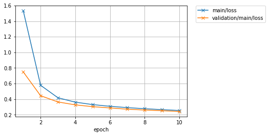
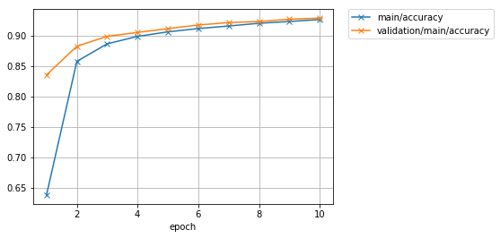
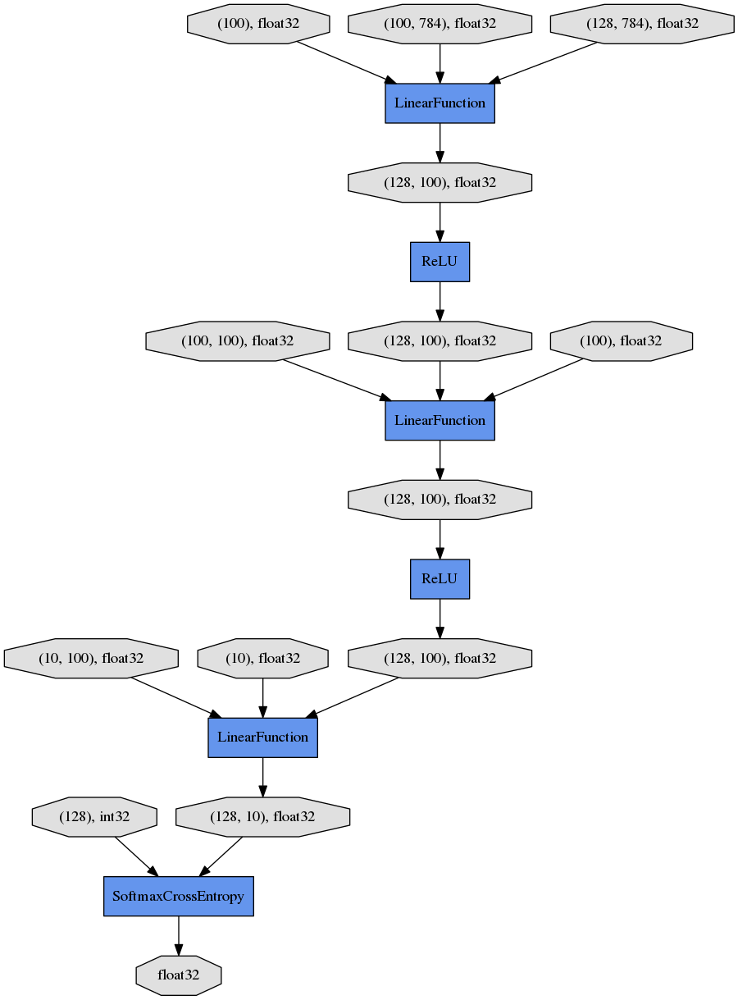

Let's try using the Trainer feature
```````````````````````````````````

By using :class:`~chainer.training.Trainer`, you don't need to write the
tedious training loop explicitly any more. Chainer contains several extensions
that can be used with :class:`~chainer.training.Trainer` to visualize your
results, evaluate your model, store and manage log files more easily.

This example will show how to use the :class:`~chainer.training.Trainer`
feature to train a fully-connected feed-forward neural network on the MNIST
dataset.

.. note::

    Please read the custom training loop tutorial:
    :doc:`tutorial/custom_training.rst` before this tutorial.

1. Prepare the dataset
''''''''''''''''''''''

Load the MNIST dataset, which contains a training set of images and class
labels as well as a corresponding test set.

.. testcode::

    from chainer.datasets import mnist

    train, test = mnist.get_mnist()

2. Prepare the dataset iterations
'''''''''''''''''''''''''''''''''

.. testcode::

    batchsize = 128

    train_iter = iterators.SerialIterator(train, batchsize)
    test_iter = iterators.SerialIterator(test, batchsize, False, False)

3. Prepare the model
''''''''''''''''''''

Here, we are going to use the same model as before.

.. testcode::

    class MLP(Chain):

        def __init__(self, n_mid_units=100, n_out=10):
            super(MLP, self).__init__(
                l1=L.Linear(None, n_mid_units),
                l2=L.Linear(None, n_mid_units),
                l3=L.Linear(None, n_out),
            )

        def __call__(self, x):
            h1 = F.relu(self.l1(x))
            h2 = F.relu(self.l2(h1))
            return self.l3(h2)

    gpu_id = 0

    model = MLP()
    model.to_gpu(gpu_id)  # If you use CPU, comment out this Linear

4. Prepare the Updater
''''''''''''''''''''''

:class:`~chainer.tarining.Trainer` is a class that holds all of the necessary
components needed for training. The main components are shown below.

.. image:: ../../image/trainer/trainer.png

Basically, all you need to pass to :class:`~chainer.training.Trainer` is an
:class:`~chainer.training.updater`. However, :class:`~chainer.training.updater`
contains an :class:`~chainer.training.Iterator` and
:class:`~chainer.Optimizer`. Since :class:`~chainer.training.Iterator` can
access the dataset and :class:`~chainer.Optimizer` has references to the model,
:class:`~chainer.training.updater` can update the parameters of models.

So, :class:`~chainer.training.updater` can perform the training procedure as
shown below:

1. Retrieve the data from dataset, one batch at a time (:class:`~chainer.dataset.Iterator`)
2. Pass the data to the model and calculate the loss (Model = :attr:`~chainer.Optimizer.target`)
3. Update the parameters of the model (:class:`~chainer.Optimizer`)

Now let's create the :class:`~chainer.training.updater` object !

.. testcode::

    max_epoch = 10
    # Note: If you don't have a GPU, set this to -1 to run on CPU only
    gpu_id = 0

    # Wapp your model by Classifier and include the process of loss calculation within your model.
    # Since we do not specify a loss funciton here, the default 'softmax_cross_entropy' is
    # used.
    model = L.Classifier(model)
    model.to_gpu(gpu_id)

    # selection of your optimizing method
    optimizer = optimizers.SGD()
    # Give the optimizer a reference to the model
    optimizer.setup(model)

    # Get an updater that uses the Iterator and Optimizer
    updater = training.StandardUpdater(train_iter, optimizer, device=gpu_id)

.. note::

    Here, the model defined above is passed to
    ``L.Classifier`` and changed to a new :class:`~chainer.Chain` class model.
    ``L.Classifier``, which in fact inherits from the :class:`~chainer.Chain`
    class, keeps the :class:`~chainer.Chain` model in its
    :attr:`~chainer.links.Classifier.predictor` attribute. Once you give input
    data and corresponding output class labels to the model by the
    ``()`` accessor, :meth:`__call__` of the model is invoked. The data is then
    given to :attr:`~chainer.links.Classifier.predictor` to obtain the output
    ``y``. Next, together with the label data, the output ``y`` will be passed
    to the loss function which is assigned by
    :attr:`~chainer.links.Classifier.lossfun` argument in the constructor and
    the ouput will be returned as a :class:`~chainer.Variable`. In
    ``L.Classifiler``, the :attr:`~chainer.links.Classifier.lossfun` is set to
    :meth:`~chainer.functions.softmax_cross_entropy` as default.

    :class:`~chainer.training.Standardupdater` is the simplest class to process
    the :class:`~chainer.training.updater` described above. Other than this
    :class:`~chainer.training.Standardupdater`, there is also a
    :class:`~chainer.training.Parallelupdater` to utilize multiple GPUs.

5. Setup Trainer
''''''''''''''''

Lastly, we will setup :class:`~chainer.training.Trainer`. The only requirement
for creating a :class:`~chainer.training.Trainer` is to pass the
:class:`~chainer.training.Updater` that we previously created above. You can
also pass a :attr:`~chainer.training.Trainer.stop_trigger` to the second
trainer argument as a tuple, ``(length, unit)`` to tell the trainer stop
automatically according to your indicated timing. The ``length`` is given as an
arbitrary integer, The ``unit`` is given as a string, by selecting ``epoch`` or
``iteration``. Without setting :attr:`~chainer.training.Trainer.stop_trigger`,
the training will not stop automatically.

.. testcode::

    # Send Updater to Trainer
    trainer = training.Trainer(updater, (max_epoch, 'epoch'), out='mnist_result')

The :attr:`~chainer.training.Trainer.out` argument in the
:class:`~chainer.training.Trainer` will set up an output directory to save the
log files, the image files of graphs to show the time progress of loss,
accuracy, etc. Next, we will explain how to display/save those outputs by using
:class:`~chainer.training.Extension`.


6. Add Extensions to Trainer
''''''''''''''''''''''''''''

The :class:`~chainer.training.Trainer` extensions provide the following
capabilites:

* Save log files automatically (:class:`~chainer.training.extensions.LogReport`)
* Display the training information to the terminal periodically (:class:`~chainer.training.extensions.PrintReport`)
* Visualize the loss progress by plottig a graph periodically and save its image (:class:`~chainer.training.extensions.PlotReport`)
* Automatically serialize the model or the state of Optimizer periodically (:meth:`~chainer.training.extensions.snapshot` / :meth:`~chainer.training.extensions.snapshot_object`)
* Display Progress Bar to show the progress of training (:class:`~chainer.training.extensions.ProgressBar`)
* Save the model architechture as a dot format readable by Graphviz (:meth:`~chainer.training.extensions.dump_graph`)

Now you can utilize the wide variety of tools shown above right away! To do so,
simply pass the desired :class:`~chainer.training.Extension` object to the
:class:`~chainer.training.Trainer` object by using the
:meth:`~chainer.training.Trainer.extend` method of
:class:`~chainer.training.Trainer`.

.. testcode::

    trainer.extend(extensions.LogReport())
    trainer.extend(extensions.snapshot(filename='snapshot_epoch-{.updater.epoch}'))
    trainer.extend(extensions.snapshot_object(model.predictor, filename='model_epoch-{.updater.epoch}'))
    trainer.extend(extensions.Evaluator(test_iter, model, device=gpu_id))
    trainer.extend(extensions.PrintReport(['epoch', 'main/loss', 'main/accuracy', 'validation/main/loss', 'validation/main/accuracy', 'elapsed_time']))
    trainer.extend(extensions.PlotReport(['main/loss', 'validation/main/loss'], x_key='epoch', file_name='loss.png'))
    trainer.extend(extensions.PlotReport(['main/accuracy', 'validation/main/accuracy'], x_key='epoch', file_name='accuracy.png'))
    trainer.extend(extensions.dump_graph('main/loss'))

:class:`~chainer.training.extensions.LogReport`
...............................................

Collect ``loss`` and ``accuracy`` automatically every ``epoch`` or
``iteration`` and store the information under the ``log`` file in the directory
assigned by the :attr:`~chainer.training.Trainer.out` argument of
:class:`~chainer.training.Trainer`.

:meth:`~chainer.training.extensions.snapshot`
.............................................

The :meth:`~chainer.training.extensions.snapshot` method saves the
:class:`~chainer.training.Trainer` object at the designated timing (defaut:
every epoch) in the directory assigned by :attr:`~chainer.training.Trainer.out`
argument in :class:`~chainer.training.Trainer`. The
:class:`~chainer.training.Trainer` object, as mentioned before, has an
:class:`~chainer.training.updater` which contains an
:class:`~chainer.Optimizer` and a model inside. Therefore, as long as you have
the snapshot file, you can use it to come back to the training or make
inferences using the previously trained model later.

:meth:`~chainer.training.extensions.snapshot_object`
....................................................

However, when you keep the whole :class:`~chainer.training.Trainer` object, in
some cases, it is very tedious to retrieve only the inside of the model. By
using :meth:`~chainer.training.extensions.snapshot_object`, you can save the
particular object (in this case, the model wrapped by
:class:`~chainer.links.Classifier`) in addition to saving the
:class:`~chainer.training.Trainer` object. :class:`~chainer.links.Classifier`
is a :class:`~chainer.Chain` object which keeps the :class:`~chainer.Chain`
object given by the first argument as a property called
:attr:`~chainer.links.Classifier.predictor` and calculate the loss.
:class:`~chainer.links.Classifier` doesn't have any parameters other than those
inside its predictor model, so we only keep ``model.predictor`` in the above
example code.

:meth:`~chainer.training.extensions.dump_graph`
...............................................

This method save the computational graph of the model. The graph is saved in the
`Graphviz <http://www.graphviz.org/>_`s dot format. The output location
(directory) to save the graph is set by the
:attr:`~chainer.training.Trainer.out` argument of
:class:`~chainer.training.Trainer`.

:class:`~chainer.training.extensions.Evaluator`
...............................................

The :class:`~chainer.dataset.Iterator` that uses the evaluation dataset and the
model object are passed to :class:`~chainer.training.extensions.Evaluator`.
The :class:`~chainer.training.extensions.Evaluator` evaluates the model using
the given dataset at the specified timing interval.

:class:`~chainer.training.extensions.PrintReport`
.................................................

:class:`~chainer.Reporter` aggregates the results to output to the standard
output. The content for displaying the output can be given by the list.

:class:`~chainer.training.extensions.PlotReport`
................................................

:class:`~chainer.training.extensions.PlotReport` plots the values specified by
its arguments, draws the graph and saves the image in the directory set by
:attr:`~chainer.training.extensions.PlotReport.file name`.

The :class:`~chainer.training.Extension` class has a lot of options other than
those mentioned here. For instance, by using the
:attr:`~chainer.training.Extension.trigger` option, you can set individual
timings to activate the :class:`~chainer.training.Extension` more flexibly.
Please take a look at the official document in more detail：
`Trainer extensions <reference/extensions.html>_`.

7. Start Training
'''''''''''''''''

To start training, just call :meth:`~chainer.training.Trainer.run` method from
:class:`~chainer.training.Trainer` object.

.. testcode::

    trainer.run()

::

    epoch       main/loss   main/accuracy  validation/main/loss  validation/main/accuracy  elapsed_time
    1           1.53241     0.638409       0.74935               0.835839                  4.93409
    2           0.578334    0.858059       0.444722              0.882812                  7.72883
    3           0.418569    0.886844       0.364943              0.899229                  10.4229
    4           0.362342    0.899089       0.327569              0.905558                  13.148
    5           0.331067    0.906517       0.304399              0.911788                  15.846
    6           0.309019    0.911964       0.288295              0.917722                  18.5395
    7           0.292312    0.916128       0.272073              0.921776                  21.2173
    8           0.278291    0.92059        0.261351              0.923457                  23.9211
    9           0.266266    0.923541       0.253195              0.927314                  26.6612
    10          0.255489    0.926739       0.242415              0.929094                  29.466

Let's see the graph of loss saved in the ``mnist_result`` directory.



How about the accuracy?



Furthermore, let's visualize the computaional graph output by
:meth:`~chainer.training.extensions.dump_graph` of
:class:`~chainer.training.Extension` using Graphviz.

::

    % dot -Tpng mnist_result/cg.dot -o mnist_result/cg.png



From the top to the bottom, you can track the data flow of the computations,
how data and parameters are passed to what type of :class:`~chainer.Function`
and the calculated loss is output.

8. Evaluate a pre-trained model
'''''''''''''''''''''''''''''''

.. testcode::

    from chainer.cuda import to_gpu
    from chainer.cuda import to_cpu

    model = MLP()
    serializers.load_npz('mnist_result/model_epoch-10', model)
    model.to_gpu(gpu_id)

    # Show the output
    x, t = test[0]
    plt.imshow(x.reshape(28, 28), cmap='gray')
    plt.show()
    print('label:', t)

    x = to_gpu(x[None, ...])
    y = model(x)
    y = to_cpu(y.data)

    print('predicted_label:', y.argmax(axis=1)[0])

.. image:: ../../image/trainer/mnist_output.png

::

    label: 7
    predicted_label: 7

It successfully executed !!
