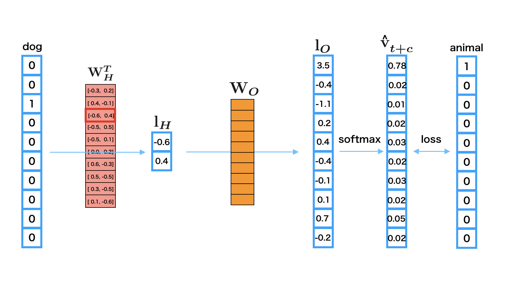

Word2Vec: Obtain word embeddings
*********************************

.. currentmodule:: chainer

0. Introduction
================

**Word2vec** is the tool for generating the distributed representation of words,
which is proposed by Mikolov et al[1]. When the tool assigns a real-valued vector
to each word, the closer the meanings of the words, the greater similarity the
vectors will indicate.

**Distributed representation** means assigning a real-valued vector for each
word and representing the word by the vector. When representing a word by
distributed representation, we call the **word embeddings**.
In this tutorial, we aim at explaining how to get the word embeddings from
Penn Tree Bank dataset.

Let's think about what the meaning of word is. Since we are human, we can
understand that the words "animal" and "dog" are deeply related eaach other.
But what information will Word2vec use to learn the vectors for words? The words
"animal" and "dog" should have similar vectors, but the words "food" and "dog"
should be far from each other. How to know the features of those words automatically?

1. Basic Idea
==============

Word2vec learns the similarity of word meanings from simple information. It learns
the representation of words from sentences. The core idea is based on the assumption
that the meaning of a word is affected by the words around it. This idea follows
**distributional hypothesis**\ [2].

The word we focus on to learn its representation is called **center word**,
and the words around it are called **context words**. The window
size :math:`C` determines the number of context words which is considered.

Here, let's see the algorithm by using an example sentence: "**The cute cat jumps over the lazy dog.**".

* All of the following figures consider "cat" as the center word.
* According to the window size :math:`C`, you can see that the number of context words is changed.

.. image:: ../../image/word2vec/center_context_word.png

2. Main Algorithm
==================

Word2vec, the tool for creating the word embeddings, is actually
built with two models, which are called **Skip-gram** and **CBoW**.

To explain the models with the figures below, we will use the following
symbols.

=====================   ===============================================================================================================================
Symbol                  Definition                                               
=====================   ===============================================================================================================================
:math:`|\mathcal{V}|`   The size of vocabulary                                   
:math:`D`               The size of embedding vector                             
:math:`{\bf v}_t`       A one-hot center word vector                             
:math:`V_{t \pm C}`     A set of :math:`C` context vectors around :math:`{\bf v}_t`, namely, :math:`\{{\bf v}_{t+c}\}_{c=-C}^C \backslash {\bf v}_t`
:math:`{\bf l}_H`       An embedding vector of an input word vector              
:math:`{\bf l}_O`       An output vector of the network                          
:math:`{\bf W}_H`       The embedding matrix for inputs                          
:math:`{\bf W}_O`       The embedding matrix for outputs                         
=====================   ===============================================================================================================================

.. note::

    Using **negative sampling** or **hierarchical softmax** for the loss
    function the loss function is very common, however, in this tutorial,
    we will use the **softmax over all words** and
    skip the other variants for the sake of simplicity.

2.1 Skip-gram
--------------

This model learns to predict context words :math:`V_{t \pm C}` when a center word
:math:`{\bf v}_t` is given. In the model, each row of the embedding
matrix for input :math:`{\bf W}_H` becomes a word embedding of each word.

When you input a center word :math:`{\bf v}_t` into the network,
you can predict one of context words :math:`\hat {\bf v}_{t+c} \in V_{t \pm C}` as follows.

1. Calculate an embedding vector of the input center word vector: :math:`{\bf l}_H = {\bf W}_H {\bf v}_t`
2. Calculate an output vector of the embedding vector: :math:`{\bf l}_O = {\bf W}_O {\bf l}_H`
3. Calculate a probability vector of a context word: :math:`\hat {\bf v}_{t+c} = \text{softmax}({\bf l}_O)`

Each element of the :math:`|\mathcal{V}|`-dimensional vector :math:`\hat {\bf v}_{t+c}` is a probability
that a word in the vocabulary turns out to be a context word at position :math:`c`.
So, the probability :math:`p({\bf v}_{t+c}|{\bf v}_t)` can be estimated by a dot product of the one-hot vector
:math:`{\bf v}_{t+c}` which represents the actual word at the position :math:`c` and the output vector
:math:`\hat {\bf v}_{t+c}`.

.. math::
    p({\bf v}_{t+c}|{\bf v}_t) = {\bf v}_{t+c}^T \hat {\bf v}_{t+c}

The loss function to predict all the context words :math:`V_{t \pm C}`
given a center word :math:`{\bf v}_t` is defined as following:

.. math::
    L(V_{t \pm C} | {\bf v}_t; {\bf W}_H, {\bf W}_O) &= \sum_{V_{t \pm C}} -\log\left(p({\bf v}_{t+c} \mid {\bf v}_t)\right) \\
    &= \sum_{V_{t \pm C}} -\log({\bf v}_{t+c}^T \hat{\bf v}_{t+c})

2.2 Continuous Bag of Words (CBoW)
-----------------------------------

This model learns to predict center word :math:`{\bf v}_t` when context words
:math:`V_{t \pm C}` is given. When you give a set of context words
:math:`V_{t \pm C}` to the network, you can estimate the probability of the 
center word :math:`\hat {\bf v}_t` as follows:

1. Calculate a mean embedding vector over all context words: :math:`{\bf l}_H = \frac{1}{2C} \sum_{V_{t \pm C}} {\bf W}_H {\bf v}_{t+c}`
2. Calculate an output vector of the embedding vector: :math:`{\bf l}_O = {\bf W}_O {\bf l}_H`
3. Calculate a probability vector of a center word: :math:`\hat {\bf v}_t = \text{softmax}({\bf l}_O)`

Each element of the :math:`|\mathcal{V}|`-dimensional vector :math:`\hat {\bf v}_t` is a probability
that a word in the vocabulary turns out to be a center word.
So, the probability :math:`p({\bf v}_t|V_{t \pm C})` can be estimated by a dot product of the one-hot vector
:math:`{\bf v}_t` which represents the actual center word and the output vector
:math:`\hat {\bf v}_t`.

.. math::
    p({\bf v}_t|V_{t \pm C}) = {\bf v}_t^T \hat {\bf v}_t

The loss function to predict the center word :math:`{\bf v}_t`
given context words :math:`V_{t \pm C}` is defined as following:

.. math::
    L({\bf v}_t | V_{t \pm C}; {\bf W}_H, {\bf W}_O) &= -\log\left(p({\bf v}_t \mid V_{t \pm C})\right) \\
    &= -\log({\bf v}_t^T \hat {\bf v}_t)

3. Details of Skip-gram
========================

In this tutorial, we mainly explain Skip-gram model because

1. It is easier to understand the algorithm than CBoW.
2. Even if the number of words increases, the accuracy is largely maintained.
   So, it is more scalable.

So, let's think about a concreate example of calculating Skip-gram under this setup:

* The size of vocabulary :math:`|\mathcal{V}|` is 10.
* The size of embedding vector :math:`D` is 2.
* Center word is "dog".
* Context word is "animal".

Since there should be more than one context word, repeat the following process for each context word.

1. The one-hot vector of "dog" is ``[0 0 1 0 0 0 0 0 0 0]`` and you input it as the
   center word.
2. The third row of embedding matrix :math:`{\bf W}_H`
   is used for the word embedding of "dog" :math:`{\bf l}_H`.
3. Then, multiply :math:`{\bf W}_O` with :math:`{\bf l}_H` to obtain the output
   vector :math:`{\bf l}_O`.
4. Give :math:`{\bf l}_O` to the softmax function to make it a predicted probability
   vector :math:`\hat {\bf v}_{t+c}` for a context word at the position :math:`c`.
5. Calculate the error between :math:`\hat {\bf v}_{t+c}` and the one-hot vector
   of "animal"; ``[1 0 0 0 0 0 0 0 0 0 0]``.
6. Propagate the error back to the network to update the parameters.

4. Implementation of Skip-gram by Chainer
==========================================

* There is an example related to Word2vec on the GitHub repository, so we will explain based on that.

        * `chainer/examples/word2vec <https://github.com/chainer/chainer/tree/master/examples/word2vec>`_

4.1 Implementation Method
--------------------------

Import Package
^^^^^^^^^^^^^^^

.. literalinclude:: ../../../examples/word2vec/train_word2vec.py
   :language: python
   :lines: 12-20
   :caption: train_word2vec.py

* Basically, if you use chainer, you import in this way.
* Importing functions as ``F`` and links as ``L`` makes it easy to use.

Define Network Structures
^^^^^^^^^^^^^^^^^^^^^^^^^^

.. literalinclude:: ../../../examples/word2vec/train_word2vec.py
   :language: python
   :pyobject: SkipGram
   :caption: train_word2vec.py

* Next, we define the network structures of skip-gram.
* When we call the constructor ``__init__``, we pass the vocabulary size
  ``n_vocab``, the size of the embedding vector ``n_units``, and the loss function
  ``loss_func`` as arguments.

        * The :class:`~chainer.Parameter` s are initialized in ``self.init_scope()``.

                * It is recommended to initialize :class:`~chaier.Parameter` here.
                * Since we set :class:`~chaier.Parameter` as the attribute of Link,
                  there are effects such as making IDE easier to follow code.
                * For details, see :ref:`upgrade-new-param-register`.

        * The weight matrix ``self.embed.W`` is the embbeding matrix for input :math:`W_H`.

* The function call ``__call__`` takes center word's ID ``x`` and context word's ID
  ``contexts``  as arguments, and returns the error calculated by the loss function
  ``self.loss_func``.

        * When the function ``__call__`` is called, the shape of ``x`` is
          ``[batch_size,]`` and the shape of ``contexts`` is
          ``[batch_size, n_context]``. The ``batch_size`` means the size
          of mini-batch, and ``n_context`` means the size of context words.
        * First, we obtain the embedding vectors of ``contexts`` by
          ``e = self.embed(contexts)``. In the Skip-gram, since each center word
          has only one context word, there is no problem to switch context word and
          center word. So, in the code, context word is used as input for the
          network. (This is because it is easy to match the CBoW code.)
        * By ``F.broadcast_to(x[:, None], (shape[0], shape[1]))``, the center word's
          ID ``x`` is broadcasted to each context word.
        * At the end, the shape of ``x`` is ``[batch_size * n_context,]`` and the
          shape of ``e`` is ``[batch_size * n_context, n_units]``. By
          ``self.loss_func(e, x)``, the error is calculated.

Define Loss Function
^^^^^^^^^^^^^^^^^^^^^

.. literalinclude:: ../../../examples/word2vec/train_word2vec.py
   :language: python
   :pyobject: SoftmaxCrossEntropyLoss
   :caption: train_word2vec.py

* Next, we define the loss function. Actually, this code also includes the part of
  the network structures.

        * After computing the linear transformation ``self.out(x)``, which is
          defined by ``L.Linear(n_in, n_out, initialW=0)``, we calculate
          the error function of cross entropy followed by softmax function with
          :class:`~chainer.functions.softmax_cross_entropy`.
        * Here, the linear transformation matrix ``self.out.W`` corresponds to the
          embedding matrix for output :math:`W_O`, and
          :class:`~chainer.functions.softmax_cross_entropy` corresponds to the
          softmax function and the loss function.

Define Iterator for Data
^^^^^^^^^^^^^^^^^^^^^^^^^

.. literalinclude:: ../../../examples/word2vec/train_word2vec.py
   :language: python
   :pyobject: WindowIterator
   :caption: train_word2vec.py

* The constructor ``__init__`` receives the document dataset ``dataset`` as a list of word IDs,
  the window size ``window`` and the mini batch size ``batch_size``.

        * In the constructor, we create a array ``self.order`` which is shuffled
          ``[window, window + 1, ..., len(dataset) - window - 1]`` in order to
          iterate randomly ordered ``dataset``.
        * e.g. If the number of words in ``dataset`` is 100 and the window size
          ``window`` is 5, ``self.order`` becomes :class:`numpy.ndarray` where
          numbers from 5 to 94 are shuffled.

* The iterator definition ``__next__`` returns mini batch sized center word
  ``center`` and context word ``contexts`` according to the parameters of the
  constructor.

        * The code ``self.order[i:i_end]`` generates the indices ``position``
          of center words, which size is ``batch_size``, from the random-ordered
          array ``self.order``. The indices ``position`` will be converted to
          center words ``center`` by ``self.dataset.take``.
        * The code ``np.concatenate([np.arange (-w, 0), np.arange(1, w + 1)])``
          creates the window offset ``offset``.
        * The code ``position[:, None] + offset[None,:]`` generates the indices
          of context words ``pos`` for each center word. The indices ``pos`` will
          be converted to context words ``contexts`` by ``self.dataset.take``.

Main Function
^^^^^^^^^^^^^^

.. literalinclude:: ../../../examples/word2vec/train_word2vec.py
   :language: python
   :start-after: Load the dataset
   :end-before: args.test
   :caption: train_word2vec.py

* ``train`` and ``val`` means training data and validation data. Each data contains
  the list of Document IDs

        .. code-block:: console
        
            >>> train
            array([ 0,  1,  2, ..., 39, 26, 24], dtype=int32)
            >>> val
            array([2211,  396, 1129, ...,  108,   27,   24], dtype=int32)

* The maximum id in ``train`` will be the vocabulary size ``n_vocab - 1``.

.. literalinclude:: ../../../examples/word2vec/train_word2vec.py
   :language: python
   :start-after: if args.model
   :end-before: elif args.model
   :caption: train_word2vec.py

* We create the ``model`` as Skip-gram.

.. literalinclude:: ../../../examples/word2vec/train_word2vec.py
   :language: python
   :start-after: args.out_type == 'original'
   :end-before: else
   :caption: train_word2vec.py

* We create the loss function ``loss_func`` as ``SoftmaxCrossEntropyLoss``.

.. literalinclude:: ../../../examples/word2vec/train_word2vec.py
   :language: python
   :start-after: Set up an optimizer
   :end-before: Set up an iterator
   :caption: train_word2vec.py

* We create the ``optimizer`` as Adam (Adaptive moment estimation).

.. literalinclude:: ../../../examples/word2vec/train_word2vec.py
   :language: python
   :start-after: Set up an iterator
   :end-before: Set up a trainer
   :caption: train_word2vec.py

* We create the iterators and updater.

.. literalinclude:: ../../../examples/word2vec/train_word2vec.py
   :language: python
   :start-after: Set up a trainer
   :end-before: Save the word2vec model
   :caption: train_word2vec.py

* We create the trainer and run it.

4.2 Run Example
----------------

Training the model
^^^^^^^^^^^^^^^^^^^

.. code-block:: console

    $ pwd
    /root2chainer/chainer/examples/word2vec
    $ python train_word2vec.py --test  # run by test mode. If you want to use all data, remove "--test".
    GPU: -1
    # unit: 100
    Window: 5
    Minibatch-size: 1000
    # epoch: 20
    Training model: skipgram
    Output type: hsm
    
    n_vocab: 10000
    data length: 100
    epoch       main/loss   validation/main/loss
    1           4233.75     2495.33               
    2           1411.14     4990.66               
    3           4233.11     1247.66               
    4           2821.66     4990.65               
    5           4231.94     1247.66               
    6           5642.04     2495.3                
    7           5640.82     4990.64               
    8           5639.31     2495.28               
    9           2817.89     4990.62               
    10          1408.03     3742.94               
    11          5633.11     1247.62               
    12          4221.71     2495.21               
    13          4219.3      4990.56               
    14          4216.57     2495.16               
    15          4213.52     2495.12               
    16          5616.03     1247.55               
    17          5611.34     3742.78               
    18          2800.31     3742.74               
    19          1397.79     2494.95               
    20          2794.1      3742.66

Search the similar words
^^^^^^^^^^^^^^^^^^^^^^^^^

.. code-block:: console

    $ pwd
    /root2chainer/chainer/examples/word2vec
    $ python search.py 
    >> apple
    query: apple
    compaq: 0.6169619560241699
    chip: 0.49579331278800964
    retailer: 0.4904134273529053
    maker: 0.4684058427810669
    computer: 0.4652436673641205
    >> animal      
    query: animal
    beauty: 0.5680124759674072
    human: 0.5404794216156006
    insulin: 0.5365156531333923
    cell: 0.5186758041381836
    photographs: 0.5077002048492432

5. Reference
=============
* [1] `Mikolov, Tomas; et al. "Efficient Estimation of Word Representations in Vector Space". arXiv:1301.3781 <https://arxiv.org/abs/1301.3781>`_
* [2] `Distributional Hypothesis <https://aclweb.org/aclwiki/Distributional_Hypothesis>`_
