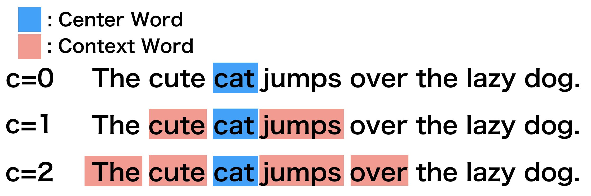

Word2vec implementation with Chainer
*************************************

.. currentmodule:: chainer

0. Introduction
================

Word2vec is the tool for generating the distributed representation of words.
When the tool asssigns a real number vector to each word, the closer
the meanings of the words, the grater similarity the vectors will indicate.
As you know, "distributed representation" is assigning a real number vector for each
object and representing the object by the vector. When representatin a word
by distributed representation, we call it "distributed representation of words"
or "word embeddings". In this tutorial we will use the term "distributed
representation of words".

Let's think about what the meaning of words is. As you are a human, you can
understand that the words **animal** and **dog** are similar. But what information will
Word2vec use in order to learn the vectors of meanings? Such that the words
**animal** and **dog** are similar, but the words "food" and **dog** are not similar.

1. Basic idea
==============

Word2vec learns the similarity of word meanings from simple information. It learns
from a sequence of words in sentences. The idea is that the meaning of the word is
determined by the words around it. This idea is an old methodology, whith is called
"distributional hypothesis". It is mentioned in papers of 1950's[5]. The word to
be learned is called "Center Word", and the words around it are called
"Context Words". Depending on the window size ``c``, the number of Contex Words
will change.

For example, I will explain with the sentence **The cute cat jumps over the lazy dog.**.

* All of the following figures consider **cat** as Center Word.
* According to the window size ``c``, you can see that Context Words are changing.

2. Main algorithm
==================

The tool for createing the distributed representation of words, Word2vec actually
is built with the two models, which are "Skip-gram" and "CBoW".

When we will explain the models with the figures below, we will use the following
symbols.

* :math:`N`: the number of vocabulary.
* :math:`D`: the size of distributed representation vector.
* :math:`v_t`: Center Word. The size is ``[N, 1]``.
* :math:`v_{t+c}`: Context Word. The size is ``[N, 1]``.
* :math:`L_H`: Distributed representation converted from input.
  The size is ``[D, 1]``.
* :math:`L_O`: Output layer. The size is ``[N, 1]``.
* :math:`W_H`: Distributed representation matrix for input.
  The size is ``[N, D]``.
* :math:`W_O`: Distributed representation matrix for the output.
  The size is ``[D, N]``.

2.1 Skip-gram
--------------

This model learns to predict Context Words :math:`v_{t+c}` when Center Word
:math:`v_t` is given. In the model, each row of the distributed representation
matrix for input :math:`W_H` becomes a distributed representation of each word.

.. image:: ../../image/word2vec/skipgram.png

2.2 Continuous Bag of Words (CBoW)
-----------------------------------

This model learns to predict Center Word :math:`v_t` when Context Words
:math:`v_{t+c}` is given. In the model, each column of the distributed
representation matrix for output :math:`W_O` becomes a distributed representation
of each word.

.. image:: ../../image/word2vec/cbow.png

3. Details of Skip-gram
========================

In this tutorial, we mainly explain Skip-gram from the following viewpoints.

1. It is easier to understand the algorithm than CBoW.
2. Even if the number of words increases, the accuracy is hard to fall down. So, it is more scalable.

3.1 Explanation using specific example
---------------------------------------

In this example, we use the following setups.

* The number of vocabulary :math:`N` is 10.
* The size of distributed representation vector :math:`D` is 2.
* Center word is **dog**.
* Context word is **animal**.

Since there should be more than one Context Word, repeat the following process for each Context Word.

1. The one-hot vector of **dog** is ``[0 0 1 0 0 0 0 0 0 0]`` and you input it as
   Center Word.
2. After that, the third row of distributed representation matrix :math:`W_H`
   for Center Word is the distributed representation of **dog** :math:`L_H`.
3. The output layer :math:`L_O` is the result of multiplying the distributed 
   representation matrix :math:`W_O` for Context Words by the distributed
   representation of **dog** :math:`L_H`.
4. In order to limit the value of each element of the output layer, 
   softmax function is applied to the output layer :math:`L_O` to calculate
   :math:`softmax(L_O)`.

        * To update the parameters, it is necessary to back-propagete the error
          between the output layer and Context Word.
        * However, the value of each element of the output layer takes the range
          :math:`[-\infty, +\infty]`. Context Word's one-hot vector takes only
          the range :math:`[0, 1]` for each element like ``[1 0 0 0 0 0 0 0 0 0]``.
        * To limit the value of each element of the output layer between
          :math:`[0, 1]`, the softmax functions is applied to the layer
          because the function limits the value between :math:`[0, 1]`.

5. Calculate the error between :math:`W_O` and **animal**'s one-hot vector
   ``[1 0 0 0 0 0 0 0 0 0 0]``, and propagate the error back to the network
   to update the parameters.

.. image:: ../../image/word2vec/skipgram_detail.png

4. Implementation of Skip-gram by Chainer
==========================================

* There is an example related to Word2vec on the GitHub repository, so we will explain based on that.

        * `chainer/examples/word2vec <https://github.com/chainer/chainer/tree/master/examples/word2vec>`_

4.1 Implementation method
--------------------------

Import package
^^^^^^^^^^^^^^^

.. literalinclude:: ../../../examples/word2vec/train_word2vec.py
   :language: python
   :lines: 12-20
   :caption: train_word2vec.py
   :lineno-match:

* Basically if you use chainer you import in this way.
* Importing functions like F, links like L makes it easy to use.

Define network structures
^^^^^^^^^^^^^^^^^^^^^^^^^^

.. literalinclude:: ../../../examples/word2vec/train_word2vec.py
   :language: python
   :lines: 82-100
   :caption: train_word2vec.py
   :lineno-match:

* Next, we define the network structures of skip-gram.
* When we call the constructor ``__init__``, we pass the vocabulary size
  ``n_vocab``, the size of the distributed vector ``n_units`` and the loss function
  ``loss_func`` as arguments.

        * The :class:`chaier.Parameter` s are initialized in ``self.init_scope()``.

                * It is recommended to initialize :class:`chaier.Parameter` here.
                * Since we set :class:`chaier.Parameter` as the attribute of Link,
                  there are effects such as making IDE easier to follow code.
                * For details, see :ref:`upgrade-new-param-register`.

        * The weight matrix ``self.embed.W`` is the distributed representation
          matrix for input :math:`W_H`.

* The function call ``__call__`` takes Center Word's ID ``x`` and Context Word's ID
  ``context``  as arguments, and returns the error calculated by the loss functions
  ``self.loss_func``.

        * When the function ``__call__`` is called, the size of ``x`` is
          ``[batch_size]`` and the size of ``context`` is
          ``[batch_size, n_context]``. The variable ``batch_size`` means the size
          of mini-batch, and ``n_context`` means the size of Context Words.
        * First, we obtain the distributed representation of ``context`` by
          ``e = self.embed(context)``. In the Skip-gram, since each Center Word
          has only one Context Word, there is no problem to switch Context Word and
          Center Word. So, in tha code, Context Word is used as input for the
          network. (This is because it is easy to match the CBoW code.)
        * By ``F.broadcast_to(x[:, None], (shape[0], shape[1]))``, the Center Word's
          ID ``x`` is broadcasted to each Context Word.
        * At the end, the size of ``x`` is ``[batch_size * n_context,]`` and the
          size of ``e`` is ``[batch_size * n_context, n_units]``. By
          ``self.loss_func(e, x)``, the error is calculated.

Define error function
^^^^^^^^^^^^^^^^^^^^^^

.. literalinclude:: ../../../examples/word2vec/train_word2vec.py
   :language: python
   :lines: 103-111
   :caption: train_word2vec.py
   :lineno-match:

* Next, we define the loss function. Actually, this codes also include the part of
  the network structures.

        * After computing the linear transformation ``self.out(x)``, which is
          defined by ``L.Linear(n_in, n_out, initialW = 0)``, we calculate
          the error function of cross entropy followed by softmax function with
          ``F.softmax_cross_entropy``.
        * Here, the linear transformation matrix ``self.out.W`` corresponds to the
          distributed representation matrix for output :math:`W_O`, and
          ``F.softmax_cross_entropy`` corresponds to the softmax function and the
          loss function.

Define iterator for data
^^^^^^^^^^^^^^^^^^^^^^^^^

.. literalinclude:: ../../../examples/word2vec/train_word2vec.py
   :language: python
   :lines: 114-151
   :caption: train_word2vec.py
   :lineno-match:

* The constructor ``__init__`` receives the document dataset ``dataset`` as a list of word IDs,
  the window size ``window`` and the mini batch size ``batch_size``.

        * In the constructor, we create a array ``self.order`` which shuffled
          ``[window, window + 1, ..., len(dataset) - window - 1]`` in order to
          iterate random-orderered ``dataset``.
        * ex.) If the number of words in ``dataset`` is 100 and the window size
          ``window`` is 5, ``self.order`` becomes :class:`numpy.ndarray` where
          numbers from 5 to 94 are shuffled.

* The iterator definition ``__next__`` returns mini batch sized Center Word
  ``center`` and Context Word ``context`` according to the parameters of the
  constructor.

        * The code ``self.order[i:i_end]`` generates the indices ``position``
          of Center Words, which size is ``batch_size``, from the random-ordered
          array ``self.order``. The indices ``position`` will be converted to
          Center Words ``center`` by ``self.dataset.take``.
        * The code ``np.concatenate([np.arange (-w, 0), np.arange(1, w + 1)])``
          creates the window offset ``offset``.
        * The code ``position[:, None] + offset[None,:]`` generates the indices
          of Context Words ``pos`` for each Center Word. The indices ``pos`` will
          be converted to Context Words ``context`` by ``self.dataset.take``.

Main function
^^^^^^^^^^^^^^

.. literalinclude:: ../../../examples/word2vec/train_word2vec.py
   :language: python
   :lines: 177-180
   :caption: train_word2vec.py
   :lineno-match:

* ``train`` and ``val`` means training data and validation data. Each data contains
  the list of Document IDs

        .. code-block:: console
        
            >>> train
            array([ 0,  1,  2, ..., 39, 26, 24], dtype=int32)
            >>> val
            array([2211,  396, 1129, ...,  108,   27,   24], dtype=int32)

* The maximum id in ``train`` will be the vocabulary size ``n_vocab``.

.. literalinclude:: ../../../examples/word2vec/train_word2vec.py
   :language: python
   :lines: 202
   :caption: train_word2vec.py
   :lineno-match:

* we create the ``model`` as Skip-gram.

.. literalinclude:: ../../../examples/word2vec/train_word2vec.py
   :language: python
   :lines: 207
   :caption: train_word2vec.py
   :lineno-match:

* we create the error function ``loss_func`` as ``SoftmaxCrossEntropyLoss``.

.. literalinclude:: ../../../examples/word2vec/train_word2vec.py
   :language: python
   :lines: 217-218
   :caption: train_word2vec.py
   :lineno-match:

* we create the ``optimizer`` as Adam (Adaptive moment estimation).

.. literalinclude:: ../../../examples/word2vec/train_word2vec.py
   :language: python
   :lines: 220-224
   :caption: train_word2vec.py
   :lineno-match:

* we create the iterators, updater and trainer.

.. literalinclude:: ../../../examples/word2vec/train_word2vec.py
   :language: python
   :lines: 232
   :caption: train_word2vec.py
   :lineno-match:

* we run the trainer to start learning.

4.2 Run example
----------------

.. code-block:: console

    $ pwd
    /root2chainer/chainer/examples/word2vec
    $ python train_word2vec.py --test  # run by test mode. If you want to use all data, remove "--test".
    GPU: -1
    # unit: 100
    Window: 5
    Minibatch-size: 1000
    # epoch: 20
    Training model: skipgram
    Output type: hsm
    
    n_vocab: 10000
    data length: 100
    epoch       main/loss   validation/main/loss
    1           4233.75     2495.33               
    2           1411.14     4990.66               
    3           4233.11     1247.66               
    4           2821.66     4990.65               
    5           4231.94     1247.66               
    6           5642.04     2495.3                
    7           5640.82     4990.64               
    8           5639.31     2495.28               
    9           2817.89     4990.62               
    10          1408.03     3742.94               
    11          5633.11     1247.62               
    12          4221.71     2495.21               
    13          4219.3      4990.56               
    14          4216.57     2495.16               
    15          4213.52     2495.12               
    16          5616.03     1247.55               
    17          5611.34     3742.78               
    18          2800.31     3742.74               
    19          1397.79     2494.95               
    20          2794.1      3742.66
