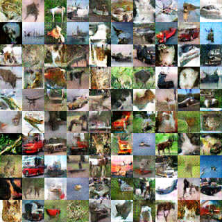

# DCGAN

This is an example implementation of DCGAN (https://arxiv.org/abs/1511.06434) 
trained on multi-GPU using `chainermn`.

This code uses Cifar-10 dataset by default.
You can use your own dataset by specifying `--dataset` argument to the directory consisting of image files for training.
The model assumes the resolution of an input image is 32x32.
If you want to use another image resolution, you need to change the network architecture in net.py.

Below is an example learning result using cifar-10 dataset after 200 epoch, 
where the model is trained using 4 GPUs with minibatch size 50 for each process.



## Implementation

The original implementation is referenced from [chainer examples](https://github.com/chainer/chainer/tree/79d6bf6f4f5c86ba705b8fd377368519bc1fd264/examples/dcgan).

It is worth noting that only main training code, `train_dcgan.py`, is modified from original code.
The model definition code in `net.py`, the updater code (which defines how to calculate the loss to train generator and discriminator) in `updater.py`,
and the training extension code in `visualize.py` are completely same with the original code. 

We can reuse most of the code developed in `chainer`, to support multi-GPU training with `chainermn`.

## How to run the code

For example, below command is to train the model using 4 GPUs (= processes).

```
mpiexec -n 4 python train_dcgan.py -g
```

If you want to restart the training to fine tune the trained model, 
specify the file path saved by `snapshot_object`.
Below command loads the models which are trained 30000 iterations.
```
mpiexec -n 4 python train_dcgan.py -g --gen_model=result/gen_iter_30000.npz --dis_model=result/dis_iter_30000.npz --out=result_finetune
```
