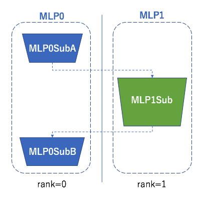
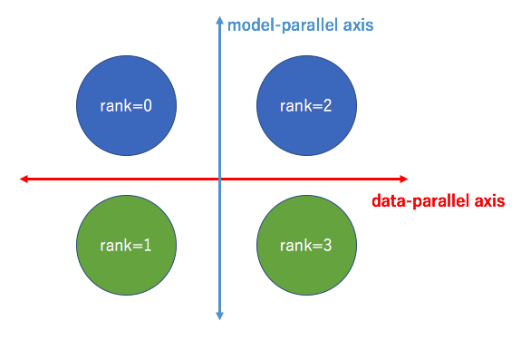
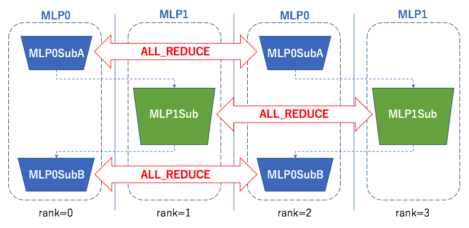

# MNIST examples

## Data Parallel (train\_mnist.py)

Data parallel is a standard feature in the field of distributed machine learning.
We have the same model on each worker:

```python
class MLP(chainer.Chain):

    def __init__(self, n_units, n_out):
        super(MLP, self).__init__(
            # the size of the inputs to each layer will be inferred
            l1=L.Linear(784, n_units),  # n_in -> n_units
            l2=L.Linear(n_units, n_units),  # n_units -> n_units
            l3=L.Linear(n_units, n_out),  # n_units -> n_out
        )

    def __call__(self, x):
        h1 = F.relu(self.l1(x))
        h2 = F.relu(self.l2(h1))
        return self.l3(h2)
```

and they can be trained with different examples separately.
After each epoch, parameters will be updated by ALL_REDUCE operation.

This example can be executed by the following command (with four workers):
```
mpiexec -n 4 python examples/mnist/train_mnist.py
```

## Model Parallel (train\_mnist\_model\_parallel.py)

Model parallel is an advanced feature.
We can split large models on multiple workers, which is especially useful for models which cannot be loaded on one worker.

The first worker loads the following model:
```python
class MLP0SubA(chainer.Chain):
    def __init__(self, comm, n_out):
        super(MLP0SubA, self).__init__(
            l1=L.Linear(784, n_out))

    def __call__(self, x):
        return F.relu(self.l1(x))


class MLP0SubB(chainer.Chain):
    def __init__(self, comm):
        super(MLP0SubB, self).__init__()

    def __call__(self, y):
        return y


class MLP0(chainermn.MultiNodeChainList):
    # Model on worker 0.
    def __init__(self, comm, n_out):
        super(MLP0, self).__init__(comm=comm)
        self.add_link(MLP0SubA(comm, n_out), rank_in=None, rank_out=1)
        self.add_link(MLP0SubB(comm), rank_in=1, rank_out=None)
```

and the second worker loads the following model:
```python
class MLP1Sub(chainer.Chain):
    def __init__(self, n_units, n_out):
        super(MLP1Sub, self).__init__(
            l2=L.Linear(None, n_units),
            l3=L.Linear(None, n_out))

    def __call__(self, h0):
        h1 = F.relu(self.l2(h0))
        return self.l3(h1)


class MLP1(chainermn.MultiNodeChainList):
    # Model on worker 1.
    def __init__(self, comm, n_units, n_out):
        super(MLP1, self).__init__(comm=comm)
        self.add_link(MLP1Sub(n_units, n_out), rank_in=0, rank_out=0)
```

The conceptual figure is as follows:



This example can be executed by the following command (with two workers):
```
mpiexec -n 2 python examples/mnist/train_mnist_model_parallel.py
```
Note that this example cannot be executed on the different number of workers from two, otherwise the remaining workers will just fail.

## Data Parallel + Model Parallel (train\_mnist\_dual\_parallel.py)

Of course we can use data parallelism and model parallelism at the same time.
Overall we have two parallelism axis.



Combining these two axis, the detailed architecture used in this example is shown in the next figure.



This example can be executed by the following command:
```
mpiexec -n 4 python examples/mnist/train_mnist_dual_parallel.py
```

Since this example relies on the splitting way of `train_mnist_model_parallel.py` (splitting the original MLP into 2 processes), it can only executed on the even number of processes.
