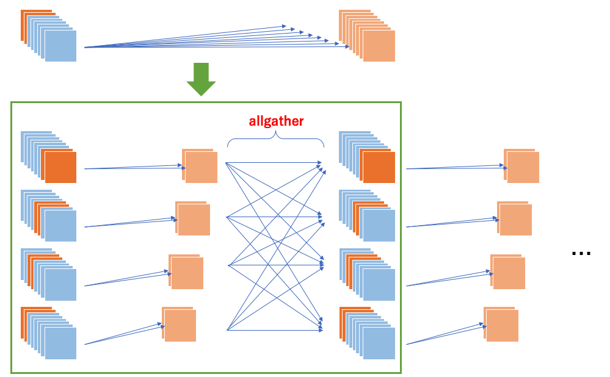

Parallel Convolution
====

This is an example for (channel-wise) model-parallel convolution layer.
Each process is responsible for a subset of channels of each layer,
which is aggregated by allgather operation.



## Run

```
mpiexec -np 4 python train.py --gpu --epoch 20
```

## Benchmark

This is the result of 4 process model-parallel VGG16.

```
epoch       main/loss   validation/main/loss  main/accuracy  validation/main/accuracy  elapsed_time
1           2.30032     1.93991               0.189538       0.234873                  78.7839
2           1.65009     1.52749               0.362456       0.423666                  155.254
3           1.34664     1.28332               0.517386       0.538217                  231.687
4           1.14162     1.26861               0.604493       0.569964                  307.934
5           1.02537     1.14984               0.64612        0.60828                   384.516
6           0.94738     0.857747              0.676236       0.699642                  460.883
7           0.9005      0.941613              0.699444       0.678045                  537.291
8           0.862572    0.920346              0.712428       0.690486                  613.641
9           0.837644    0.871828              0.722526       0.713873                  690.127
10          0.805104    0.789606              0.735375       0.737958                  766.501
11          0.79348     0.778395              0.740717       0.739053                  842.877
12          0.775456    0.818261              0.745739       0.718053                  919.327
13          0.766645    0.770938              0.749281       0.743332                  995.795
14          0.748153    0.831802              0.753961       0.721139                  1072.28
15          0.738143    0.751652              0.757362       0.753185                  1148.63
16          0.727406    0.798907              0.763124       0.735868                  1224.83
17          0.718345    0.647609              0.766284       0.786823                  1301.15
18          0.717653    0.868377              0.765925       0.711286                  1377.34
19          0.707101    0.679286              0.768026       0.76463                   1453.63
20          0.695821    0.74336               0.772427       0.759355                  1529.92
```


## Benchmark (for reference)

Below the result for single-node VGG16 is shown.

```
epoch       main/loss   validation/main/loss  main/accuracy  validation/main/accuracy  elapsed_time
1           2.34159     1.90463               0.1743         0.2582                    29.2918
2           1.79195     1.69903               0.30636        0.3696                    57.64
3           1.46033     1.28639               0.44652        0.5203                    86.4359
4           1.1914      1.1341                0.57862        0.6015                    115.727
5           0.984272    1.30657               0.65692        0.5665                    145.723
6           0.873275    0.833474              0.703361       0.7121                    175.449
7           0.793094    0.873955              0.7349         0.7072                    205.497
8           0.737453    0.724129              0.7573         0.7545                    235.222
9           0.697329    0.644915              0.770759       0.7883                    265.093
10          0.663382    0.764737              0.784599       0.7541                    294.742
11          0.630886    0.70101               0.79682        0.7682                    324.374
12          0.61289     0.631162              0.80308        0.7921                    353.765
13          0.591036    0.768498              0.811779       0.7519                    383.462
14          0.57872     0.654855              0.814399       0.7767                    413.018
15          0.557009    0.653573              0.821759       0.7855                    442.614
16          0.554905    0.735885              0.822239       0.7675                    471.965
17          0.543167    0.710202              0.826479       0.771                     501.23
18          0.532696    0.600228              0.82858        0.8024                    530.594
19          0.519544    0.531294              0.834739       0.8301                    559.868
20          0.512379    0.640066              0.838139       0.7905                    589.153
```
